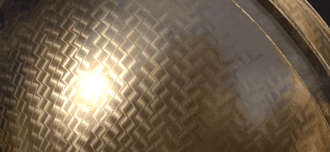
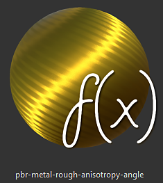
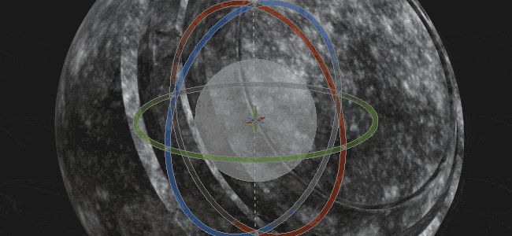

# Version 2018.3

**La Substance Painter 2018.3** est là et apporte de nombreux nouveaux workflows et fonctionnalités de rendu !

Date de publication : *20 novembre 2018*

## Principales fonctionnalités

### Exportation vue 2D

Il est désormais possible d&#39;**exporter le rendu Vue 2D** **en tant que texture**. Cette fonctionnalité a été demandée par de nombreuses personnes et nous l’avons finalement rendue disponible ! Le processus d&#39;exportation utilisera l&#39;état actuel de la **Vue 2D** pour effectuer le rendu d&#39;une texture avec les paramètres d&#39;exportation standard (remplissage, format de fichier, nombre de bits par pixel). Cela signifie que si le mode d&#39;affichage est défini sur **Solo** au lieu du mode **Matériau**, la Vue 2D sera exportée telle quelle.

Rendez-vous dans la **fenêtre d&#39;exportation** et choisissez la nouvelle configuration nommée « **vue 2D** » :\

Une nouvelle **carte convertie** nommée « **vue 2D** » est également disponible dans l&#39;onglet **Configuration** de la fenêtre d&#39;exportation au cas où vous souhaiteriez créer votre propre **préconfiguration d&#39;exportation**.

### Filtre d’éclairage Baké amélioré

Le filtre **Environnement d&#39;éclairage baké** a été considérablement amélioré et prend désormais correctement en charge les **maps d&#39;environnement HDR**.\
Vous pouvez désormais répliquer l’éclairage du viewport (comme le montre la Vue 2D) et le baker dans le canal de Base color. Le nouveau filtre fournit d&#39;autres commandes telles que la **rotation** de la carte **de l&#39;environnement** à la verticale **et la modification de l&#39;** exposition **.**

### Reflets de Specular anisotrope en temps réel

Dans cette nouvelle version, nous introduisons un nouveau shader nommé « **pbr-metal-rugueux-anisotropie-angle** ». Ce shader prend en charge deux canaux nommés « **Anisotropy angle** » et « **Anisotropy level** » qui peuvent être utilisés pour créer des reflets de specular anisotropes. Ce shader translatera également dans l&#39;Iray-tel sans qu&#39;il soit nécessaire de le convertir.

Ce nouveau shader est accessible via la [fenêtre Shader](../../interface/shader-settings/shader-settings.md) en cliquant sur le bouton shader et en ouvrant la mini-étagère :

L&#39;exemple de projet par défaut « **Sphère de prévisualisation** » a été mis à jour pour tirer parti de ce nouveau shader et montrer comment configurer les différents canaux.

>[!NOTE]
>
> Si des **artefacts de ligne** étranges apparaissent lors de l&#39;utilisation de dégradés dans le canal **Anisotropy angle**, modifiez le mode de filtrage sur « **Au plus proche** » en cas de calque de remplissage, car cela pourrait améliorer l&#39;échantillonnage pour le shader et éliminer le problème.

### Shader à pelage transparent mis à jour

Le shader **Clear Coat** (**enduit de pbr**) a été amélioré pour offrir plus de contrôles et de possibilités de rendu. Nous avons également saisi cette occasion pour le rendre compatible avec **Iray** avec une **MDL** dédiée.

Voici une liste des modifications :

* **Contrôlez** le calque secondaire **Rugosité** (via le canal **User0**).
* **Masquer** le calque secondaire (via le canal **Utilisateur1**).
* Choisissez le comportement à appliquer au calque de surface : **Conserver les détails normaux** (original) ou **Surface lisse** (nouveau, ignorer la map de maillage normal)

Pour des raisons pratiques, nous avons également ajouté un nouveau modèle de projet prêt pour texturer ce nouveau shader nommé : **PBR - Métallique rugosité enduite**.

### Nouveau lissage de Viewport

Le post-processus de Substance Painter de l&#39;anticrénelage a été remanié et remplacé par une nouvelle méthode appelée « **Antialiasing temporel** » (**TAA**).\
Cette nouvelle technique offre de bien meilleurs résultats dans tous les cas pour un coût très minime. **Le TAA** fonctionne en accumulant des informations sur plusieurs cadres, ce qui permet de produire des contours très lisses sans perdre de détails.

Puisqu&#39;il ne s&#39;agit plus d&#39;un post-effet, le paramètre a été légèrement déplacé dans la fenêtre **Paramètres d&#39;affichage** et se trouve désormais **en dessous** de la section **Post-effets**.

Ce nouveau lissage offre également de nouvelles possibilités lorsqu’il est associé à la transparence. Si un projet utilise le shader **Alpha-Test**, essayez d&#39;activer le paramètre « **Alpha dithering** » :

Le nouveau **TAA** filtrera également correctement le motif de Bruit bleu visible dans les **reflets de Specular** ainsi que dans les échantillons de **Subsurface scattering**.

### Texturation virtuelle fragmentée (SVT)

L&#39;un des grands changements de cette nouvelle version est l&#39;introduction de **Sparse Virtual Texture** ou **SVT**.

Ce nouveau système modifie certains principes fondamentaux de Substance Painter et la façon dont l&#39;application fonctionne. Substance Painter utilise désormais le SVT pour conserver une empreinte mémoire spécifique pour le viewport, ce qui permet de **diffuser des textures d&#39;entrée et de sortie**. Le principal avantage est la possibilité de charger des projets plus volumineux plus facilement et de réduire la pression sur le GPU pour **améliorer les performances**. Cela signifie que si les choses commencent à devenir trop gros, déchargera certaines textures sur le disque et les récupérera plus tard (si nécessaire). Il s&#39;agit d&#39;un **cache volatile** qui est supprimé lorsque l&#39;application se ferme.

Un autre avantage du système est l&#39;introduction de **mipmaps** à l&#39;intérieur du **viewport**, ce qui améliorera la qualité de la texture et réduira l&#39;effet Moire, particulièrement visible avec les motifs de tissu.

Nous avons exposé quelques commandes concernant ce nouveau système qui peuvent être modifiées dans les préférences principales (**Modifier > Paramètres**) :

* **Répertoire du cache** : ce paramètre contrôle l&#39;emplacement où la Substance Painter de données écrira ses fichiers temporaires, y compris le cache SVT.
* **Accélération de la prise en charge matérielle** : si cette option est activée, Substance Painter utilisera la prise en charge native de Sparse Textures par le GPU (si elle est désactivée, elle reviendra à une implémentation logicielle)

Pour plus d&#39;informations sur le SVT, consultez notre page de documentation : [Sparse Virtual Texture](../../features/sparse-virtual-textures.md)

>[!NOTE]
>
> Il est recommandé de définir le **répertoire du cache** sur un **disque SSD** pour optimiser les performances lors de l’utilisation de la Substance Painter.
> 
> Ces paramètres peuvent être remplacés via la variable d&#39;environnement : [Variables d&#39;environnement](../../pipeline-and-integration/configuration/environment-variables.md).

### Nouvel outil de Symétrie amélioré

L’outil symétrie a été retravaillé et permet désormais de décaler le point d’origine. Lorsqu&#39;un projet est partiellement symétrique ou décentré, le plan peut désormais être ajusté. Le décalage sera enregistré dans le projet par axe.

Nous avons également profité de l’occasion pour lui donner un peu d’amour et lui donner un nouveau feedback visuel :

* Une **ligne d&#39;intersection** est maintenant tracée par **défaut** sur le maillage pour indiquer où se trouve le plan de symétrie.
* Un **point en miroir** s&#39;affiche désormais lors du déplacement du **curseur** pour indiquer où le contour en miroir sera appliqué.

Tous les nouveaux visuels peuvent être modifiés via le nouveau menu Symétrie de la barre d’outils contextuelle :

* **Miroir X, Miroir Y, Miroir Z** : définissez la direction utilisée pour la symétrie
* **Décalage** : contrôle la valeur de décalage par axe. L’icône en forme de flèche croisée permet de réinitialiser tous les décalages à 0.
* **Plan de Symétrie** : Afficher le plan permet de dessiner un plan qui coupe le maillage. Afficher l&#39;intersection dessine une ligne sur le maillage à l&#39;endroit où le plan coupe le maillage.
* Le curseur **Symétrie** :Show dessine un curseur de pinceau secondaire à l&#39;endroit où la symétrie est appliquée. L’option Masquer pendant la peinture affiche uniquement ce curseur lorsque vous ne peignez pas.
* **Manipulateur** : Afficher le Manipulateur affiche un manipulateur dans le viewport pour décaler le plan de symétrie. **Taille du Manipulateur** contrôle la taille du contrôleur dans le viewport.

Les mêmes **raccourcis** que pour les trois Planaires et l&#39;UV peuvent être utilisés pour masquer/afficher le Manipulateur de Symétrie :

* **Q** : Afficher/Masquer le Manipulateur
* **Maj** : Contraindre la translation (décalage discret)
* **+ / -** : modifier la taille du Manipulateur

### Manipulateur Tri-Planaire Amélioré

En plus des 3 axes d&#39;origine pour contrôler la rotation, nous avons également ajouté une nouvelle sphère de rotation lors du contrôle du manipulateur Tri-planaire. La sphère permet de tester rapidement différents angles lors de la projection de motifs de bruit par exemple.

### Exportation de Textures tramées 8 bits

Lors de l&#39;exportation des textures Normal et Map height aux formats de fichier en mode 8 bits, la Substance Painter appliquera désormais automatiquement **dithering** pour réduire les **problèmes** de **bandes**.

>[!NOTE]
>
> Si un paramètre prédéfini d’exportation utilise une map normal, mais qu’un autre élément de la couche alpha (comme RGB = Normal, A = Rugosité), seule la normale est tramée.

### Améliorations du comportement de la pile de calques

Quelques améliorations ont été apportées au workflow de la gestion des piles de calques et des calques :

* Attribuez des **couleurs** aux **calques** et aux **dossiers** dans la Pile de calques de données via le menu **clic droit** pour organiser les calques.\
  Cependant, les couleurs des calques de Substance Painter se comportent un peu différemment que dans d’autres logiciels :
  * Les calques d’un dossier hériteront de la couleur du dossier (mais seront grisés).
  * Le déplacement d’un calque sans couleur affectée à l’intérieur d’un dossier contenant une couleur hérite de la couleur du dossier.
  * Si un calque a une couleur dédiée, elle ne sera pas remplacée par le dossier.Ce comportement original permet de coloriser et d’organiser plus facilement la pile de calques sans avoir à attribuer trop de couleurs à la main.

* **masquez et affichez** rapidement plusieurs **calques** en **cliquant et en faisant glisser** la souris.\
  Nous avons également saisi cette occasion pour affiner un peu le comportement de l’annulation du masquage des calques dans les dossiers masqués, qui va maintenant également annuler le masquage du dossier.

* Basculez rapidement **entre les modes de fusion** avec les **raccourcis clavier** **Flèche**.\
  Après la **fermeture** du menu contextuel de fusion, le **focus** **restera** sur le calque qui peut et peut continuer à être modifié avec le même raccourci précédent.

### Nouvelles entrées de Substance pour les filtres et les générateurs

De nouvelles entrées de Substance ont été exposées pour les filtres et les générateurs personnalisés. Ces nouveaux apports de textures permettent la création d&#39;effets plus avancés grâce à de nouvelles informations liées au maillage.

Les nouvelles données disponibles sont les suivantes :

* Position du maillage
* Normale de l&#39;espace monde du maillage
* Tangente Espace monde maillage
* Espace monde maillage bitangent
* Taille du texel maillage
* Masque UV maillage

Pour plus de détails, consultez la nouvelle documentation : [Entrée par Maillage](../../content/creating-custom-effects/mesh-based-input.md)

À titre d&#39;exemple, nous fournissons désormais un nouveau **générateur de masque** nommé « **Distance de la bordure de l&#39;UV** » qui crée un masque blanc noir à partir de la bordure des Îlots UV du Jeu de textures actuel.

>[!NOTE]
>
> Ces entrées sont fournies directement à partir du moteur de Substance Painter en fonction du Maillage du projet et n&#39;utilisent pas les [Bakers](../../baking/baking.md).

### Contenu nouveau et mis à jour

Dans cette nouvelle version, nous avons inclus de nouveaux contenus :

* Nouveaux motifs de **dégradé** procéduraux à utiliser avec le nouveau shader **anisotrope** :

  * Radial Anisotrope
  * Dégradé circulaire
  * Chevauchement de disque en dégradé
  * Disque de dégradé décalé
  * Dégradé de flocons
  * Variante de dégradé
  * Vérificateur de dégradé
  * Vérificateur de dégradé double
  * Gradient Weave
  * Armature en dégradé pivotée
  * Angle d’armure du dégradé
  * Angle d’armure de dégradé pivoté\
    
* Nouveau mappage d&#39;**environnement** :

  * Studio Automotive Neutral\
    
* Nouveau **projet** **modèle** :

  * PBR - Anisotropy angle de Métallique rugosité
  * PBR - Métallique rugosité couchée
* Nouveau **matériau** :

  * Human Female 30s Face 06 (peut être rapidement trouvé via le paramètre prédéfini Peau dans l&#39;étagère)\
    Ce nouveau matériau de peau a été fourni par **Texturation.XYZ** et donne de superbes détails de surface pour mettre en peinture une peau réaliste.\
    

Nous avons également mis à jour une partie du contenu existant pour l’affiner :

* Filtre de mise à jour « **Environnement d&#39;éclairage baké** » : voir ci-dessus.
* Filtre « **Shutline MatFx** » mis à jour : permet désormais de masquer l’effet de matériau et de conserver uniquement le résultat height/normal.
* **Exemple de projet** mis à jour : la sphère de prévisualisation peut désormais être utilisée avec la symétrie et dispose d’un nouvel angle de caméra pour les rendus personnalisés. Son shader par défaut est désormais « Anisotropy angle ».

## Notes de mise à jour

### 2018.3.3

(Publié Le 7 Mars 2019)

**Ajouté :**

* [Contenu] Intégrer un nouveau modèle de projet : « PBR - Métallique rugosité Alpha-blend »
* L&#39;ordre de recherche dynamique des bibliothèques Linux a été modifié pour donner la priorité aux bibliothèques dans le répertoire d&#39;installation par rapport à ce qui est installé sur le système

**Fixe :**

* Le maillage disparaît parfois du viewport 3D (appuyez sur F pour réinitialiser la caméra)
* [glTF] Mise à jour du chargeur de Substances Painter Sketchfab avec les nouveaux types de licences Sketchfab
* [Import]&#x200B;[glTF] Mauvaise gestion de la modulation de texture d&#39;entrée telle que définie dans les fichiers glTF
* Dans certains cas, le plan de Sol [Importer]&#x200B;[glTF] ne s&#39;affiche pas correctement lors de l&#39;importation glTF
* [Export]&#x200B;[USD] L’opacité ne fonctionne pas dans Arkit
* [Export]&#x200B;[USD] crashs d&#39;exportation USDz dans certains cas
* [Export]&#x200B;[USD] Exporter vers USD sans enregistrer les pistes vers le crash
* [Export]&#x200B;[USD] Mode de répétition incorrect pour les textures, mode de subdivision pour les maillages et types de sortie pour les nuanceurs
* [Export]&#x200B;[USD] Exportations fragmentées de certains jeux de textures seulement avec toute la géométrie
* crash [Instance] lors de la tentative de suppression d’un calque d’instance rompu
* [Régression]&#x200B;[Exporter] Certaines cartes non exportées dans le nombre de bits par pixel choisi
* [Linux] Problème avec la bibliothèque libtbb.so.2

**Problèmes Connus :**

* Calcul bloqué dans certains cas sur les GPU AMD VEGA
* Problème de tablette Huion avec les raccourcis sous Windows

### 2018.3.2

(Publié le 24 janvier 2019)

**Ajouté :**

* Résumé : correctif avec de nouvelles fonctionnalités
* [Export] Autoriser l&#39;exportation au format USDZ
* [Viewport] Permet de contrôler la qualité de la texture dans les Paramètres d’affichage
* [Viewport] Ajout du paramètre de biais mip dans les paramètres d’affichage
* [Viewport] Ajout de filtrage anisotrope dans les paramètres d’affichage
* [plug-ins] Mettez à jour les plug-ins officiels pour utiliser le style de Substance Painter 2018
* [Licence] Installer la licence par défaut dans un dossier utilisateur

**Fixe :**

* Crash lié à la décompression
* Ajouter un TAA sur un matériau solo
* Bruit avec ombre, TAA et shader alpha avec dithering
* Supprimer specular dithering pour tous les shaders PBR classiques
* Crash dans les paramètres de shader dans certains cas
* L’activation de diffusion n’est pas synchronisée entre OpenGL et les rendus Iray
* Les outils Doigt et Dupliquer ne fonctionnent plus sur des maillages spécifiques
* Certains jeux de textures ne peuvent pas apparaître dans le rendu d’Iray
* Les Jeux de textures renommés ne sont pas enregistrés après la fermeture du projet
* Artefacts de structure filaire lors du glisser-déposer de matériaux sur des Map id
* [Scripts] La création du chemin d’accès au fichier n’est pas forcée lors de l’enregistrement d’un projet
* [Script] Le rappel « onProjectAboutToSave() » ne fonctionne plus
* Liens de forum rompus dans la fenêtre de rapport de bogue

**Problèmes Connus :**

* Calcul bloqué dans certains cas sur les GPU AMD VEGA
* Problème de tablette Huion avec les raccourcis sous Windows

### 2018.3.1

(Publié le 6 décembre 2018)

**Ajouté :**

* Résumé : correctif
* [Symétrie]&#x200B;[Viewport] La peinture sur Symétrie dans la Vue 2D est de retour et dispose désormais d’un aperçu du pinceau de duplication fixe

**Fixe :**

* [Export] L’exportation Vue 2D génère parfois une texture noire
* [Iray] Les informations normales deviennent incorrectes dans Iray après l’instanciation d’un calque de matériau
* Les jeux de textures non carrés peuvent parfois entraîner un crash
* [Annuler] Plusieurs touches Ctrl+Z peuvent parfois entraîner un crash de manière aléatoire
* [XML] AlgScrollView peut créer un avertissement dans le journal dans certains cas (boucles de liaison)

**Problèmes Connus :**

* Calcul bloqué dans certains cas sur les GPU AMD VEGA
* Problème de tablette Huion avec les raccourcis sous Windows
* Le lissage et les ombres lorsqu’ils sont actifs ensemble peuvent donner des résultats inattendus

### 2018.3.0

(Publié le 20 novembre 2018)

<b><b>Ajouté :</b></b>

* Résumé : mises à niveau du viewport, exportation correcte de Vue 2D, nouveaux assistants d’interface utilisateur, outil de symétrie amélioré, nouveau contenu et amélioration considérable des performances
* [Lissage]&#x200B;[Viewport] Nouveau filtrage antialiasing temporel pour viewport 3D (via les paramètres d’affichage)
* [Exporter] Exportez le contenu du viewport 2D en une seule texture
* [Exportation]&#x200B;[Dithering] Exposer le dithering à l’exportation
* [Pile de calques] Couleurs sur les calques et les dossiers
* [Pile de calques] Activation et désactivation rapides de plusieurs calques et effets
* [Pile de calques] Navigation plus facile pour les modes de fusion avec les touches haut et bas et le défilement de la souris
* [Proj]&#x200B;[UI] manipulateur de rotation supplémentaire sur les trois axes pour triplanar
* [Proj]&#x200B;[Raccourcis] - et + pour modifier la taille du manipulateur de Projection UV
* [Shader] Contrôle des paramètres de la couche revêtue avec des canaux dans le shader revêtu de PBR
* [Substance] Exposer de nouvelles entrées de texture basées sur le maillage pour les filtres et les générateurs
* [Symétrie]&#x200B;[Viewport]&#x200B;[Interface utilisateur] Décalage de la symétrie de contrôle avec les manipulateurs
* [Symétrie]&#x200B;[Barre d’outils contextuelle]&#x200B;[Interface utilisateur] Nouveau panneau symétrie avec des options
* [Symétrie] Nouveau mode d&#39;intersection de lignes de symétrie
* [Symétrie] Nouveau curseur de duplication de symétrie
* [Symétrie]&#x200B;[Raccourcis] Q pour masquer et -, + pour modifier la taille et Maj pour contraindre
* [Journal] Amélioration des messages d’erreur en cas d’échec de l’exportation des textures
* [Scripts] Autoriser à modifier ou à mettre à jour les ressources dans les paramètres d’affichage
* [Scripts] Autoriser la création ou la suppression de canaux dans les Jeux de textures
* [Contenu]&#x200B;[Shaders] Ajoutez la prise en charge de l&#39;anisotropie avec un shader dédié (pbr-metal-rugueux-anisotropie-angle)
* [Contenu] Mise à jour de la sphère de prévisualisation avec anisotropie et angle modifié
* [Contenu] Mise à jour de la ligne d’arrêt matFx
* [Contenu] Nouvelle numérisation de face transparente Texturing.XYZ
* [Contenu] Nouvelles procédures anisotropes
* [Contenu] Nouveau filtre : environnement d&#39;éclairage baké
* [Contenu] Nouvelle map d&#39;environnement : studio automobile neutre
* [Contenu] Nouveau modèle de projet : PBR - Anisotropy angle de métallique rugosité (avec canaux d’anisotropie)
* [Content] Nouveau modèle de projet : PBR - métallique rugosité Coated
* [SVT]&#x200B;[Moteur] Sparse Virtual Texture (SVT)
* [SVT]&#x200B;[Préférences]&#x200B;[Interface utilisateur] Option d’accélération de la prise en charge matérielle SVT
* [SVT]&#x200B;[Journal] Informations supplémentaires sur la fonction de texturation virtuelle dispersée (par exemple, taille du disque)
* [SVT]&#x200B;[UI] Fenêtre de message au début si la taille du disque est trop faible pour le cache
* [SVT]&#x200B;[Préférences]&#x200B;[UI] Emplacement du cache global de la Substance Painter de données
* [SVT] Nouvelle variable d’environnement pour spécifier le chemin du cache de Substance Painter
* [SVT] Nouvelle variable d’environnement pour activer l’accélération de la prise en charge matérielle SVT
* [SVT] Détecter la prise en charge fragmentée par le matériel
* [SVT]&#x200B;[Dispersé matériel] Augmenter la version minimale du pilote pour le GPU Nvidia
* [SVT]&#x200B;[Shader]&#x200B;[Viewport]&#x200B;[UI] Avertir l’utilisateur si des artefacts sont présents avec une texture virtuelle dispersée à l’ouverture du projet

<b><b>Fixe :</b>\
</b>

* [Sélecteur de couleurs] Un curseur de peinture apparaît lorsque vous tentez de choisir une couleur
* Le crash par sélection ou désélection de calques dans un ordre spécifique peut entraîner un crash
* Crash lors du collage en tant qu’instance d’un calque avec un masque
* crash [Canal utilisateur]&#x200B;[Régression] lors du changement de nom du canal utilisateur
* [Canal utilisateur] Aperçu du pinceau grisé
* [Alembic] Un seul jeu de textures de plusieurs matériaux après l’importation
* [Moteur] La texture exportée diffère de celle du viewport pour les tampons de pinceau
* [Moteur] L’inversion avec un effet de niveau n’affecte pas entièrement une texture
* Le sélecteur de matériau applique un contour pendant le prélèvement
* Le passage d’une résolution de 128 x 128 px entraîne un crash
* Les liens de map de maillage ne sont pas mis à jour correctement lors du rétablissement ou de l’instanciation des calques
* [Substance] L&#39;espace colorimétrique UserData ne fonctionne pas sur le Maillage Baké Normal demandé comme entrée
* Incompatibilité d&#39;association MDL lors de l&#39;utilisation de plusieurs instances de shaders
* [Symétrie]&#x200B;[Calque de remplissage] Plan de Symétrie et son manipulateur actif dans le Calque de remplissage
* [Viewport] Le point de pivot de la traduction n’est pas toujours mis à jour après avoir cliqué
* [UI] Correction des icônes et suppression des espaces réservés pour les moniteurs HDPI

<b><b>Problèmes connus :</b>\
</b>

* Calcul bloqué sur les GPU AMD VEGA
* Problème de tablette Huion avec les raccourcis sous Windows
* Le lissage et les ombres lorsqu’ils sont actifs ensemble peuvent donner des résultats inattendus

<b>  
</b>
