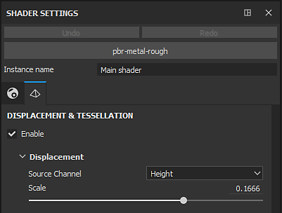
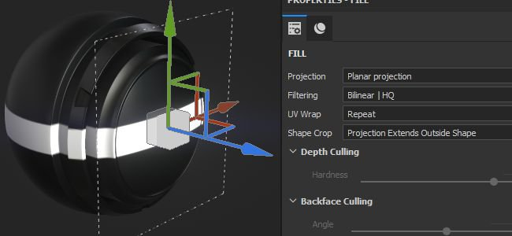
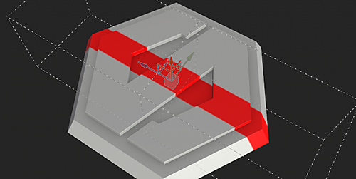

# Version 2019.1

**Substance Painter 2019.1** développe ses fonctionnalités existantes et introduit également de nouveaux outils artistiques. Cette version se concentre également sur la diffusion de nombreux nouveaux contenus.

Date de publication : *23 avril 2019*

## Principales fonctionnalités

### Traits dynamiques

Avec cette version, notre moteur de pinceau prend désormais en charge ce que nous appelons les Traits dynamiques. Ces types de contours créent des variations et de nouveaux effets grâce à la génération de nouvelles versions de Substance à la volée. Il est désormais possible de définir un nouveau matériau de Substance ou une nouvelle alpha pour chaque nouveau coup de pinceau peint sur votre ressource.

Lorsqu’une ressource compatible Dynamic Stroke est chargée dans votre outil de Peinture (Peinture, Gomme, Doigt ou Clone), un nouveau groupe de paramètres apparaît :

Traits dynamiques prend en charge les propriétés suivantes (si elles sont exposées dans le graphe Substance) :

* **Index de tampon** : ID/numéro d’un tampon à l’intérieur d’un trait.
* **Générateur aléatoire** : peut changer par tampon ou par trait.
* **Temps** : le temps de peinture écoulé d’un coup de pinceau, peindre rapidement ou plus lentement, produit des résultats différents.

L’index de tampon est fourni avec deux autres paramètres :

* **Démarrage du tampon** : *À partir du début* (démarrez toujours l&#39;index à partir de 0) ou *À partir d&#39;un index aléatoire* (choisissez une position aléatoire entre 0 et le maximum défini par **Nombre de cycles de tampon**).
* **Nombre de cycles de tampons** : ce paramètre définit le nombre total de variations de Substance qui seront générées. Afin d&#39;optimiser les performances, ce paramètre fonctionne comme une limite. Substance Painter, utilisez-le pour recycler ce qui a déjà été généré au lieu d’en créer un nouveau.

Vous pouvez trouver des ressources compatibles avec cette nouvelle fonctionnalité simplement en parcourant l&#39;étagère et en regardant les nouvelles icônes qui sont maintenant à côté d&#39;eux :

Les ressources compatibles avec la fonctionnalité reçoivent également automatiquement une nouvelle balise nommée « **dynamicstroke** » pour faciliter le filtrage par mots-clés dans l&#39;Étagère.

Nous avons également ajouté de nombreux **paramètres prédéfinis d&#39;outil** pour jouer avec :

{width="450px"}

>[!NOTE]
>
> Pour en savoir plus sur cette fonctionnalité (et son impact sur les performances), consultez la [documentation dédiée](../../painting/dynamic-strokes/dynamic-strokes.md).

### Displacement Et Tessation

La Substance Painter prend désormais en charge **Displacement** et **maillage Tesslation** dans son viewport en temps réel et dans l&#39;Iray. Ils peuvent tous les deux être contrôlés dans la fenêtre **Paramètres de Shader** sous les paramètres de shader.

* **Canal source** : canal à partir duquel la déformation de maillage est basée. La valeur par défaut est Height, mais elle peut également être définie sur Displacement.
* **Échelle** : contrôle le degré de déformation appliqué au maillage dans le projet.

* **Mode de subdivision** : longueur uniforme ou de bord. Détermine le mode de calcul de la quantité de subdivision.
* **Nombre de subdivisions** : (Mode uniforme) De 1 à 32. Une valeur élevée produit plus de polygones, ce qui donne plus de détails, mais peut entraîner des problèmes de performances.
* **Longueur Maximale** : (Longueur Du Contour Du Mode) 1 / Valeur. Chaque bord de polygone est divisé jusqu&#39;à ce que chaque segment soit égal ou inférieur à ce nombre, 1/1 étant la taille de la scène.

Chargez l&#39;exemple de projet « **Répétition Matériau** » (via **Fichier > Charger l&#39;exemple**) pour tester rapidement cette nouvelle fonctionnalité :

{width="450px"}{width="450px"}

>[!NOTE]
>
> Un nouveau filtre nommé « **Height à la normale** » a été ajouté dans l&#39;Étagère et peut être utilisé pour obtenir la map normal finale (au cas où la conversion native par Substance Painter ne serait pas assez forte).

### Effet de masque de comparaison

La création et la fusion de matériaux peuvent parfois être un peu difficiles, c&#39;est pourquoi nous avons créé un nouvel effet nommé « **Masque de comparaison** ». Cet effet permet de comparer rapidement et facilement deux couches et de produire ainsi un masque.

L’effet Masque de comparaison présente les propriétés suivantes :

* **Canal** : canal à comparer entre la source et la cible à partir duquel créer un masque.
* **Comparer** : trois paramètres sont disponibles ici pour choisir la façon dont le masque doit être calculé. La liste déroulante au milieu définit l&#39;opération de comparaison (inférieure à, dans la tolérance, supérieure à).
* **Constante** : valeur à comparer lorsque le paramètre de comparaison est défini sur « constante ».
* **Dureté** : contrôle le smoothness/la dureté de la comparaison de masques obtenue.
* **Histogramme** : fournissez une vue d’histogramme de la source et de la cible. Utile pour savoir s&#39;ils se chevauchent un peu ou pas du tout (s&#39;ils ne se chevauchent pas, le masque sera vide).

Pour faciliter encore la configuration, vous pouvez cliquer avec le bouton droit de la souris sur un calque et choisir le raccourci « **Ajouter un masque avec une combinaison height** » pour ajouter rapidement ce nouveau masque sur votre calque. Ce raccourci changera également votre mode de fusion de couche Height en « Normal » au lieu du « Linear dodge (Ajouter) » par défaut.\

### Symétrie radiale

Nous avons étendu les capacités de notre outil de symétrie pour gérer la symétrie radiale. Un nouveau mode est désormais disponible dans le menu Paramètres de symétrie pour l’activer (disponible dans la barre d’outils contextuelle).

Les paramètres suivants sont disponibles :

* **X / Y / Z** : contrôle la direction de l&#39;axe de symétrie utilisé par la symétrie radiale.
* **Count** : nombre de points dupliqués.
* **Plage d’angle** : emplacement des points dupliqués par rapport à l’original. Ce paramètre peut être utilisé pour faire un cercle complet ou un quart de celui-ci, etc.

Nous avons également ajouté un petit aperçu pour faciliter l’ajustement des paramètres avant de commencer la peinture :

### Nouveaux modes de Projection de Calque de remplissage

Deux nouveaux modes de projection ont été ajoutés avec des calques de remplissage et des effets de remplissage : **Planaire** et **Sphérique**. Nous avons également ajouté de nombreux nouveaux paramètres pour contrôler plus précisément les comportements des projections 3D.

* **Nouveau mode de Projection Planaire**\
  La projection d&#39;un plan est désormais possible avec ce nouveau mode. Il peut être utile pour créer des bandes sur les véhicules ou pour placer des décalcomanies à un emplacement spécifique.

  
* **Outil Surface pour la Projection Planaire**\
  Pour faciliter la manipulation de la projection planaire, nous avons également ajouté une nouvelle commande pour le Manipulateur 3D que nous appelons **Outil Surface** et qui est accessible avec le raccourci « **Maj+W** ». Vous pouvez également y accéder à partir de la barre d’outils contextuelle. Notez que ce nouveau mode n’est disponible qu’avec la Projection Planaire.

  

  
* **Abattage/Fondu Planaire de la Projection**\
  Plusieurs paramètres sont disponibles pour rendre la projection planaire continue ou finie. Lorsqu’un paramètre d’abattage est activé, le cadre en pointillés autour du manipulateur indique le cadre de sélection de la projection et la ligne médiane est l’endroit où la projection commence. La mise à l’échelle de la projection permet de contrôler la distance parcourue et le moment où l’atténuation commence.

  {width="500px"}

  
* **Nouveau mode de Projection sphérique**\
  Les projections sphériques sont désormais réalisables avec ce nouveau mode. Avec elle, vous pouvez obtenir des motifs avancés ou suivre des surfaces plus facilement incurvées.

  {width="350px"}
* **Nouveaux paramètres de recadrage de forme**\
  Les projections 3D ont désormais un paramètre qui contrôle la répétition de la projection. Très utile, par exemple, pour répéter une décalcomanie uniquement sur une zone spécifique sans avoir à la masquer manuellement.

  {width="500px"}
* **Paramètres existants déplacés et renommés**\
  En raison de ces nouvelles projections, nous avons retravaillé un peu le fonctionnement de certains paramètres. Par exemple, « **Répétition** » a été renommée avec « **Pliage des UV** ». La répétition ne peut désormais être définie que verticalement ou horizontalement. L&#39;échelle, la rotation et le décalage font désormais partie d&#39;un nouveau groupe de paramètres nommé « **Transformations d&#39;UV** » pour être plus cohérents entre les modes de projection.

  

  
* **Amélioration du mode Tous les axes du Manipulateur de rotation** Au lieu de dessiner une sphère explicite, elle est maintenant masquée pour éviter de masquer la texture ci-dessous. Cliquez entre les axes pour sélectionner la sphère qui permet de faire pivoter tous les axes en même temps.\
  

### Diverses améliorations

* **Sélection multiple pour Jeu de textures**\
  Il est désormais possible de sélectionner plusieurs Jeux de textures pour modifier leur résolution en une seule fois via les paramètres de Jeu de textures.\
  En mode de sélection multiple, la notion de Jeu de textures « principal » est toujours présente, c&#39;est pourquoi des éléments supplémentaires sont sélectionnés en gris. Si vous devez passer à un autre Jeu de textures tout en conservant la sélection actuelle, vous pouvez utiliser le bouton central de la souris pour le faire.
* **Affichage/masquage rapide dans la liste des Jeux de textures**\
  Vous pouvez désormais cliquer et faire glisser (comme dans la pile de calques) pour masquer ou afficher les Jeux de textures.
* **Interface utilisateur améliorée pour la Pile de calques**\
  Nous avons modifié l’icône de l’état masqué/affiché d’un calque pour être plus cohérent et plus facile à comprendre. Nous avons également modifié l’affichage des calques sélectionnés afin de faciliter la comparaison avec la sélection de leurs effets et d’autres calques.\
  
* **Nouvelle position d&#39;effet basée sur la sélection actuelle** Tout nouvel effet ajouté sur un calque sera désormais placé juste au-dessus de celui actuellement sélectionné.\
  
* **Activation/désactivation rapide des boutons de canal Matériau**\
  Vous pouvez maintenant appuyer sur ALT et cliquer sur un bouton de canal pour l’isoler. Cliquer à nouveau permet de réactiver tous les canaux.\
  
* **Dithering à l&#39;exportation** Le Dithering peut désormais être désactivé via un paramètre dédié dans la fenêtre d&#39;exportation en regard du format de fichier et du nombre de bits par pixel. Pour plus d&#39;informations sur l&#39;application et le moment de l&#39;application de dithering [consultez la documentation d&#39;exportation](../../export/export-window/export-window.md).\
  
* **Meilleurs histogrammes**\
  Nous avons retravaillé notre générateur d&#39;histogrammes. Les histogrammes doivent désormais afficher des informations plus précises et se mettre à jour correctement après une modification de la pile de calques.\
  
* **Amélioration de l’instanciation des calques**\
  Le mode de fusion des calques d’instance est désormais défini sur Transfert au lieu du mode de fusion par défaut. Ce mode de fusion améliore la compatibilité de certains effets lorsque les calques sont instanciés entre les Jeux de textures.

### Nouveau contenu

Dans cette version, nous avons également ajouté beaucoup de nouveau contenu : des paramètres prédéfinis aux alpha et même de nouveaux filtres puissants.

* **Nouveau pinceau et nouveaux Paramètres prédéfinis d&#39;outil**\
  Cette version introduit la nouvelle fonctionnalité Traits dynamiques et, avec elle, nous avons ajouté des pinceaux et des Paramètres prédéfinis d&#39;outil prêts à l’emploi.

  * 10 nouveaux Paramètres prédéfinis de pinceau :
    * Encre sale
    * Encre aléatoire
    * Lourd incurvé feuille
    * Feuille courbe
    * Désordre des feuilles
    * Leaf Simple
    * Tourbillon De Feuille
    * Long en zigzag
    * Zigzag Short
    * Étape en zigzag
  * 11 nouveaux Paramètres prédéfinis d&#39;outil :
    * Feuilles d’automne
    * Fissures
    * Empreintes
    * Teinte du dégradé
    * Clou
    * Cailloux
    * Rayures
    * Couleur de la pulvérisation
    * Pulvériser la lumière de la peau
    * Pulvériser la peau rouge
    * Fermeture Éclair
* **93 nouveaux Alpha**\
  Il y en a trop pour tous les énumérer, alors jetez un œil à la section « Alpha » de l&#39;Étagère et vous verrez beaucoup de nouvelles flèches, triangles, signes et autres formes.
* **13 nouveaux filtres**\
  Nous avons beaucoup de nouveaux filtres dans cette nouvelle version qui peuvent être très utiles pour une série de situations :

  * **Pente de flou** : un nouveau filtre de flou a été ajouté à la famille. Ce filtre fonctionne de la même manière que le filtre de déformation : utilisez l’entrée existante ou une entrée personnalisée pour flouter la couche cible.
  * **Biseau** : crée une bordure de dégradé autour d’une forme, utile si vous souhaitez étendre votre masque par exemple.
  * **Correspondance des couleurs** : ce filtre tente de faire correspondre une couleur source à une couleur cible. Pratique pour ajuster les couleurs sur un matériau.
  * **Courbe de dégradé** : ce filtre fournit une liste de courbes prédéfinies qui peuvent être appliquées sur n&#39;importe quelle entrée en niveaux de gris pour modifier leur aspect.
  * **Dégradé dynamique** : remappe une entrée en niveaux de gris par une nouvelle image d&#39;entrée (niveaux de gris ou couleur).
  * **Réglage de l&#39;Height** : ce filtre fournit deux paramètres pour manipuler facilement la couche d&#39;height : Décalage et Produit.
  * **Height à normal** : ce filtre convertit le canal d&#39;Height en un canal normal et l&#39;alimente en canal normal. Il dispose de différentes commandes d’intensité en fonction des besoins.
  * **Contour du masque** : ce filtre crée une bordure blanche sur noire autour d&#39;une entrée en niveaux de gris. Cette option est particulièrement utile dans Masquer pour créer des bordures autour des formes.
  * **Validation PBR** : nous avons ajouté ce filtre pour vérifier que les couleurs de votre matériau PBR se trouvent dans les bonnes plages. Pour plus d&#39;informations, consultez le [Guide PBR](https://www.allegorithmic.com/pbr-guide) !
  * **Peinture d&#39;écaillage MatFX** : simule l&#39;ancienne peinture qui commence à s&#39;écailler. Ce filtre produit un alpha qui facilite la fusion avec les matériaux situés en dessous.
  * **Gouttes d’eau MatFx** : simule des gouttes d’eau à la surface d’un objet. Comme de l&#39;eau sur une voiture après la pluie.
* **7 nouveaux générateurs**\
  Avec cette version, nous avons ajouté quelques nouveaux générateurs :

  * **Ambient occlusion** : Générateur de masque offrant des contrôles sur la Map de maillage Ambient occlusion. D’après l’éditeur de masques.
  * **Normales des espaces monde** : Générateur de masque offrant des contrôles sur la Map de maillage Normales des espaces monde. D’après l’éditeur de masques.
  * **Position** : Générateur de masque qui offre des commandes sur la Map de maillage Position. D’après l’éditeur de masques.
  * **Courbure** : Générateur de masque offrant des contrôles sur la Map de maillage de Courbure. D’après l’éditeur de masques.
  * **Piqûre automatique** : Générateur de masque qui crée des points près des bordures de l’UV, de la Courbure du Maillage ou autour d’une entrée de masque personnalisée.
  * **Densité UV** : Assistant qui génère un dégradé coloré en fonction de la densité Texel des polygones du maillage.
  * **Couleur aléatoire d&#39;UV** : générez une couleur aléatoire par Îlot UV (ou en fonction d&#39;une entrée de dégradé personnalisée).
* **2 nouvelles maps d&#39;environnement**

  * Forêt D&#39;Automne
  * Sol Canopus

    
* **5 nouvelles procédures**

  * Teinte du dégradé
  * Créateur de dégradé
  * Variation des couleurs par index
  * Variation Des Couleurs Par Graine
  * Contour progressif stylisé

    

## Tutoriels

Consultez notre tutoriel qui couvre nos dernières fonctionnalités :

Nous avons également un tutoriel sur Substance Academy qui explique comment créer un contour dynamique : [Création d’un contour dynamique personnalisé pour la Substance Painter](https://academy.allegorithmic.com/courses/Creating-a-custom-Dynamic-Stroke-for-Substance-Painter)

## Notes de mise à jour

### 2019.1.3

*(Publié Le 1Er Juillet 2019)*\
Résumé : **Correctif avec 2 nouvelles fonctionnalités**

**Fixe :**

* « Suivre le chemin » ne fonctionne pas tout le temps
* Le mappage de canaux ne fonctionne pas avec SBSAR utilisé dans les emplacements de canal unique
* [Pile de calques] Faibles performances lors du défilement avec des calques masqués
* [TextureSet] Crash lorsque vous cliquez entre les masques
* Le Displacement [SVT] ne s’affiche pas correctement et scintille dans certains cas
* [Alembic] Crash avec maillage utilisant des normales de point au lieu des normales de vertex
* [Alembic][Journal] Signaler une erreur dans le journal si le fichier Alembic n’est pas pris en charge lors de l’importation

### 2019.1.2

*(Publié Le 21 Mai 2019)*\
Résumé : **Correctif**

**Fixe :**

* Crash lors de la sélection de deux ressources avec une entrée d’image

### 2019.1.1

*(Publié Le 20 Mai 2019)*\
Résumé : **Correctif**

**Ajouté :**

* Mise à jour vers la dernière version de Substance Engine avec la dernière version de Substance Designer 2019.1

**Fixe :**

* [Substance] Visible Si n&#39;est pas pris en compte pour les Images d&#39;entrée
* [SVT][Moteur] La modification de la résolution de jeu de textures entraîne un crash dans certains cas
* [Moteur] Des textures noires aléatoires apparaissent dans certains cas
* [Pile de calques][Interface utilisateur] Le basculement d’un masque avec la touche MAJ permet de sélectionner plusieurs calques en même temps
* [Pile de calques] L’opacité n’a aucun effet sur l’effet de Peinture avec le mode de fusion Transfert
* [Pile de calques] L’entrée Height à la normale du filtre ne se met pas à jour correctement avec le contour de la gomme
* [LayersStack] Crash lors de l’annulation de la dépose d’un masque adaptable
* Structure filaire scintillante avec les ombres et l’anticrénelage temporel activé
* [Displacement] Décalage sur AMD avec certains maillages lourds
* [Windows] Crash lors de l’ouverture de certains projets via l’explorateur de fichiers
* [Histogramme] Crash lors de la suppression d’un masque avec un point d’ancrage dans certains cas
* Crash lors de la génération de l’aperçu dans de rares cas
* [Crash] Impossible de rouvrir un projet en utilisant trop d’outils de duplication et d’estompage
* Dans certains cas, aucun maillage ne s’affiche dans le mode de matériau après l’enregistrement
* [Scripting] alg.mapexport.documentStructure() renvoie des valeurs incorrectes pour les dossiers

**Problèmes Connus :**

* Un double-clic sur le nom du jeu de textures le sélectionne avant de passer en mode de changement de nom

### 2019.1

*(Publié Le 23 Avril 2019)*\
Résumé : **Contour dynamique avec nouveau contenu dédié, Displacement et Tessellation en temps réel et en Iray, effet Masque de comparaison, symétrie radiale, Planaire et Projection sphérique**

**Ajouté :**

* [Outil] Contour dynamique : variation de la Substance le long d’un contour
* [Trait dynamique] Exposer un nouveau paramètre d’index de tampon avec des options
* [Contour dynamique] Tenir compte du paramètre $time
* [Trait dynamique] Générer un nouveau paramètre $randomseed par trait et par tampon
* [Contour dynamique] Démarrage d’un index de contour dynamique à partir d’un nombre aléatoire
* [Contour dynamique][Étagère] Aide à la recherche d’une ressource de contour dynamique avec une nouvelle icône dédiée
* Displacement et tessellation dans le viewport en temps réel
* Displacement et tessellation en Iray
* [Paramètres de Shader][Interface utilisateur] Nouvel onglet pour contrôler le displacement et la tessellation
* [Pile de calques] Nouvel effet CompareMask : générez un masque en comparant deux couches
* [Pile de calques][Interface utilisateur] Nouvelle entrée dans le menu contextuel « Ajouter un masque avec une combinaison d’heights » pour insérer un effet CompareMask
* [Symétrie] Nouveau mode de symétrie : peinture radiale
* [Paramètres de Symétrie] Développez les sections « Paramètres » et « Affichage »
* [Paramètres de Symétrie][Interface utilisateur] Aperçu pour la peinture radiale
* Exposez deux nouveaux modes de projection : planaire et sphérique
* [Proj] Nouveau mode de recadrage de forme pour toutes les projections
* [Proj] Mode Planaire avec nouveau manipulateur : Outil Surface
* [Proj][Raccourci] Raccourci MAJ+W pour l’outil Surface
* [Proj] Masquage de projection Planaire avec culling de profondeur et backface culling
* [Manipulateur] Amélioration du manipulateur de rotation sur les trois axes pour triplanar
* [Outil][UX] Le fait de cliquer en maintenant la touche Alt enfoncée sur un canal permet de le mettre en avant (l’active ou désactive tous les autres)
* [Moteur] Mise à jour vers la dernière version de la Substance Engine
* [Jeu de textures] Sélection multiple et modification de la résolution
* [Jeu de textures] Activation et désactivation rapides des jeux de textures
* [Jeu de textures] Combiner les options Solo et Toutes les options dans un nouveau menu
* [Jeu de textures][Pile de calques] Nouvelle icône pour l’activation et la désactivation
* [Pile de calques][UX] Insérer des effets au-dessus de ceux déjà sélectionnés
* [Pile de calques][UI] Style de sélection de la vue de la pile de calques de reprise
* [Pile de calques] Le mode de fusion des calques d’instance est désormais en mode Transfert par défaut
* [Export] Option pour activer et désactiver dithering
* [Module externe] Prise en charge du modificateur de précision pour les curseurs (MAJ)
* [Plug-in][UI] Nouvelle icône pour l’enregistrement automatique
* [Scripts] Répertorie le contenu d’un dossier
* [Scripts] Autoriser la suppression de fichiers
* [Scripting] Lire toutes les informations sur les piles, y compris les ressources utilisées
* [Contenu][Contour dynamique] Nouveaux outils et paramètres prédéfinis de pinceau
* [Contenu][Contour dynamique] Deux nouveaux dégradés procéduraux : Teinte du dégradé et Générateur de dégradé
* [Contenu] 11 nouveaux filtres : Peinture de pelage MatFx, gouttes d&#39;eau MatFx et plus encore
* [Contenu] 7 nouveaux générateurs : Auto Stitcher, Couleur aléatoire UV, Densité UV et plus encore
* [Contenu] 93 nouveaux alphas : nouveaux textes, flèches et diverses autres formes
* [Contenu] 2 nouvelles procédures : teinte de dégradé, créateur de dégradé et plus encore
* [Contenu] 21 nouveaux outils et Paramètres prédéfinis de pinceau pour les Traits dynamiques : cailloux, empreintes, spray et plus encore
* [Contenu] 2 Nouveaux HDR : Sol Canopus et forêt d&#39;automne
* [Contenu] Mise à jour du contenu avec une curation de vitesse aléatoire en étagère
* [Contenu] Nouvelle icône avec paramètre de base aléatoire exposé en étagère

**Fixe :**

* [pile Calques] La Pile de calques continue de glisser indéfiniment
* [Mac] « Afficher dans le Finder » peut entraîner un blocage
* [Scripts] Les paramètres enregistrés via l’interface utilisateur personnalisée sont perdus si le fichier shader est déplacé
* Le numéro de version de l’API [Scripting] est incorrect et n’est pas à jour
* [Effet] L’histogramme ne s’affiche pas correctement
* [Effet] L’effet Histogramme ne se met pas à jour dans certains cas
* [Étagère] Les points ne sont pas correctement alignés sur le matériau « Pyramide de tissu plastique »

**Problèmes Connus :**

* Un double-clic sur le nom du jeu de textures le sélectionne avant de passer en mode de changement de nom
* [Pile de calques][Interface utilisateur] Le basculement d’un masque avec la touche MAJ permet de sélectionner plusieurs calques en même temps
