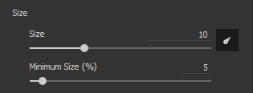
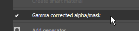
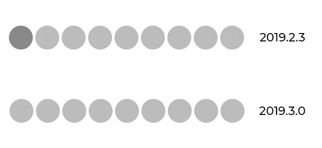
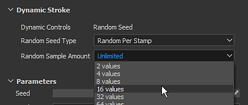
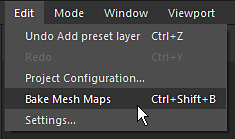
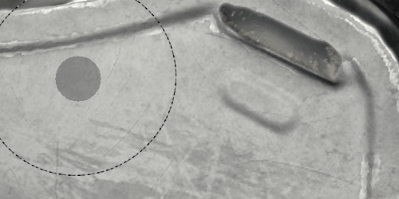

# Version 2019.3

**Substance Painter 2019.3** introduit la prise en charge des paramètres prédéfinis de pinceau Photoshop et l&#39;déplié automatique de vos maillages, ainsi que diverses améliorations de la qualité de vie, telles qu&#39;une meilleure gestion des tablettes graphiques.

Date de publication : *17 décembre 2019*

## Principales fonctionnalités

### Prise en charge de Photoshop Paramètre prédéfini de pinceau (ABR)

Vous pouvez désormais utiliser vos pinceaux Photoshop en Substance Painter. En exportant simplement vos paramètres prédéfinis sous forme de fichier ABR, vous pouvez désormais les importer en tant que paramètres prédéfinis de pinceau normaux. Les paramètres prédéfinis contenus dans des fichiers ABR apparaîtront dans l’Étagère sous forme de paramètres prédéfinis de pinceau individuels.

Si vous n’avez pas de fichiers ABR à importer, vous pouvez en trouver un grand nombre en ligne :

* [Les Paramètres prédéfinis de pinceau de Kyle en Adobe](https://www.adobe.com/products/photoshop/brushes.html)
* [Paramètres prédéfinis de pinceau sur ArtStation](https://www.artstation.com/marketplace?q=photoshop%20brush&sort_by=trending)
* [Paramètres prédéfinis de pinceau sur DeviantArt](https://www.deviantart.com/search?q=photoshop%20brush)
* [Paramètres prédéfinis de pinceau sur Cubebrush](https://cubebrush.co/marketplace?categories=354,57)

Afin de prendre en charge les pinceaux Photoshop, diverses nouvelles fonctionnalités ont été ajoutées aux propriétés de l’outil de peinture :

* **Nouveaux paramètres de taille et de débit minimum**\
  Vous pouvez désormais spécifier la taille minimale et le débit minimal de l’outil lorsque l’option Pression du Stylet est activée. Ce paramètre fonctionne sous la forme d’un pourcentage basé sur la taille/le flux maximal actuellement défini. Ces paramètres sont étalonnés automatiquement lors de l’utilisation d’un paramètre prédéfini de pinceau Photoshop.\
  
* **Nouveaux paramètres de Variation des positions**\
  Afin de respecter le comportement du pinceau Photoshop, nous avons ajouté quelques nouveaux paramètres. Il est désormais possible de définir à quel axe la variation est appliquée et comment les positions aléatoires sont distribuées (choisissez **Uniforme** pour correspondre à Photoshop).\
  \
  
* **Nouveau mode de simulation de transparence**\
  Photoshop ne combine pas les traits de pinceau avec la composition de la Substance Painter. Nous avons donc ajouté un nouveau mode de fusion (Lighten) pour obtenir un résultat plus proche de celui de la peinture. Ce mode de fusion n’accumule pas de manière excessive lorsque les tampons se chevauchent, ce qui peut améliorer la sensation de pression lorsque vous peignez avec une valeur Flux/Opacité faible.\
  \
  
* **Prise en charge de l&#39;arrondi et de la symétrie**\
  Un nouvel Alpha de Substance nommé **Photoshop Brush Maker** a été ajouté pour prendre en charge des paramètres tels que l&#39;arrondi (mise à l&#39;échelle de l&#39;height de l&#39;Alpha) et la symétrie (symétrie d&#39;une image sur les deux axes). Cet Alpha de Substance est automatiquement chargé lorsque vous cliquez sur un paramètre prédéfini de pinceau provenant d&#39;un fichier ABR.\
  \
  
* **Nouvelle correction gamma pour le canal Alpha des calques**\
  Photoshop ne fusionne pas ses traits de pinceau dans l’espace Gamma linéaire, ce qui signifie que les paramètres de fusion et d’opacité risquent de ne pas être corrects lorsque vous peignez avec un paramètre prédéfini de pinceau Photoshop. Il est possible d’activer un nouveau paramètre sur les calques pour qu’il corresponde à ce comportement et applique une correction gamma. Cela aura une incidence sur la valeur alpha utilisée pour la peinture des contours, ainsi que sur la façon dont le masque du calque est utilisé pour la fusion avec d’autres calques. Cependant, les modes de fusion du calque fonctionneront toujours dans l’espace gamma linéaire.\
  Pour **activer ce paramètre**, il vous suffit de cliquer avec le bouton droit de la souris sur un calque et de choisir **Alpha/masque corrigé par gamma**. Une nouvelle icône apparaît en regard du calque pour indiquer quand ce paramètre est activé.\
   \
  
* **Valeur maximale augmentée pour l&#39;Espacement et la Variation des positions**\
  Afin de respecter les paramètres des paramètres prédéfinis de pinceau Photoshop, la valeur maximale des paramètres suivants a été augmentée :

  * **Espacement** : la valeur maximale peut désormais être définie sur 1 000.
  * **Variation des positions** : la valeur maximale peut désormais être définie sur 1 000.

Pour plus d&#39;informations, telles que l&#39;exportation et l&#39;importation de fichiers ABR, consultez la documentation [Photoshop Paramètre prédéfini de pinceau](../../painting/presets/photoshop-brush-presets/photoshop-brush-presets-abr.md).

>[!NOTE]
>
> Tous les paramètres de pinceau Photoshop ne sont pas pris en charge pour le moment. Pour plus d&#39;informations, consultez la [liste de compatibilité](../../painting/presets/photoshop-brush-presets/photoshop-brush-parameters-compatibility.md).

### Améliorations de la prise en charge des tablettes graphiques et de peinture

Outre la prise en charge des paramètres prédéfinis de pinceau Photoshop, de nombreuses améliorations et corrections ont été apportées concernant l’utilisation des tablettes graphiques.

* **Le premier tampon de ligne droite n&#39;est plus doublé**\
  Lorsque vous peignez une ligne droite, le premier tampon n’est plus dupliqué (vous n’avez plus besoin d’annuler votre tampon simplement pour placer la ligne droite).\
  
* **Interpolation de la pression en ligne droite**\
  Les lignes droites prennent désormais en charge la pression. La valeur de pression sera interpolée entre le premier tampon et le dernier tampon.\
  
* **Nouveaux modes d&#39;aperçu du pinceau**\
  L’aperçu du pinceau dans le viewport peut désormais être remplacé par différents modes de visualisation. Pour changer de mode, il suffit de cliquer sur le nouveau bouton déroulant dans la barre d&#39;outils contextuelle.

  
* **Courbes de pression du Stylet**\
  Dans la barre d&#39;outils contextuelle, il est maintenant possible de définir comment la pression du stylet doit être interprétée. Ces nouveaux paramètres contrôlent la vitesse de l’accumulation de pression, qui permet différents styles de peinture.

  * **Linéaire** : pas de transformation, la pression récupérée comme indiqué par le stylet de la tablette graphique. Utilisez ce paramètre au cas où une courbe de pression de Stylet serait déjà définie dans les paramètres Pilotes de tablette.
  * **Accélération** (par défaut) : ralentissez le début de la pression, ce qui facilite la peinture des traits fins ou peu nets.
  * **Décélération** : ralentissez le début de la pression et accélérez sa fin, ce qui facilite la peinture des traits légers ou forts.

  
* **Le bouton de pression n&#39;est plus une liste déroulante**\
  Nous avons modifié les commandes de pression du Stylet pour qu&#39;elles soient de simples boutons d&#39;activation/désactivation. Cela permet d’activer et de désactiver la pression beaucoup plus facilement et plus rapidement.

  
* **Prise en charge améliorée des tablettes graphiques et passage à Windows Ink**\
  Nous avons retravaillé la façon dont nous manipulons les tablettes graphiques. Cela devrait améliorer la compatibilité en général avec les modèles récents de tablettes graphiques et réduire le nombre de problèmes que nous avions dans le passé. Sous Windows, nous avons également basculé vers Windows Ink au lieu de Wintab pour améliorer la compatibilité.

  >[!NOTE]
  >
  > Assurez-vous que vos pilotes Wacom sont à jour et que « Windows Ink » est activé dans les paramètres de la tablette.

### Déplié automatique (Beta)

La Substance Painter va désormais déplier automatiquement les maillages dont les coordonnées UV sont manquantes. Cela permet d&#39;importer n&#39;importe quel type de géométrie et de commencer immédiatement à la peinture. Notre système d&#39;UV générera un Îlot UV par sous-maillage tout en suivant l&#39;affectation du matériau pour Déplier les Jeux de textures. Cette fonctionnalité est actuellement en version Beta et évoluera dans les versions futures. Le Déplié automatique sera uniquement appliqué aux projets qui **n&#39;utilisent pas le workflow UDIM**.

* **Déplié automatique**\
  Par défaut, la Substance Painter génère désormais automatiquement des coordonnées UV pour les maillages qui en sont dépourvus. Cela s’applique à la fois à la création de projet et à la réimportation de maillage. Il est toutefois possible de désactiver ce comportement en accédant aux [paramètres principaux](https://helpx.adobe.com/substance-3d/unlisted/documentation/spdoc/general-71008262.html) et en désactivant l&#39;**activation de l&#39;UV automatique** sous **Options d&#39;importation**.

  
* **Barre de progression Dépliée**\
  Lors de l’importation d’un maillage, une barre de progression s’affiche pour indiquer l’état du processus. Cela inclut également le processus d’UV.

  
* **Problèmes Actuellement Connus**\
  Étant donné que cette nouvelle fonctionnalité est actuellement en version Beta, certains problèmes sont attendus. Reportez-vous aux notes de mise à jour ci-dessous pour obtenir une liste des problèmes actuellement connus. Si l&#39;application crash et produit des résultats incorrects, nous vous suggérons de nous envoyer un rapport de crash ou de bogue via l&#39;application pour nous aider à examiner le problème et à améliorer le processus.

>[!NOTE]
>
> Un nouveau **générateur** a été ajouté à l&#39;Étagère pour vous aider à visualiser le déplié automatique. Pour l&#39;utiliser, il vous suffit de créer un calque, d&#39;ajouter un effet générateur et d&#39;y charger la nouvelle ressource **UV Checker**.

### Améliorations de l’intégration des Substances

Nous continuons à améliorer l’intégration du format de Substance en prenant en charge certaines fonctionnalités attendues depuis longtemps, mais également en améliorant le système existant, tel que la fonctionnalité de contour dynamique.

* **Non serré avec les curseurs de plages souples**\
  Jusqu’à présent, les curseurs exposés du graphe de Substance se comportaient toujours comme s’ils étaient serrés. Cela signifie que les valeurs qui pouvaient être saisies ne pouvaient pas dépasser les valeurs minimale et maximale par défaut définies par le paramètre.

  
* **Prise en charge de l&#39;étape définie dans les paramètres**\
  Les graphes de Substance ayant des paramètres avec une étape définie seront désormais pris en compte lors de l’ajustement du curseur.
* **Précision accrue des chiffres pour les curseurs flottants**\
  Le curseur flottant peut désormais avoir des valeurs d’entrée qui descendent jusqu’à 6 décimales. Ceci est toutefois limité par la précision en virgule flottante, ce qui signifie que la valeur saisie peut être arrondie dans certains cas.
* **Nouveau contrôle de générateur aléatoire avec Traits dynamiques**\
  Il est désormais possible de demander plusieurs valeurs de départ aléatoires dans une plage définie. Cela permet de créer des variations de Substance uniques et aléatoires tout en obtenant de bonnes performances grâce au recyclage de la mémoire cache.\
  Sous le groupe Contour dynamique, basculez le paramètre **Type de valeur prédéfinie aléatoire** sur **Aléatoire par contour** ou **Aléatoire par tampon** pour accéder au nouveau paramètre. La **quantité d&#39;échantillons aléatoires** définit le nombre total de variations de Substance générées. Une fois la quantité sélectionnée générée, des variations aléatoires sont déjà sélectionnées dans l’ensemble.

  
* **Nouvelles données utilisateur Traits dynamiques statiques**\
  Une nouvelle optimisation a été ajoutée qui permet de spécifier quand une Substance peut être considérée comme un trait dynamique. Comme pour l’option Visible If, il est désormais possible d’ajouter des conditions dans le champ userdata pour spécifier sous quelle Substance Painter de condition doit générer de nouvelles variations de Substance avec la fonction Dynamic Stroke. Pour plus d&#39;informations, consultez la [documentation userdata](../../content/creating-custom-effects/user-data.md).
* **Nouvelles données utilisateur pour désigner un nœud de sortie comme masque pour tous les canaux**\
  Il est désormais possible d’ajouter de nouvelles données utilisateur sur un nœud de sortie afin de l’utiliser comme masque alpha pour tous les autres canaux. Ce système est similaire au système **canaux\_Alpha** existant, mais sans qu&#39;il soit nécessaire de créer une nouvelle sortie dédiée dans le graphe de Substance. Pour plus d&#39;informations, consultez la [documentation userdata](../../content/creating-custom-effects/user-data.md).

### Améliorations diverses

Diverses améliorations ont été apportées à la suite de l&#39;application, ce qui devrait faciliter le travail quotidien au sein de la Substance Painter.

* **Objectif viewports indépendants**\
  La mise au point 2D et 3D (raccourci F) a été modifiée avec le comportement suivant :

  * **Placer le curseur sur la Vue 2D** : appuyer sur F permet uniquement de mettre au point la Vue 2D.
  * **Placer le curseur sur la vue 3D** : appuyer sur F permet uniquement de mettre au point la vue 3D.
  * **Souris à l&#39;extérieur des viewports** : appuyez sur F pour mettre au point la vue 2D et 3D.

  {width="400px"}
* **raccourci du clavier et du menu de la fenêtre de Baking**\
  La fenêtre de baking peut être ouverte de deux nouvelles manières différentes :

  * En appuyant sur **Ctrl+Maj+B**.
  * En accédant au menu Modifier et en cliquant sur **Baking Maps de maillage**.

  
* **Défilement des docks et des fenêtres avec Ctrl+Alt+clic gauche sur raccourci**\
  Un nouveau raccourci a été ajouté qui permet de faire défiler les fenêtres et les docks sans avoir besoin de la molette de la souris. Ce raccourci, il est maintenant possible de faire défiler avec le stylet de la tablette graphique.

  
* **Améliorations des performances**\
  En arrière-plan, de nombreuses optimisations ont été mises en place qui devraient améliorer les performances générales de la Substance Painter (des projets d&#39;ouvertures à la peinture).

### Nouveau contenu

Dans cette version, de nombreux nouveaux contenus ont été ajoutés :

* **Exemple de projet « Meet Mat » mis à jour**\
  Mat a été mis à jour avec une nouvelle topologie, ce qui le rend plus convivial avec displacement. Le Map id a été retravaillé pour offrir plus de possibilités de masquage et un nouvel ensemble de Caméras est disponible dans le projet pour offrir de nouveaux angles de vue.

  {width="500px"}
* **Nouveaux filtres**\
  3 nouveaux filtres ont été ajoutés pour faciliter le contenu stylisé :

  * **Bande dessinée MatFx**\
    Ce filtre simule les hachures et les lignes de contour en fonction des entrées fournies (de la base color/diffusion à la courbure).

    
  * **Aquarelle MatFx**\
    Ce filtre simule la peinture aquarelle avec débordement de couleur et absorption du papier en lisant la couleur d’entrée.

    
  * **Peinture à l&#39;huile MatFx**\
    Inspiré du travail d&#39;[Emrecan Cubukcu](https://www.artstation.com/emrecancubukcu), ce filtre lit les informations de couleur à partir de l&#39;entrée et les translate dans des traits de pinceau en fonction de divers paramètres. Plusieurs paramètres prédéfinis sont disponibles pour tester facilement des variantes. Nous vous recommandons de l&#39;associer au filtre **Environnement d&#39;éclairage baké** ou de baker/peinture manuellement les ombres dans vos textures pour maximiser son effet.

    

    

    >[!NOTE]
    >
    > Il s’agit d’un filtre très coûteux dont le calcul peut prendre un certain temps. Lors de l’itération, il est recommandé de désactiver le calque contenant l’effet avant d’ajuster les calques situés en dessous.
* **Nouveaux paramètres prédéfinis de pinceau**

  * **102 paramètres prédéfinis de pinceau Photoshop**\
    Avec l’introduction de la prise en charge des pinceaux dans Photoshop, un nouvel ensemble de paramètres prédéfinis a été inclus pour le présenter. Ces paramètres prédéfinis ont été sélectionnés dans les packs de Kyle T. Webster disponibles sur le [site web Adobe](https://www.adobe.com/products/photoshop/brushes.html).

    {width="500px"}
  * **18 nouveaux paramètres prédéfinis de pinceau**\
    En plus des paramètres prédéfinis de pinceau Photoshop, de nouveaux paramètres prédéfinis plus réguliers ont été ajoutés :

    * Pression Dure De Base
    * Feuille anthracite
    * Cadre complet anthracite
    * Fusain
    * Fusain moyen
    * Fusain naturel
    * Dégradé anthracite
    * Tremblement du contour dense
    * Points ondulés
    * Contour ondulé avec rupture
    * Contours ondulés
    * Flèche de rouleau de peinture
    * Peinture à rouleaux agrafes larges
    * Agrafes À Rouleaux De peinture
    * Piqûres de rouleau de peinture
    * Stripe peinture à rouleaux
    * Peinture longue et étroite de la veine à rouleaux
    * Texte d’avertissement du rouleau de peinture

    {width="500px"}
* **Nouveaux paramètres prédéfinis d&#39;outil**\
  Deux nouveaux paramètres prédéfinis d&#39;outil simulant la peinture de la gouache ont été ajoutés.

  * Gouache Dense.
  * La Gouache S&#39;Est Estompée.

  
* **Nouveaux caractères alphas**\
  Outre les caractères alphanumériques utilisés pour la création des nouveaux paramètres prédéfinis de pinceau (voir ci-dessus), deux nouveaux Alpha importants ont été intégrés :

  * **Photoshop Brush Maker**\
    Ce nouveau graphe de Substance reproduit certains paramètres de pinceau spécifiques disponibles dans Photoshop via la fonction de contour dynamique. Il est possible de contrôler l’arrondi et le retournement ou une image d&#39;entrée. Certains paramètres de variation sont également disponibles pour créer d’autres variations. Ce graphe de Substance est automatiquement inséré dans la section Alpha lorsque vous cliquez sur un paramètre prédéfini de pinceau Photoshop provenant d’un fichier ABR.

    
  * **Rouleau De Peinture Du Créateur De Pinceaux**\
    Ce nouveau graphe de Substance simule un rouleau de Peinture (ou un simple outil en ruban) pour peinture de motifs continus avec des spires sans rupture. Pour faciliter la configuration, examinez les paramètres prédéfinis existants ou reportez-vous à la description du graphe. Nous vous recommandons d&#39;activer le [Retard des souris](../../painting/lazy-mouse.md) pour que le pinceau déroulant dessine correctement sans créer de rupture.

    

    {width="290px"}
* **Nouveau générateur de « Vérificateur d&#39;UV »**\
  Un nouveau générateur appelé « UV checker » a été intégré pour aider à analyser les coordonnées d&#39;UV du maillage. Cela rend les UV générés par notre Déplié automatique plus faciles à UV.

  
* **Nouveau modèle et paramètres prédéfinis d&#39;exportation**

  * **Keyshot 9+**\
    Ce paramètre d’exportation prédéfini rend les textures exportées compatibles avec la nouvelle fonction Keyshot 9, qui simplifie le chargement et l’affectation des textures et des matériaux. Pour plus d&#39;informations, consultez la [documentation Keyshot](https://luxion.atlassian.net/wiki/spaces/K9M/pages/1124335675/Material+Importer).
  * **Spark AR Studio**\
    Ce nouveau modèle de projet et ce paramètre prédéfini d&#39;exportation facilitent l&#39;utilisation de [Spark AR Studio](https://sparkar.facebook.com/ar-studio/).

>[!WARNING]
>
> * Cette version ne prend plus en charge MacOS 10.11 (El Capitan).
> * Cette version ne prend plus en charge CentOS 6.x.
> * Sous CentOS 7.5 (ou version antérieure), l&#39;application peut ne pas démarrer en raison de problèmes de dépendance. Pour résoudre ce problème, mettez à jour le système ou copiez la [bibliothèque suivante](https://centos.pkgs.org/7/centos-x86_64/freetype-2.8-12.el7.x86_64.rpm.html) dans le dossier d&#39;installation.

## Notes de mise à jour

### 2019.3.3

*(Publié Le 6 Février 2020)*\
Résumé : **Correctif avec mise à niveau vers Iray 2019.3**

**Ajouté :**

* Mettre à niveau vers Iray 2019.3
* [Log] Indiquer un bios obsolète pour le processeur Ryzen entraînant un crash lors du baking
* [ABR] Extraire les caractères alphanumériques ABR vers l’étagère

**Fixe :**

* [Baker] Le Baking échoue si le maillage High-poly n&#39;a pas de rayons UV
* [Linux] Les raccourcis de souris personnalisés ne sont pas enregistrés
* [Pinceau] Le contour disparaît avec certaines formes alpha
* [Tablette] Mauvaise détection lors du déplacement des curseurs
* [Raccourcis] Impossible de configurer un raccourci avec « Ctrl+Alt+Clic de souris »
* [Étagère] Impossible de voir l’info-bulle des ressources lors de l’utilisation d’une tablette stylet
* [vue 2D][Exporter] Le paramètre prédéfini vue 2D ne prend pas en compte les informations normales
* Blocage lorsque vous peignez en alignement UV avec certains pinceaux
* Peindre sous un filtre crée un artefact sur le contour continu
* [Viewport] Cache de texture incorrect dans le viewport après la réimportation d&#39;un maillage
* [Crash] Erreur lors de l’enregistrement après l’exportation vers Photoshop
* [Crash] Écriture de symboles spéciaux dans le préfixe lors de l’importation de ressources
* [Crash] Cliquez sur la référence dans Propriétés du point d’ancrage
* [Points d’ancrage] Le canal ne se met pas à jour lorsqu’il existe un filtre entre le point d’ancrage et la référence
* Le lien d’URL d’Iray dans le menu Aide ne fonctionne pas

**Problèmes Connus :**

* [UV] Le traitement des maillages à poly élevé peut prendre beaucoup de temps
* [UV] Les Vertex situés exactement aux mêmes coordonnées sont fusionnés
* [UV] La génération d&#39;UV peut échouer sur certaines parties du maillage dans de rares cas
* [UV] Rapport texel non uniforme ou fortement déformé dans un seul Îlot UV dans certains cas
* [UV] Rapport texel non uniforme entre les Jeux de textures
* [UV] Les Îlots UV générés peuvent être très allongés et ne s&#39;intègrent pas dans l&#39;espace UV dans certains cas
* [UV] Les faces dégénérées ou les faces de maillage non triangulaires avec des bords petits ou qui se chevauchent peuvent ne pas être dépliées

### 2019.3.2

*(Publié Le 21 Janvier 2020)*\
Résumé : **Correctif**

**Fixe :**

* L’ouverture d’un projet enregistré en mode canal solo n’affiche pas le maillage
* Le viewport n’est pas toujours mis à jour lorsque vous peignez sous le calque à l’aide de l’outil de duplication

**Problèmes Connus :**

* [Bakers] Crash lié au multi-threading sur les CPU Ryzen
* [UV] Le traitement des maillages à poly élevé peut prendre beaucoup de temps
* [UV] Les Vertex situés exactement aux mêmes coordonnées sont fusionnés
* [UV] La génération d&#39;UV peut échouer sur certaines parties du maillage dans de rares cas
* [UV] Rapport texel non uniforme ou fortement déformé dans un seul Îlot UV dans certains cas
* [UV] Rapport texel non uniforme entre les Jeux de textures
* [UV] Les Îlots UV générés peuvent être très allongés et ne s&#39;intègrent pas dans l&#39;espace UV dans certains cas
* [UV] Les faces dégénérées ou les faces de maillage non triangulaires avec des bords petits ou qui se chevauchent peuvent ne pas être dépliées

### 2019.3.1

*(Publié Le 20 Décembre 2019)*\
Résumé : **Correctif**

**Fixe :**

* Crash lorsque vous travaillez sur des maillages avec des Projections UV spécifiques
* [ABR] Crash lors du basculement entre les paramètres prédéfinis Photoshop
* [Linux] Impossible de démarrer la Substance Painter sur CentOS 7.4 en raison d&#39;un problème de dépendance libGLX
* [Bakers] Crash lors du baking après avoir utilisé Fichier > Nettoyer
* [Baker] La boîte de dialogue de progression du Baking se bloque après l’annulation
* [Baker] Le maillage de Baking après exportation des textures ne fonctionne pas
* [Bakers] Utilisation des résultats « Correspondance par nom » avec des Maps de maillage noires
* [Bakers] Cage non prise en compte
* [Étagère] L’importation de fichiers PSD entraîne des images rompues
* [Exemple] L’exemple de projet « Mat » a des caméras défectueuses et un paramètre prédéfini d’exportation incorrect

**Problèmes Connus :**

* [Bakers] Crash lié au multi-threading sur les CPU Ryzen
* [UV] Le traitement des maillages à poly élevé peut prendre beaucoup de temps
* [UV] Les Vertex situés exactement aux mêmes coordonnées sont fusionnés
* [UV] La génération d&#39;UV peut échouer sur certaines parties du maillage dans de rares cas
* [UV] Rapport texel non uniforme ou fortement déformé dans un seul Îlot UV dans certains cas
* [UV] Rapport texel non uniforme entre les Jeux de textures
* [UV] Les Îlots UV générés peuvent être très allongés et ne s&#39;intègrent pas dans l&#39;espace UV dans certains cas
* [UV] Les faces dégénérées ou les faces de maillage non triangulaires avec des bords petits ou qui se chevauchent peuvent ne pas être dépliées

### 2019.3.0

*(Publié Le 17 Décembre 2019)*\
Résumé : **version majeure avec amélioration de l’expérience utilisateur en peinture à la main, utilisation des tablettes, UV automatique en version bêta (0.3.0) et divers nouveaux contenus pour la peinture à la main**

**Ajouté :**

* Intégration de l’UV automatique de la version 0.3.0 dans Substance Painter
* [UV] déplié automatique en Substance Painter lorsqu&#39;aucun UV n&#39;est présent ou des UV partiels sont dépliés
* [UV] Un paramètre global pour l’activer et le désactiver
* [UV] Version consignée dans le fichier journal
* [UV][Interface utilisateur] Indiquer la progression de l’UV
* [UI] Nouveaux paramètres dans la barre d’outils contextuelle pour sélectionner l’aperçu du pinceau : aperçu complet, contour du pinceau et réticule
* [Outil] Nouveau mode de fusion avancé dans la section alpha : Lighten (maximum) en plus de Normal
* [Pile de calques] Option de correction gamma par calque pour alpha ou masque (menu contextuel)
* [Pile de calques][Interface utilisateur] Ajouter une icône « i » lorsque le gamma d’un calque alpha est corrigé
* [Tablette][Outil] Exposez une pression minimale pour la taille et le débit
* [Tablette][Interface utilisateur] Nouveau paramètre dans la barre d’outils contextuelle pour sélectionner la pression de la courbe : linéaire, facile à entrer, facile à sortir
* [Tablette][UX] Ajouter Ctrl+Alt+clic pour faire défiler
* Importation de paramètres prédéfinis de pinceau Photoshop (format ABR)
* [ABR] Prise en charge des paramètres de forme
* [ABR] Prise en charge des paramètres de dynamique de forme
* [ABR] Prise en charge des paramètres de transfert
* [ABR] Prise en charge des paramètres de diffusion
* [ABR][Traits dynamiques] Prise en charge de l’arrondi et de la symétrie
* [ABR][Étagère] Exposer la structure du dossier des pinceaux dans l’éditeur de filtres
* [ABR][Étagère] Icône Ajouter Photoshop dans les vignettes
* [ABR][Étagère] Ajoutez la liste des paramètres non pris en charge dans la vignette détaillée ABR
* [Outil][Traits dynamiques] Nouveau paramètre de contour dynamique pour contrôler le nombre de valeurs aléatoires à générer
* [Outil][Interface utilisateur] Ajouter de nouveaux paramètres de distribution et d’axe pour la variation de diffusion
* [Raccourci] Ajouter Ctrl + Maj + B pour ouvrir la fenêtre de Baking
* [UI][Menu] Ajoutez une entrée dans le menu « Modifier » pour ouvrir la fenêtre de Baking
* [UI][Paramètres] Amélioration de l’alignement de la liste des raccourcis
* [UI] Remplacement des icônes de contrôle de pression (taille et débit) par des boutons d’activation/de désactivation
* [Viewport] Permettre de mettre au point le viewport 2D et 3D séparément
* Mise à jour de QT 5.12.5
* [UI] Indiquer la progression du chargement du maillage
* [Substance] Ajout de la prise en charge pour la plage non serrée et souple avec les curseurs
* [Substance] Augmentez la précision des paramètres de Substance jusqu’à 6 décimales
* [Substance] Prendre en compte l&#39;étape définie par un paramètre
* [Substance] Optimisation de la génération de contour dynamique avec prise en charge des conditions dans les données utilisateur
* [Substance] Permettre de désigner une sortie du graphe comme masque pour tous les canaux via les données utilisateur
* [Contenu] Mettez à jour le projet d’exemple « Mat » avec une topologie adaptée au displacement, un nouveau Map id et de nouvelles caméras
* [Contenu] Intégrez 3 nouveaux filtres (MatFx) : BD, aquarelle, Peinture à l’huile (inspirée du travail d’Emrecan Cubukcu)
* [Contenu] Intégrez 102 paramètres prédéfinis de pinceau Photoshop provenant des packs de Kyle T. Webster
* [Contenu] Intégrez 18 nouveaux paramètres prédéfinis de pinceau : Peinture Roller Arrow, Peinture Roller Warning text, Charcoal Fine et plus encore
* [Contenu] Intégrez 9 nouveaux caractères alphanumériques : rouleau de Peinture Brush Maker, Photoshop Brush Maker, motifs de pinceau et plus encore
* [Contenu] Intégrer 2 nouveaux paramètres prédéfinis d&#39;outil : Gouache Dense et Gouache Faded
* [Contenu] Intégrer 1 nouveau générateur : UV checker (mettre en évidence les Îlots UV et les seams)
* [Contenu] Intégration de 2 nouveaux paramètres prédéfinis d’exportation : Keyshot 9+ et Spark AR Studio
* [Contenu] Intégrer 1 nouveau modèle de projet : Spark AR Studio (Facebook)

**Fixe :**

* [Tablette] L’annulation des contours du stylet (Ctrl+Z) entraîne plus de décalage que l’annulation des contours de la souris
* [Tablette] Les pressions de début et de fin ne sont pas prises en compte pour tracer une ligne droite
* [Tablette] Le premier tampon est dessiné deux fois en ligne droite
* [Tablette] Prise en charge améliorée des raccourcis de tablette Huion
* [Tablette] Amélioration de la prise en charge des boutons de stylet Huion
* [Tablette] Décalage entre l’aperçu du pinceau et le tampon dessiné
* [Tablette] Les raccourcis permettant de modifier les pinceaux avec stylet entraînent dans de rares cas des performances réduites
* [Tablette] Décalage lors de la peinture sur un calque spécifique
* Des textures floues peuvent survenir dans de rares cas lors du changement de viewport
* [UI][Substance] Les entrées d’image ne sont pas toujours affichées
* Nettoyer ne supprime pas les paramètres prédéfinis importés dans un projet depuis l’étagère
* [Outil][Contour dynamique] Problème de performances lors de l’ajustement du nombre de cycles de tampons
* Problèmes d’actualisation lors de la peinture en mode viewport 3D/2D dans de rares cas
* Peindre un trait très long peut entraîner un gel
* [Outil] Problème de performances lors de la peinture avec des traits dynamiques spécifiques
* [UI] La barre d’outils contextuelle affiche toujours les propriétés du pinceau lors de la sélection d’un dossier
* Les valeurs d’axe de symétrie ne sont pas réinitialisées
* L’importation de textures EXR avec des valeurs de point flottant est entièrement noire
* Alt+clic sur un canal à isoler ne fonctionne pas pour le filtre et le générateur
* [Export] crashs de projet spécifiques à l&#39;export
* [Substance] Valeur par défaut incorrecte dans la liste déroulante si le paramètre est masqué par Visible Si
* [Shader] Les canaux définis par l’intermédiaire du calque de Matériaux ne sont pas triés de la même manière dans l’interface utilisateur
* [Étagère] Les métadonnées des paramètres prédéfinis ne sont pas enregistrées sur le disque

**Problèmes Connus :**

* [UV] Le traitement des maillages à poly élevé peut prendre beaucoup de temps
* [UV] Les Vertex situés exactement aux mêmes coordonnées sont fusionnés
* [UV] La génération d&#39;UV peut échouer sur certaines parties du maillage dans de rares cas
* [UV] Rapport texel non uniforme ou fortement déformé dans un seul Îlot UV dans certains cas
* [UV] Rapport texel non uniforme entre les Jeux de textures
* [UV] Les Îlots UV générés peuvent être très allongés et ne s&#39;intègrent pas dans l&#39;espace UV dans certains cas
* [UV] Les faces dégénérées ou les faces de maillage non triangulaires avec des bords petits ou qui se chevauchent peuvent ne pas être dépliées
* L’exemple Metmat présente des problèmes avec les caméras importées
