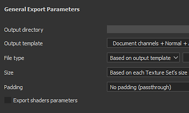
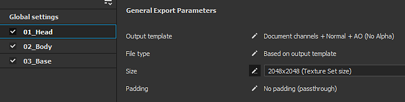
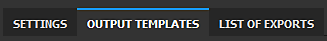
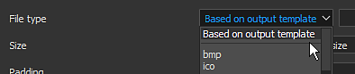

# Version 2020.1 (6.1.0)

**Substance Painter 2020.1 (6.1.0)** offre un tout nouvel exportateur, des scripts python, un nouveau boulanger de courbures, du nouveau contenu et de nombreuses autres améliorations de workflow.

Date de publication : *22 avril 2020*

>[!NOTE]
>
> À partir de cette version, le numéro de version de l’application commencera à changer de format. **2020.1** devient désormais **6.1.0**.

## Principales fonctionnalités

### Nouvelle fenêtre Exporter la texture

La fenêtre d’exportation a été entièrement remaniée pour offrir un moyen plus simple et plus facile de configurer et d’exporter des textures à partir d’un projet. Il apporte également de nouvelles fonctionnalités qui rendent l&#39;exportation beaucoup plus pratique. La nouvelle fenêtre d’exportation est désormais divisée en trois onglets :

**Paramètres**

Cet onglet permet de définir les paramètres généraux et spécifiques de chaque ensemble de textures.

* **Nouveaux paramètres généraux**\
  Les paramètres généraux sont un ensemble de paramètres partagés entre tous les ensembles de textures. Ils peuvent être utilisés pour attribuer ou mettre à jour rapidement des paramètres sans avoir à modifier manuellement chaque ensemble de textures individuellement. Les paramètres généraux ont les paramètres suivants :

  * **Répertoire de sortie** : définit l&#39;emplacement cible où les textures seront générées.
  * **Modèle de sortie** : définit le paramètre prédéfini à utiliser pour configurer le nom et le packing des textures exportées.
  * **Type de fichier** : définit le format de fichier et le nombre de bits par pixel des textures exportées.
  * **Taille** : définit la plus grande résolution de texture à laquelle un ensemble de textures sera exporté.
  * **Remplissage** : définit la façon dont les informations en dehors des Îlots UV seront générées.
  * **Exporter les paramètres des nuanceurs** : si cette option est activée, exporte un fichier json contenant les paramètres de nuanceur et leurs affectations de jeux de textures.

  
* **Paramètres et paramètres remplacés par ensemble de textures**\
  Sous les Paramètres généraux se trouve la liste des Ensembles de textures du projet actuellement ouvert. La section Paramètres généraux d&#39;exportation affiche les paramètres hérités des paramètres généraux. Il est également possible de choisir un autre **paramètre prédéfini d&#39;exportation par ensemble de textures**.

  

  Cliquer sur l&#39;icône Plume permet de remplacer un paramètre spécifique pour modifier sa valeur. En cliquant à nouveau dessus, vous désactivez le remplacement et réinitialisez la valeur par défaut (héritée des Paramètres généraux).

  
* **Choix des textures à exporter**\
  Sous les paramètres d’exportation Ensembles de textures se trouve une liste des textures qui seront générées. Avec cette liste, il est possible de choisir précisément quel fichier doit être généré en les cochant ou en les décochant. La liste affiche également le format de fichier et le nombre de bits par pixel de chaque texture, hérités de la configuration d’exportation ou du modèle de sortie. Utilisez l’icône de plume pour remplacer le format de fichier et le nombre de bits par pixel d’une texture spécifique.
* **Enregistrer les paramètres sans exporter**\
  Il est désormais possible d&#39;enregistrer la configuration d&#39;exportation du projet sans avoir à exporter les textures à l&#39;aide du nouveau bouton **Enregistrer les paramètres**. Cette option est utile lorsque vous souhaitez ajuster un projet sans régénérer les textures, ce qui peut prendre un certain temps.

  
* **Cliquez et faites glisser pour activer/désactiver rapidement les exportations**\
  Cliquez et faites glisser la souris pour activer ou désactiver rapidement les ensembles de textures et les textures :

  

  

**Modèles de sortie**

Cet onglet permet de créer des paramètres prédéfinis de configuration pour nommer les textures exportées.

* <b>Créer des paramètres prédéfinis d&#39;exportation</b>\
  L&#39;onglet <b>Modèle de sortie</b> est identique à l&#39;onglet <b>Configuration</b> de l&#39;ancien exportateur. Il peut être utilisé pour créer des paramètres prédéfinis d’exportation afin de nommer et d’emballer rapidement des textures. Pour savoir comment créer des paramètres prédéfinis d’exportation personnalisés, consultez notre page de documentation.
* **Configurer le format de fichier et le nombre de bits par pixel dans les paramètres prédéfinis d&#39;exportation**\
  Un nouvel ajout aux paramètres prédéfinis d’exportation est la possibilité de définir le format de fichier et le nombre de bits par pixel par texture pour faciliter encore davantage le partage d’une configuration entre les projets.

  
* **Contrôler les textures exportées du modèle de sortie**\
  Lors de la configuration du processus d&#39;exportation, utilisez la nouvelle option **D&#39;après le modèle de sortie** pour définir les propriétés de texture à partir du paramètre prédéfini d&#39;exportation.

  

**Liste des exportations**

Cet onglet affiche le processus d’exportation en cours ainsi qu’un récapitulatif global de toutes les textures exportées.

* **Liste des textures exportées**\
  L’onglet répertorie chaque texture individuelle à exporter par ensemble de textures, en tenant compte des paramètres remplacés et des textures ignorées/exclues. C’est un bon moyen de s’assurer que tout va bien avant de lancer le processus d’exportation. L’interface bascule automatiquement vers cet onglet lorsque le processus d’exportation démarre.

  
* **Processus d&#39;exportation et journalisation**\
  À droite de l’onglet se trouve une console qui affiche des détails sur le processus d’exportation en cours. Elle indique quelles textures ont été exportées avec succès, ainsi que les avertissements et les erreurs. La partie inférieure de l’interface affiche également une barre de progression qui indique l’état actuel du processus :

  

  

### Nouveau mode de calque de décalcomanie

Un nouveau mode **Décalcomanie** est disponible lorsque vous faites glisser et déposez une matière à partir des [Actifs](../../interface/assets/assets.md). Il crée un nouveau calque de remplissage en mode **Projection planaire** qui permet de positionner plus facilement les motifs et les images. Pour l&#39;utiliser, il vous suffit de **glisser-déposer** n&#39;importe quel matériau de l&#39;étagère tout en appuyant sur le **raccourci clavier ALT** pour prévisualiser le manipulateur et relâcher la souris une fois que la décalcomanie est là où vous souhaitez qu&#39;elle soit. Lorsque vous relâchez le bouton de la souris, un nouveau calque de remplissage est créé.

Pour cette occasion, nous avions également inclus 5 décalcomanies dans l&#39;étagère par défaut sélectionnée dans Substance Source. Si vous souhaitez en savoir plus sur ce nouveau workflow de décalcomanie, consultez [cet article](https://magazine.substance3d.com/effortless-grunge-look-with-new-substance-source-parametric-decals/).

>[!NOTE]
>
> Pour faciliter l&#39;utilisation des décalcomanies, nous avons implémenté un nouveau [mot-clé de données utilisateur](../../content/creating-custom-effects/user-data.md) qui permet de spécifier le mode de fusion par défaut pour chaque canal lors de la création de calques.

### Nouveau script Python

Il est désormais possible d&#39;écrire et d&#39;exécuter des scripts et des modules **Python** avec Substance Painter. Nous avons intégré Python 3.7 et PySide2 à Substance Painter, nous fournissons également une API Python personnalisée via le module **substance\_painter** dédié. En outre, nous avons saisi cette occasion pour repenser notre API à partir de la version JavaScript afin de la rendre plus claire et plus facile à utiliser. Ils partagent des similitudes qui devraient simplifier la création de plug-ins Python pour les utilisateurs existants.

Pour en savoir plus sur l’API Python, consultez la documentation accessible via le menu Aide de l’application.

* **Installation d&#39;un module Python**\
  Les modules Python peuvent être installés dans le dossier Documents dédié sous le compte d’utilisateur, mais nous fournissons également un moyen d’ajouter des emplacements de chemin supplémentaires via une variable d’environnement dédiée pour faciliter la configuration dans un studio.
* **Sous-modules Substance Painter Python**\
  Les sous-modules suivants ont été présentés (d’autres seront disponibles à une date ultérieure) :

  * substance\_painter.display
  * substance\_painter.event
  * substance\_painter.exception
  * substance\_painter.export
  * substance\_painter.logging
  * substance\_painter.project
  * substance\_painter.resource
  * substance\_painter.textureset
  * substance\_painter.ui
* **Interprète Python**\
  Une nouvelle fenêtre de console Python est disponible pour tester les modules et/ou exécuter des scripts Python :

  {width="500px"}

### Boulangers améliorés

Dans cette version, le boulanger Courbure a été amélioré et le boulanger Occlusion ambiante a obtenu quelques nouveaux paramètres.

* <b>Nouvelle courbure du baker de maillage</b>\
  L&#39;ancienne boulangerie de courbure est maintenant obsolète et a été remplacée par la nouvelle version « à partir du maillage » qui a été récemment ajoutée à la Substance Designer. Pour en savoir plus sur les nouveaux paramètres de boulangerie, consultez la page de documentation.\
  Le nouveau boulanger présente les caractéristiques suivantes :

  * <b>Plus de précision</b> : la courbure calculée est beaucoup plus précise et produit des valeurs réalistes.
  * <b>Contact de maillage</b> : l&#39;interpénétration entre les maillages produit désormais des informations de courbure (ce qui n&#39;était pas le cas avec le boulanger précédent).
  * <b>Maillage polyvalent</b> : les détails sont désormais cuits à partir du maillage polyvalent directement au lieu d&#39;être convertis à partir de la carte normale.
  * <b>Performances</b> : le nouveau boulanger utilise le lancer de rayons pour calculer les détails, ce qui signifie qu&#39;il bénéficie de l&#39;accélération du GPU raytracing (RTX/Optix).

  {width="500px"}

  Il est toujours possible d&#39;accéder à l&#39;ancien baker de courbure pour des raisons de compatibilité via les paramètres du baker de courbure. Choisissez le paramètre **Générer à partir de la carte normale** pour utiliser l&#39;ancien boulanger.

  
* <b>Amélioration De L&#39;Occlusion Ambiante</b>\
  Ambient Occlusion baker a été amélioré pour prendre en charge de nouveaux paramètres :

  * <b>Plan au sol</b> : simule un plan sous le filet pour créer une ombre provenant du sol. Pour plus d’informations, voir la documentation de l’Occlusion ambiante.
  * <b>Ignorer l&#39;arrière-plan</b> : un nouveau suffixe de nom de maillage permet d&#39;ignorer un objet spécifique lors de la cuisson de l&#39;Occlusion ambiante. Par exemple, cela permet d&#39;ignorer les détails de géométrie flottante. Pour plus d’informations, consultez la documentation de Correspondance par nom

  {width="500px"}

### Amélioration de l’exportation du maillage (avec facettisation)

Le filet d’exportation a été amélioré avec de nouvelles fonctionnalités et de nouveaux paramètres :

* **Exporter la topologie de maillage d&#39;origine ou exporter le maillage avec facettisation**\
  Lors de l’exportation du filet, il est désormais possible d’appliquer la facettisation générée pour les effets de displacement. Les paramètres possibles sont les suivants :

  * **Sans displacement/facettisation** : exportez le filet de base sans subdivisions de filet. Si l&#39;option **Appliquer la triangulation** est désactivée, les triangles, quads ou n-gons du maillage d&#39;origine sont exportés.
  * **Avec displacement/facettisation** : exportez le filet avec des subdivisions. Si l&#39;option **Recalculer les normales des sommets** est activée, les normales du maillage seront ajustées pour correspondre aux décalages du displacement.

  
* **Hiérarchie de scène et noms de maillage**\
  La hiérarchie de scène d’origine et les noms d’objets du filet importé sont désormais conservés et appliqués de nouveau au filet exporté.
* **Exporter au format de fichier FBX**\
  Le maillage du projet peut désormais être exporté au format FBX, avec d’autres formats de fichiers.\
  **Remarque** : les données incompatibles avec la Substance Painter sont toujours ignorées lors de l&#39;importation (par exemple : peau, liaisons).

### Amélioration du déballage UV automatique

Le déballage UV automatique peut désormais être plus facilement contrôlé à l’aide de nouveaux paramètres :

* **Utiliser le déballage UV automatique lors de la création du projet**\
  Lors de la création d’un projet, un nouveau paramètre permet désormais d’activer ou de désactiver le nouveau processus de déballage UV automatique. Ce paramètre est également disponible lors de la réimportation d’un filet 3D dans un projet existant.

  
* <b>Paramètres avancés de déballage</b>\
  À côté de la case à cocher pour activer le déballage UV automatique se trouve un nouveau bouton <b>Options</b>. Cela ouvre une nouvelle fenêtre avec des paramètres avancés pour contrôler le processus de déballage, ce qui permet de préserver les informations de maillage existantes à différentes parties du processus au lieu de toujours recalculer tout comme auparavant. Pour plus d’informations, voir la documentation dédiée. Les paramètres actuels sont :

  * <b>Coutures</b> : définit si les coutures existantes sont préservées ou régénérées.
  * <b>Îlots UV</b> : définit si le déballage UV existant est conservé ou régénéré.
  * <b>Packing</b> : définit si le packing d&#39;Îlot UV est conservé ou régénéré.
  * <b>Taille de la marge</b> : définit l&#39;espacement entre chaque Îlot UV (pourcentage).

  

### Nouveau contenu

Dans cette version, nous avons inclus quelques nouveaux matériaux et mis à jour un grand nombre de nos paramètres prédéfinis d’exportation pour qu’ils correspondent aux nouvelles versions du logiciel.

* **5 nouveaux matériaux de décalcomanie**\
  Nous avons ajouté 5 nouveaux matériaux provenant directement de Substance Source pour tester la nouvelle fonction de décalcomanie :

  * Fuites de Rouilles importantes
  * Acarospora Lichen Moyen
  * Peu De Fuites De Sang
  * Impacts de petites balles sur le mur en béton
  * Étiquette de peinture pulvérisée

  
* <b>Nouveau nuanceur Vray, modèles de projet et paramètres prédéfinis d&#39;exportation</b>\
  En collaboration avec [Chaos Group](https://www.chaosgroup.com/), nous avons intégré deux nouveaux shaders qui répliquent les comportements VrayMtl. Ils doivent fournir un aspect plus précis lors de la tentative de correspondance des rendus effectués avec Vray. Utilisez les modèles de projet pour configurer facilement tout nouveau projet pour Vray. Consultez la documentation pour en savoir plus.

  
* <b>Nouveaux modèles de projet Maxwell et paramètres prédéfinis d’exportation</b>\
  En collaboration avec [Next Limit](http://www.nextlimit.com/), nous avons intégré de nouveaux modèles de projet et des paramètres prédéfinis d&#39;exportation pour le rendu Maxwell.
* **Paramètres prédéfinis d&#39;exportation mis à jour**\
  De nombreux paramètres prédéfinis d’exportation ont été mis à jour, principalement pour utiliser le nouveau format de fichier et les nouveaux paramètres de nombre de bits par pixel, mais également pour correspondre aux nouvelles versions du logiciel.

## Tutoriels

Consultez nos nouveaux tutoriels vidéo couvrant les nouvelles fonctionnalités :

## Notes de mise à jour

### 2020.1.3

*(Publié Le 16 Juin 2020)*\
Résumé : **Correctif**

**Ajouté :**

* [Export] Ajout de paramètres de displacement dans le fichier json des paramètres du nuanceur

**Fixe :**

* [Blocage]&#x200B;[Moteur] Blocage lors de la tentative d’effacement et de remplacement de canaux existants
* [Crash] Changement de l’ombrage après avoir peint un masque dans un calque de matériau
* [Blocage]&#x200B;[Moteur] Blocage avec certains projets lourds
* [Bakers] La correspondance par nom ne fonctionne pas avec les OBJ exportés depuis zBrush
* [Displacement]&#x200B;[SVT] Les textures ne s’affichent pas à l’ouverture du projet lorsque le displacement est activé
* [Export] Certaines textures sont exportées en gris uniforme
* [Export] Les ensembles de textures désactivés ne doivent pas être exportés pour les paramètres prédéfinis d&#39;exportation Dimension et Sketchfab
* [Script]&#x200B;[JavaScript] Blocage lors de l’utilisation de l’API JavaScript pour accéder à la configuration d’exportation dans l’événement onProjectOpened
* [Scripting]&#x200B;[JavaScript] onExportFinished() n’est pas appelé après une exportation

### 2020.1.2

*(Publié Le 28 Mai 2020)*\
Résumé : **Correctif de bug avec mise à jour de Substance Engine et Bakers**

**Ajouté :**

* [Bakers] Mise à jour vers la version la plus récente
* [Boulangers] Nouvelle méthode d&#39;échantillonnage en Occlusion ambiante, Courbure, Thickness boulangers
* Mise à jour vers la version la plus récente de la Substance Engine
* [Scripting]&#x200B;[Python] Autoriser la création de ResourceID pour les ressources du projet
* [Scripting]&#x200B;[Python] Autoriser l&#39;interrogation des informations de canal
* [Scripting]&#x200B;[Python] Ajout de fonctions dryrun et callback pour simuler l’exportation de texture

**Fixe :**

* [Bakers] Normales incorrectes dans World Space Normals baker utilisant une carte de normales de tangente dans des cas spécifiques
* [Boulangers] Erreur de cuisson Occlusion ambiante avec Optix quand aucun poly élevé
* [Traits dynamiques] Décalage lors du chargement d’un ensemble de textures spécifique
* [Export] Ne doit pas exporter les ensembles de textures désactivés pour USD, glTF
* [Scripting]&#x200B;[JavaScript] Impossible de modifier les nouveaux paramètres de Curvature Baker
* [Scripting]&#x200B;[JavaScript] alg.texturesets.addChannel() ne renvoie pas d’erreur dans certains cas
* [Script]&#x200B;[JavaScript] Erreur typographique dans la documentation de l’API JavaScript pour setProjectExportOptions()
* [Scripts]&#x200B;[JavaScript] Exporte toujours tous les jeux de textures
* [Scripting]&#x200B;[Python] sys.executable renvoie un chemin vers python.exe au lieu de Substance Painter
* Cache de texture non compatible avec le système d’exploitation Mac et Windows/Linux
* [Livelink UE4] Seule la dernière matière est utilisée pour tous les ensembles de textures d’un filet combiné

**Problèmes Connus :**

* [Export]&#x200B;[Dimension]&#x200B;[Skecthfab] Ne doit pas exporter les ensembles de textures désactivés
* [Crash] Changement de l’ombrage après avoir peint un masque dans un calque de matériau

### 2020.1.1

*(Publié Le 5 Mai 2020)*

**Ajouté :**

* [Export] Commentaires visuels d&#39;état remplacés sur TextureSet

**Fixe :**

* [Export] La taille de la fenêtre de l’exportateur est trop grande sur un moniteur à résolution spéciale et ne peut pas être redimensionnée
* [Exportation] Les options ne sont pas enregistrées après l’exportation
* [Exportation] Blocage ou impossible d’exporter avec le paramètre prédéfini d’exportation « à partir du cache »
* [Exportation] L’annulation de l’exportation génère un mappage vide supplémentaire inattendu
* [Exportation] Correction des paramètres prédéfinis d’exportation virtuelle
* [Python] La variable env. PYTHONPATH n&#39;est pas prise en compte
* [Python]&#x200B;[Exportation] L’annulation de l’exportation via Python renvoie une erreur d’exception
* [Python]&#x200B;[Export] export\_project\_textures résultat incorrect avec le format de fichier psd

**Problèmes Connus :**

* [JavaScript] Impossible de modifier les nouveaux paramètres de Curvature Baker
* [JavaScript]&#x200B;[Exporter] Exporte toujours tous les jeux de textures
* [Bakers] Crash sur Linux avec GPU raytracing
* [Export]&#x200B;[USD] Ne doit pas exporter les ensembles de textures désactivés

### 2020.1.0

*(Publié Le 22 Avril 2020)*

**Ajouté :**

* Nouvel exportateur de textures et de filets
* [Export] Nouvelle interface d&#39;exportation
* [Exporter]&#x200B;[Onglet Exporter] Autoriser la sélection des couches de mappages exportées par ensemble de textures
* [Exporter]&#x200B;[Onglet Exporter] Permet de modifier la taille de l&#39;ensemble de textures en une seule action
* [Exporter]&#x200B;[Onglet Exporter] Autoriser un modèle différent par ensemble de textures (sauf USD, glTF, Sketchfab et Dimension)
* [Exporter]&#x200B;[Onglet Exporter] Activation et désactivation rapides des cartes et des ensembles de textures
* [Exportation]&#x200B;[Onglet Exportation] La résolution d’exportation 8 192 x 8 192 n’est plus expérimentale
* [Exporter]&#x200B;[Onglet Exporter] Autoriser la modification du format de fichier et du nombre de bits par pixel par mappage
* [Exporter]&#x200B;[Onglet Exporter] Autoriser la réinitialisation des valeurs des paramètres par défaut
* [Exporter]&#x200B;[Onglet Exporter] Autoriser l’enregistrement des paramètres sans exportation
* [Exporter]&#x200B;[Onglet Modèles de sortie] Renommez l’onglet Configuration en onglet Modèles de sortie
* [Exporter]&#x200B;[Onglet Modèles de sortie] Autoriser la définition du format de fichier et du nombre de bits par pixel par mappage prédéfini
* [Exportation]&#x200B;[Onglet Liste des exportations] Nouvel onglet Aperçu pour résumer et afficher le processus d’exportation
* [Importer/Exporter le maillage] Optimisation des performances du temps d’importation/exportation
* [Exporter le filet] Exporter le filet dans FBX
* [Exporter le filet] Exporter le filet avec le displacement et la facettisation
* [Exporter le filet]&#x200B;[Interface utilisateur] Nouveaux paramètres pour recalculer le sommet normal, appliquer la triangulation
* [Exporter le filet] Exportez la topologie de filet d&#39;origine avec les nouveaux UV générés par le déballage automatique.
* Mise à jour du déballage UV automatique avec plus de commandes
* [Dépliant UV]&#x200B;[Interface utilisateur] Ajouter un paramètre pour activer le dépliant UV automatique dans la nouvelle fenêtre de projet
* [Dépliant UV]&#x200B;[Interface utilisateur] Nouvelles options pour contrôler les étapes de débordement (coutures, débordement, packing)
* [Dépliant UV]&#x200B;[UI] Permettre la conservation des coutures/débordement/packing existantes
* [Dépliant UV]&#x200B;[Interface utilisateur] Nouvelles options pour recalculer entièrement les étapes de dépliant
* [Dépliant UV]&#x200B;[Interface utilisateur] Nouvelle option pour contrôler la taille de la marge (aucune, petite, moyenne et grande)
* Nouveaux boulangers
* [Bakers] Remplacer l&#39;ancienne courbure par la nouvelle courbure du maillage
* [Boulangers] Ajouter l&#39;option de correspondance par nom pour ignorer la face arrière dans le boulanger « Occlusion ambiante »
* [Boulangers] Ajouter l’option Plan au sol dans le boulanger « Occlusion ambiante »
* Nouvelle API de script Python (3.7.6)
* [Python]&#x200B;[UI] Nouveau menu de script pour Python
* [Python]&#x200B;[UI] Nouvelle documentation Python dans le menu Aide
* [Python] Exposer les modules Substance Painter Python : substance\_painter, alg, display, project.setting, project, texturesets, ui
* [Python] Exposer le nouveau module Python « substance\_painter »
* [Python] Exposer le nouveau sous-module Python : alg, display, log, project, resource, texturesets, ui
* [Python] Récepteur des modifications de projet
* [Python] Nouveaux exemples dans la documentation Python
* [JavaScript]&#x200B;[UI] Menu des plug-ins remplacé par JavaScript
* [Fenêtre d’affichage] Autoriser la création d’une projection de décalcomanie en faisant glisser/déposer + ALT une ressource de l’étagère
* Nouveau contenu
* [Contenu] 5 nouveaux matériaux de décalcomanie de Substance Source
* [Contenu] Ajout de nouveaux modèles de projet et de paramètres prédéfinis d’exportation pour le rendu Maxwell
* [Contenu] Ajout d’un modèle de projet pour l’exportation Keyshot 9
* [Contenu] Mettez à jour le paramètre prédéfini d’exportation Keyshot 9 pour prendre en charge les formats displacement et émissif
* [Contenu]&#x200B;[Exportateur] Mise à jour de tous les paramètres prédéfinis d’exportation pour les faire correspondre aux dernières versions des moteurs de jeu et des moteurs de rendu
* [Contenu]&#x200B;[Exportateur] Mettez à jour les fichiers de paramètres prédéfinis pour utiliser de nouveaux formats et paramètres d’interpolation
* [Contenu] Nouveaux modèles et nuanceurs pour prendre en charge le matériel VRay (VRayMtl)
* [Pile de calques] Autoriser la suppression des effets de calque à l’aide de l’icône de la corbeille ou du raccourci clavier Supprimer
* Supprimer la Substance Source du plug-in (utiliser le lanceur avec la fonctionnalité « envoyer à »)
* [Windows] Ne pas afficher l’avertissement TDR sur les GPU haut de gamme

**Fixe :**

* Problèmes de traduction dans la boîte de dialogue Nouveau fichier de projet
* [Bakers] Le paramètre « Enregistrer le fichier de scène prétraité » ne fonctionne plus
* [Boulangers] Blocage lors de la cuisson avec optix en l&#39;absence de poly élevé
* [Projection planaire] La projection ne fonctionne pas sur les filets comportant des UV répétitifs
* [Décalcomanie] Différence de comportement dans la couche normale lors de l’utilisation de différents modes de projection du calque de remplissage
* L’artefact [Doigt]&#x200B;[Dupliquer] peut apparaître lorsque vous peignez dans le masque
* [Moteur] Blocage avec un contenu de calque spécifique
* [Moteur] Blocage aléatoire lors de la peinture dans certains cas
* [Point d’ancrage] La référence à un masque vide renvoie toujours du blanc.
* [Export] Calque non pris en compte dans certaines configurations de pile particulières
* [Exporter le filet] Impossible d’exporter avec un chemin contenant des caractères spéciaux
* [Filet d’exportation] Impossible de lire les fichiers glTF lors de l’exportation depuis Linux ou MacOS
* [Importer le maillage] La réimportation de DAE, PLY ou glTF ne fonctionne pas comme prévu
* [Crash] Changement de l’ombrage après avoir peint un masque dans un calque de matériau

**Problèmes Connus :**

* [Scripting]&#x200B;[JavaScript] Impossible de modifier les nouveaux paramètres de Curvature Baker
* [Bakers] Crash sur Linux avec GPU raytracing
* [Export]&#x200B;[USD] Ne doit pas exporter les ensembles de textures désactivés
