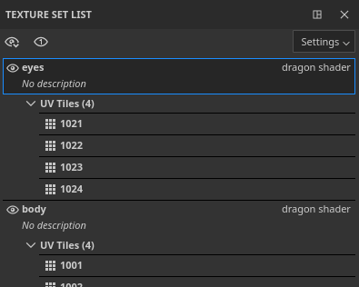
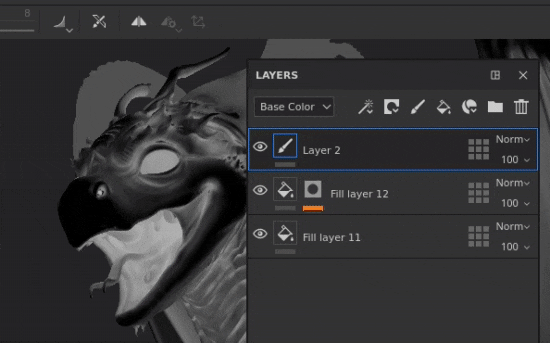
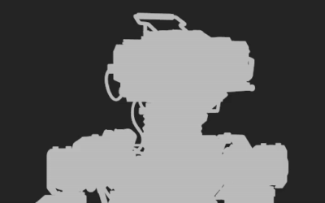
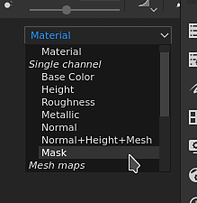

# Version 2020.2 (6.2.0)

**Substance Painter 2020.2.0 (6.2.0)** introduit le nouveau workflow de mosaïque UV qui permet de peindre sur les UDIM. Il inclut également plusieurs améliorations des performances et de la taille du projet pour tout type de projet.

Date de publication : *23 juillet 2020*

&#x200B;>> 

Crédits d&#39;artiste : Dragon de [Damien Guimoneau](https://www.artstation.com/damz) et Robot de [Jason Huang](https://www.artstation.com/jasonhuang).

## Principales fonctionnalités

### Nouveau workflow de mosaïque UV avec peinture sur les UDIM

Dans cette version, nous présentons le nouveau flux de travaux UV Tiles à Substance Painter qui permet de peindre sur des carreaux UDIM.

Avec le nouveau workflow, les **UV ne sont plus divisés en ensembles de textures individuels**. En revanche, les carreaux UV sont contenus dans un seul jeu de textures basé sur l&#39;affectation de matière du filet. Les mosaïques UV qui se trouvent dans le même ensemble de textures peuvent être **peintes sans coutures**, dans les fenêtres 2D et 3D.

UV Tile est le terme utilisé pour décrire de manière générique ce nouveau workflow, car UDIM est principalement une convention de nommage. Bien que l’UDIM soit actuellement la seule convention disponible, nous prévoyons de l’étendre à l’avenir (comme la prise en charge du nommage Mudbox ou ZBrush). Nous pensons également à prendre en charge les carreaux avec des coordonnées négatives, ce qui n&#39;est pas possible avec le schéma UDIM. C’est pourquoi nous avons choisi un terme plus large pour ce workflow.

Voici un aperçu des modifications introduites avec ce nouveau workflow :

* **Création d&#39;un projet de mosaïque UV**\
  Lors de la création d’un projet, un nouveau paramètre permet de spécifier si le nouveau workflow doit être utilisé ou non.

  Notez qu’une fois le workflow décidé et le projet créé, il ne peut plus être modifié par la suite, contrairement à d’autres paramètres.

  
* Carreaux UV dans la clôture 2D

  Lors de l&#39;utilisation du nouveau workflow de mosaïque UV, la vue 2D affiche désormais une nouvelle grille où chaque mosaïque UV a un numéro UDIM dédié. Chaque carreau peut être peint individuellement.

  
* Peinture sur des carreaux UV

  Tuiles UV

  qui se trouvent dans le même ensemble de textures peuvent être peintes de manière transparente. Cela permet d&#39;augmenter la résolution générale et la qualité d&#39;un actif en multipliant simplement le nombre de tuiles UV.
* Carreaux UV dans la fenêtre Liste des ensembles de textures

  Le

  La liste des ensembles de textures contient

  a été mis à jour pour répertorier les carreaux UV liés à la matière trouvée sur le maillage importé. Chaque vignette UV s’affiche avec son nom basé sur la convention UDIM.

  
* Modification de la résolution par carreau UV

  Bien que la résolution par défaut de chaque carreau UV soit basée sur son jeu de textures parent, il est possible de la remplacer par carreau. Sélectionnez simplement les carreaux dans la liste des ensembles de textures, puis accédez à la fenêtre Paramètres de l’ensemble de textures pour modifier la résolution. Lorsque la résolution d’une mosaïque est remplacée, la nouvelle résolution s’affiche dans la vue 2D en regard de son numéro.

  
* Icônes de nouvelle pile de calques

  La pile de calques propose de nouvelles icônes pour les calques de peinture et de remplissage. Comme les tuiles UV présentent beaucoup plus d&#39;ensembles de textures, il n&#39;a pas été possible de les afficher tous dans cette petite zone. Cela améliore les performances, car il n’est plus nécessaire de calculer des vignettes spécifiques. Ce nouvel ensemble d’icônes peut également être utilisé pour des projets standard en activant un paramètre dans les paramètres principaux (voir ci-dessous).

  
* Nouveau masque de mosaïque UV sur les calques

  Le masque de tuile UV est une nouvelle façon de masquer les calques d&#39;entrée/sortie qui est plus efficace que le masquage normal. Il offre de meilleures performances car il permet d&#39;écarter complètement le calcul de Tuiles UV spécifiques. C&#39;est un outil que nous vous recommandons d&#39;utiliser pour une expérience confortable lorsque vous travaillez dans un projet avec de nombreuses tuiles UV. Pour plus d&#39;informations, consultez la [page dédiée](../../interface/layer-stack/geometry-mask.md) dans la documentation.

  {width="550px"}
* **Peinture à travers des tuiles UV masquées**\
  Lorsque plusieurs carreaux UV se trouvent dans le même jeu de textures, il peut être difficile de peindre certaines zones d&#39;un filet en raison d&#39;autres parties de la géométrie gênantes. Pour éviter cela, un nouveau paramètre de peinture a été ajouté dans la barre d’outils contextuelle nommé **Les tracés de peinture ignorent les tuiles UV masquées**. Lorsque ce paramètre est activé, toute mosaïque UV exclue via le masque de mosaïque UV est masquée dans la clôture, ce qui permet aux tracés de peinture de passer ou de les ignorer. La modification du masque de carreau UV permet de recalculer les traits de pinceau, car elle permet de réimporter un filet qui peut avoir un carreau UV modifié ou une nouvelle géométrie qui doit également être exclue. Cela évite de refaire les tracés de peinture.

  

  
* Cuisson de carreaux UV

  Les boulangers prennent également en charge les tuiles UV et il y a maintenant une liste de sélection dans la fenêtre de cuisson

  pour spécifier les carreaux et les ensembles de textures à cuire. La sélection peut être rapidement modifiée en cliquant sur la case à cocher et en la faisant glisser, ou en utilisant les nouveaux menus déroulants.

  

  
* Exportation de textures de carreaux UV avec la nouvelle balise $udim

  Une nouvelle balise a été ajoutée aux modèles de sortie, ce qui permet d&#39;exporter des fichiers avec le numéro UV Tile dans leurs noms de fichiers. Actuellement, seule la convention UDIM est disponible. Il est également possible d’utiliser des parenthèses pour définir des éléments facultatifs dans un nom de fichier lorsqu’une balise n’est pas disponible. Cela permet, par exemple, de créer des noms de fichiers qui ajoutent uniquement le numéro UDIM lorsqu’ils sont disponibles avec des projets de mosaïque UV, rendant les paramètres prédéfinis d’exportation compatibles avec tout type de projet.

  
* **Importation de séquences d&#39;images** Une séquence d&#39;images est une série de textures dont chacune correspond à un carreau UV spécifique. Pour importer une séquence d’images, il vous suffit de glisser-déposer le premier fichier de la séquence dans l’étagère ou d’utiliser la fenêtre des ressources d’importation. Les fichiers restants dans la séquence seront également importés automatiquement. Les séquences s’affichent dans l’étagère sous la forme d’une ressource unique avec un numéro indiquant le nombre de fichiers qu’elles contiennent. Pour utiliser la séquence, faites-la glisser et déposez-la dans un calque de remplissage. Le mode de projection sera automatiquement défini sur **Remplissage (correspondance par carreau UV)**.

  {width="600px"}

  
* Prise en charge des facettes avec des maillages alambiques

  Les facettes alambiques sont désormais importées en tant que matériaux à diviser en ensembles de textures. Cette modification rend les filets alambiques compatibles avec le nouveau workflow des tuiles UV. Si un filet Alembic contient des faces qui ne font pas partie d&#39;un jeu de faces, elles sont automatiquement placées dans un jeu de textures nommé Matière par défaut.

Pour en savoir plus sur le nouveau workflow de mosaïque UV, consultez la [documentation dédiée](../../features/uv-tiles/uv-tiles.md).

>[!NOTE]
>
> Le workflow UV Tile peut être très exigeant, nous vous recommandons de travailler avec des SSD pour stocker à la fois le cache et un fichier de projet afin de réduire les temps de chargement et d&#39;obtenir une expérience fluide.

### Nouveau moteur de pause

Il est maintenant possible de mettre en pause le moteur de Substance Painter pendant le travail. Une fois le moteur en pause, tout calcul de texture, mise à jour de la fenêtre d’affichage ou tracé de peinture est enregistré, mais pas calculé.

Cette nouvelle action permet de configurer et de modifier des piles de calques complexes et de retarder le calcul jusqu’au dernier moment. Le principal avantage de mettre le moteur en pause est d&#39;éviter les calculs intermédiaires et de ne calculer que le résultat final. Cela rend l’application plus réactive et la mise à jour globale plus rapide. Le compromis est qu&#39;il n&#39;y a pas de retour visuel tant que le moteur n&#39;est pas en pause.

Pour mettre le moteur en pause, cliquez simplement sur le bouton **dans la barre d&#39;outils contextuelle** au-dessus de la fenêtre d&#39;affichage ou utilisez le **raccourci Maj + Échap** (peut être modifié dans les Paramètres). Pour reprendre l’exécution du moteur, désactivez le bouton ou réutilisez le raccourci.

### Améliorations des performances

* **Exportation plus rapide des textures**\
  L’exportation de textures doit être beaucoup plus rapide, en particulier dans les projets lourds qui génèrent de nombreuses textures. Plusieurs améliorations ont été apportées à la génération et à l’écriture des textures. Lors de nos tests internes sur des projets comportant de nombreux ensembles de textures ou piles de calques complexes, nous avons constaté que le processus d&#39;exportation était généralement jusqu&#39;à **4 ou 5 fois plus rapide**.
* **Calcul de la mémoire cache retardé lors de l&#39;ouverture des projets** La Substance Painter utilise un système de mémoire cache pour permettre des ajustements et des fusions rapides de calques. Dans les versions précédentes, ce cache était calculé chaque fois qu’un projet était ouvert (visible par la barre de chargement verte au bas de la clôture). Désormais, le calcul de la mémoire cache n’est déclenché que lorsque vous tentez de modifier un calque (en peignant ou en ajustant un paramètre de calque de remplissage, par exemple). Cette modification permet d’ouvrir des projets sans attendre et de passer aux ensembles de textures souhaités avant de commencer à travailler. Le calcul est également plus granulaire, ce qui permet de ne calculer que ce qui est nécessaire. Par exemple, dans un projet contenant des carreaux UV, seuls les carreaux qui doivent être modifiés sont calculés.
* **Chargement asynchrone des cartes de maillage** Les cartes de maillage sont désormais chargées de manière asynchrone. Cela signifie que l&#39;application ne sera plus bloquée en attendant le chargement des cartes de maillage. Ceci est particulièrement visible lors de l&#39;affichage de la carte de maillage dans la clôture (comme dans l&#39;image ci-dessous). Cela permet également d’ouvrir les projets plus rapidement, car il n’y a plus d’attente pour les mappages de maillage.

  
* **Modification améliorée du mode d&#39;affichage du masque**\
  Lorsque vous cliquez en maintenant la touche ALT enfoncée sur un masque (ou sur le mode d’affichage dédié) pour l’afficher dans la fenêtre, les mises à jour de texture ne sont désormais effectuées que pour le masque. Cela signifie que la peinture et la modification des effets sont beaucoup plus fluides avec ce mode d&#39;affichage, car tous les autres calculs sont retardés jusqu&#39;à ce que la fenêtre d&#39;affichage repasse en mode Matériau.

  
* **Vignettes de nouvelle pile de calques**\
  Comme mentionné précédemment, la pile de calques peut désormais utiliser un nouvel ensemble d’icônes. L’utilisation de ces icônes peut améliorer les performances générales car aucune vignette n’a besoin d’être calculée. Bien que cette option soit automatique pour les projets de mosaïque UV, les projets standard peuvent également choisir d’utiliser ces icônes en accédant à **Modifier > Paramètres** et en activant **Remplacer les vignettes des piles de calques par des icônes**.

  
* **Enregistrement incrémentiel plus rapide** Comme le projet peut être plus petit et que le processus d’enregistrement est plus granulaire en ce qui concerne les données qui ont été modifiées, l’enregistrement incrémentiel (en appuyant sur CTRL+S) est désormais beaucoup plus rapide. Ceci est particulièrement visible sur les projets lourds.
* **Amélioration des performances de démarrage Iray**\
  Le passage au mode de rendu avec Iray devrait être plus rapide car nous avons amélioré la façon dont nous gérons la mémoire partagée au sein de l’application.

### Améliorations de la taille du projet

Les fichiers de projet sont connus pour avoir une [empreinte de fichier importante](../../technical-support/workflow-issues/project-issues/projects-are-really-big.md). Nous avons pris le temps d&#39;étudier la cause profonde de ce problème et avons conçu quelques solutions. Cette version introduit un premier ensemble de modifications :

* **Conversion des sorties bakers en images en niveaux de gris**\
  Dans les versions précédentes, les boulangers produisaient des images RGB dans tous les cas. Désormais, les boulangers de niveaux de gris (courbure, occlusion ambiante) ne produisent que des images en niveaux de gris. Cette simple modification peut réduire la taille des projets de 20 % à 60 %. Pour tirer parti de ce changement, les cartes de maillage dans les projets existants doivent être régénérées.
* **Modification des paramètres de diffusion et de dilatation par défaut pour les boulangers**\
  Auparavant, les boulangers généraient une dilatation de 1 pixel puis un motif de diffusion (pixels flous en dehors des Îlots UV). Cette configuration génère des textures assez lourdes car les dégradés sont difficiles à compresser. Les paramètres par défaut ont donc été modifiés pour réduire ce problème. Par défaut, la diffusion est maintenant désactivée et la dilatation a été réglée sur 32 pixels (qui devraient correspondre aux résolutions 4K). Nous vous recommandons de basculer le projet existant vers ces nouveaux paramètres et de procéder à une réorganisation pour tirer parti de cette amélioration.

### Améliorations diverses

Cette nouvelle version inclut quelques modifications supplémentaires :

* **Sélection au four**\
  Pour faciliter les choses avec le nouveau workflow de mosaïque UV, la fenêtre de cuisson a été légèrement modifiée pour inclure une nouvelle liste de sélection, qui inclut la liste de mosaïque UV par ensemble de textures. Le bouton « Bake current Texture Set » a donc été supprimé. Pour faciliter la sélection des aliments à préparer, plusieurs options ont été ajoutées dans les menus déroulants :

  

  
* **Instance de nuanceur dans les paramètres de l&#39;ensemble de textures**\
  Avec la refonte de la liste des ensembles de textures pour inclure les carreaux UV, quelques légères modifications ont été apportées pour rendre l&#39;interface utilisateur moins encombrée. La fonctionnalité qui permettait auparavant de créer et de passer à différentes instances d’ombrage a maintenant été déplacée dans les paramètres de l’ensemble de textures.

  

## Tutoriels

Vous trouverez ci-dessous nos nouveaux tutoriels vidéo couvrant les nouvelles fonctionnalités. D&#39;autres vidéos sont disponibles sur [Substance Academy](https://www.youtube.com/playlist?list=PLB0wXHrWAmCx1fWbUyBFcjtfL8xhxZFnv) à propos du nouveau workflow UV Tile.

## Notes de mise à jour

### 2020.2.0

*(Publié Le 23 Juillet 2020)*

**Ajouté :**

* Tuiles UV (UDIM)
* [Tuiles UV] Peindre sur les tuiles UV
* [Tuiles UV] Permet de choisir entre le nouveau workflow et l&#39;ancien pour les tuiles UV
* [Tuiles UV] Importer des séquences d’images de tuiles UDIM/UV en tant que ressource
* [Tuiles UV] Ajouter une liste de tuiles UV par ensemble de textures dans la fenêtre Liste des ensembles de textures
* [Tuiles UV] Permet de modifier la résolution de plusieurs tuiles UV à la fois dans les paramètres du jeu de textures
* [Tuiles UV]&#x200B;[Vue 2D] Afficher les tuiles UV sous forme de grille
* [Tuiles UV]&#x200B;[Vue 2D] Nouveau bouton de fenêtre pour afficher ou masquer les informations des tuiles UV
* [Tuiles UV] Basculer l’outil de peinture sur un seul canal par défaut pour les projets de tuiles UV
* [Tuiles UV] Nouveau bouton dans la barre d’outils contextuelle pour ignorer les tuiles UV masquées pendant la peinture
* [Tuiles UV]&#x200B;[Pile de calques] Nouvelles icônes de pile de calques pour améliorer les performances
* [Tuiles UV]&#x200B;[Pile de calques] Amélioration des icônes de peinture et de remplissage dans la barre d’outils
* [Masque de mosaïque UV]&#x200B;[Vue 2D] Permet d&#39;inclure ou d&#39;exclure plusieurs mosaïques UV à la fois (clic gauche, CTRL+clic gauche)
* [Masque de carreau UV] Nouveau masque de carreau UV à inclure, exclure les carreaux par calque avec une nouvelle icône
* [Masque de carreaux UV]&#x200B;[Pile de calques] Affiche le nombre de carreaux UV dans l&#39;icône de masque de carreaux UV lorsque tous ne sont pas inclus
* [Masque de mosaïque UV]&#x200B;[Vue 2D/3D] Ajoutez un effet de survol pour visualiser les mosaïques UV sous le curseur
* [Tuiles UV]&#x200B;[Bakers] Permettre de sélectionner et de cuire des tuiles UV spécifiques
* [Tuiles UV]&#x200B;[Boulangers] Ajouter des options de sélection pour Ensembles de textures/Tuiles UV
* [Tuiles UV]&#x200B;[Bakers] Option de menu contextuelle permettant de sélectionner des tuiles UV dans un ensemble de textures
* [Tuiles UV]&#x200B;[Bakers] Permet une sélection rapide dans le jeu de textures/tuiles UV en faisant glisser
* [Tuiles UV]&#x200B;[Bakers] Remplacez les boutons « Tous » et « Aucun » dans les cartes de maillage par des options de sélection plus explicites
* [Tuiles UV]&#x200B;[Boulangers] Afficher le nombre de textures à cuire
* [Tuiles UV]&#x200B;[Exporter] Permet de sélectionner et d&#39;exporter des tuiles UV spécifiques
* [Tuiles UV]&#x200B;[Exporter] Permet de sélectionner rapidement des tuiles UV en faisant glisser
* [Tuiles UV]&#x200B;[Exporter] Ajouter des options de menu déroulant pour les tuiles UV
* [Tuiles UV]&#x200B;[Exportation] Rendre certains paramètres prédéfinis d’exportation indisponibles s’ils ne fonctionnent pas avec les tuiles UV (Adobe Dimension, Sketchfab, glTF, USD)
* [Vignettes UV]&#x200B;[Contenu] Mettez à jour les paramètres prédéfinis d’exportation pour utiliser la nouvelle balise $udim
* [Vignettes UV] Améliorer le rapport d’erreurs lors de l’importation de maillages avec des Îlots UV qui se chevauchent
* [Tuiles UV] Tuiles UV compatibles en Irlande
* [Tuiles UV]&#x200B;[Scripts] Ajouter la documentation d&#39;exportation de tuile UV à Python doc
* Performance
* [Performances] Nouveau bouton dans la barre d’outils contextuelle pour suspendre le calcul du moteur pendant le travail (MAJ+ECHAP)
* [Performances] Ouverture plus rapide du projet en retardant le calcul du cache du jeu de textures
* [Performance] N’attendez pas le chargement des cartes de maillage lors de l’ouverture du projet
* [Performances]&#x200B;[Vue 2D/3D] Ne pas calculer la couche de masque dans la fenêtre d’affichage lorsqu’elle n’est pas utilisée
* [Performances] Ne bloquez pas l&#39;application lors du chargement des cartes de maillage affichées dans les fenêtres
* [Performances] Amélioration de la vitesse d’enregistrement incrémentielle lors de l’enregistrement d’un projet
* [Performance]&#x200B;[Boulangers] Modifiez les paramètres de dilatation par défaut pour améliorer le gain de temps et la taille du projet
* [Performances]&#x200B;[Boulangers] Passez en niveaux de gris sur des Boulangers spécifiques pour améliorer le gain de temps et la taille du projet
* [Performances]&#x200B;[Exportation] Améliorer les performances du moteur pour exporter les textures plus rapidement
* [Performances]&#x200B;[Exportation] Améliorer la réactivité lors de l’ouverture de la boîte de dialogue d’exportation avec de nombreux ensembles de textures
* [Performances]&#x200B;[Exportation] Améliorer les performances lors du passage à l’onglet « Liste des exportations »
* [Performances]&#x200B;[Iray] Réduction du temps de démarrage Iray
* Autre
* [Boulangers] Ajout d’options de sélection pour les ensembles de textures
* Déplacer la gestion des instances de shader vers les paramètres du jeu de textures
* [Vue 2D/3D] Ajout d’un message au bas de la clôture pour indiquer le type de masque modifié
* [Pile de calques] Nouvelle option dans les paramètres pour basculer entre les vignettes héritées et les nouvelles
* [Pile de calques] Ajout d’un retour visuel pour indiquer l’état de chargement des vignettes
* [Proj] Nouveau mode de projection « Fill (Match Per UV-Tile) » pour charger les séquences d&#39;images
* [Proj] Changez le mode de projection des calques de remplissage en « Remplissage (correspondance par mosaïque UV) » dans des cas spécifiques
* [Contenu] Optimisation des préréglages du pinceau Fusain pour améliorer les performances
* Mettez Iray à jour vers la version 2020.0.0
* [Exporter] Désactiver l’onglet Liste des exportations lorsque rien n’est sélectionné
* Déplier automatiquement
* [Déplier automatiquement] Améliorer la qualité du placement des coutures
* [Déballage automatique] Paramétrage amélioré pour augmenter la vitesse et la stabilité

**Fixe :**

* [Alembic] Les facettes sont ignorées lors de l’importation de fichiers
* [Alembic] Temps de chargement infini avec des fichiers spécifiques
* [Importation] Une séquence d’images UDIM incorrecte est importée lorsque seule l’extension de fichier diffère
* [Blocage] L’ouverture d’un projet verrouillé par un autre processus entraîne un blocage
* [Export] Le canal émissif n’est pas exporté au format USD
* [Contenu] Le matériau dynamique « Fusain » contient des traits de peinture

**Problèmes Connus :**

* [Liste de jeux de textures] Impossible de masquer la description
* [Liste des ensembles de textures] Problèmes d’interface utilisateur
