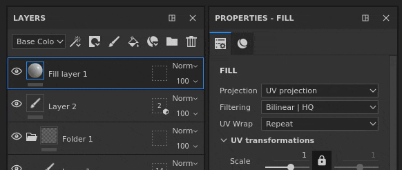
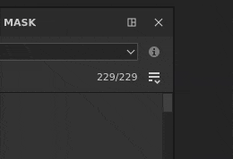
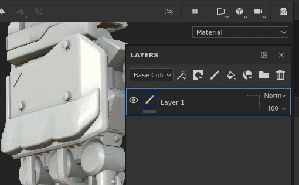
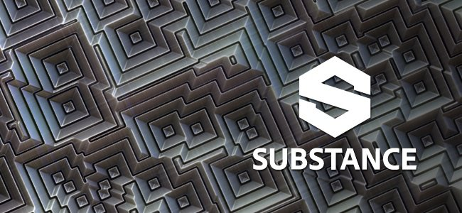

# Version 2021.1 (7.1.0)

**Substance Painter 2021.1 (7.1.0)** introduit plusieurs nouvelles fonctionnalités et améliorations telles que le masque de géométrie et le copier-coller d&#39;effets dans la pile de calques.

Données de mise à jour : *28 janvier 2021*

>[!NOTE]
>
> Cette version élève la version minimale prise en charge d’Ubuntu à 18.04 et de MacOS à 10.14. Pour plus de détails, consultez la [configuration requise](../../getting-started/system-requirements.md).

## Principales fonctionnalités

### Nouveau masque de géométrie

Le masque de géométrie est un nouvel outil de masquage dans la pile de calques qui permet de masquer la géométrie en fonction des noms de filet ou des vignettes UV. Il s&#39;agit d&#39;une évolution du masque de tuile UV précédemment nommé qui masquait la géométrie en fonction des nombres UDIM.

Ce nouvel outil est un meilleur moyen de masquer la géométrie que la peinture ordinaire (ou lors de l&#39;utilisation du [remplissage polygonal](../../painting/tool-list/polygon-fill.md)), car il bénéficie de plusieurs optimisations du moteur. Il est également non destructif, car il ne stocke pas les informations de géométrie (telles que les faces ou les sommets), mais uniquement le nom du filet ou le numéro de mosaïque UV. Par conséquent, la réimportation d’un filet ne rompra pas le masque. Un autre avantage est que le masquage de la géométrie permet de peindre sur des surfaces qui n&#39;étaient pas accessibles auparavant dans un ensemble de textures, ce qui évite de diviser un objet en plusieurs ensembles de textures par exemple.

* **Nouveau masque de géométrie sur les calques**\
  Le masque de géométrie est automatiquement disponible sur tous les calques de la [pile de calques](../../interface/layer-stack/layer-stack.md). Par défaut, il n’a aucun effet, ce qui signifie que le calque est entièrement visible.\
  Le masque de géométrie possède son propre menu contextuel qui permet de sélectionner ou désélectionner rapidement tous ses éléments mais aussi de copier ses valeurs sur un autre calque.

  

  

* **Modification des propriétés du masque de géométrie** Le masque de géométrie suit la même logique que les contextes de l&#39;autre calque (comme la modification d&#39;un masque ou de propriétés instanciées). Pour passer en mode d&#39;édition de masque de géométrie, cliquez simplement sur le carré en pointillé à droite d&#39;un calque. Pour quitter le masque de géométrie, cliquez sur le contenu ou le masque de peinture du même calque.

  

* **Masquage par nom de filet ou par mosaïque UV**\
  En haut des propriétés Masque de géométrie se trouve une liste déroulante qui contrôle le mode de masquage. Il est possible de choisir entre le masquage par numéro de tuile UV ou par nom de filet. Cette liste déroulante est désactivée et définie sur le nom du maillage uniquement dans le cas où un projet n’utilise pas le workflow de mosaïque UV.

  

* **Masquage de la géométrie via les propriétés**\
  Lors de la modification du masque de géométrie, la fenêtre des propriétés affiche une liste des noms de filet (ou des carreaux UV) en fonction de la géométrie associée au jeu de textures actuel.

  * Le nombre au-dessus de la liste indique combien de maillages/tuiles UV sont démasqués sur le total disponible.
  * Le menu en regard du numéro offre des commandes rapides pour sélectionner tous les éléments ou aucun et même inverser la sélection actuelle.
  * La liste ci-dessous définit les éléments masqués ou non. Comme pour toute autre liste de l&#39;application, il est possible de cliquer et de faire glisser pour activer/désactiver plusieurs éléments à la fois. Sinon, utilisez **ALT+clic** pour isoler un élément.

   

* **Masquage de la géométrie via la clôture**\
  La sélection du masque de géométrie peut également être modifiée dans les vues 2D et 3D. Déplacez simplement la souris sur la partie qui doit être visible/masquée et cliquez dessus pour basculer son état. Lors de la modification du masque de géométrie, la géométrie masquée s&#39;affiche avec un effet de lignes grises et diagonales. Il est également possible d’effectuer des sélections rectangulaires en cliquant et en faisant glisser pour sélectionner plusieurs éléments à la fois.\
   

* **Peinture de géométrie masquée/inaccessible.**\
  Après avoir sélectionné la géométrie à masquer dans le masque de géométrie, il est possible d&#39;activer le bouton **Masquer/Ignorer la géométrie exclue** en haut de la clôture (ou en appuyant sur le raccourci **ALT+H**). Lorsque cette option est activée, la géométrie exclue est masquée (ainsi que les autres ensembles de textures) pour n&#39;afficher que la géométrie incluse/peignable avec le calque actuel. Cette option permet de peindre des zones qui étaient précédemment bloquées ou hors de portée. Cette option s’applique également à tout type de calque.

  >[!NOTE]
  >
  > Peindre avec une géométrie masquée reste dynamique : si une géométrie bloquant la peinture a été initialement masquée lors de la frappe, puis est démasquée, elle bloquera à nouveau la frappe précédemment effectuée.

  

### Nouveaux effets de superposition de calques par copier-coller

Les effets peuvent désormais être copiés sur plusieurs calques et piles de calques, de la même manière que les calques ordinaires.

La sélection multiple est désormais également possible pour offrir la possibilité de copier et coller plusieurs effets à la fois.

Pour plus de facilité, la copie ou le déplacement d’un effet à partir d’un masque sur un calque sans masque en ajoutera automatiquement un. En effet, les effets du contenu de calque et du masque ne sont pas compatibles. Cela signifie que la copie d’un effet d’un masque dans le contenu d’un calque bascule automatiquement sur le masque (ou en crée un).

* **Copier et coller via le menu contextuel**\
  Cliquez avec le bouton droit de la souris sur n’importe quel effet dans la pile de calques d’un ensemble de textures et choisissez l’action Couper ou Copier. Cliquez ensuite à nouveau avec le bouton droit de la souris sur un calque et choisissez Coller pour déplacer ou créer une copie des effets souhaités. Nous avons également profité de l’occasion pour retravailler le menu contextuel et donner accès à davantage de fonctionnalités :

  

* **Copier-coller avec les raccourcis clavier**\
  Comme pour tout calque, le raccourci clavier **CTRL+C** (copier)/**CTRL+X** (couper) et **CTRL+V** (coller) peuvent être utilisés pour copier des effets en fonction de la sélection actuelle. Comme pour les calques, les effets sont insérés au-dessus de la sélection actuelle.

  

* **Dupliquer rapidement l’effet avec des raccourcis clavier**\
  Utilisez **CTRL+D** pour dupliquer la sélection actuelle ou appuyez sur **ALT tout en faisant glisser** un effet pour la dupliquer à l&#39;emplacement souhaité :

  

* **Déplacer les effets d&#39;un calque à l&#39;autre**\
  Outre la copie et la duplication, il est désormais possible de déplacer un effet par simple glisser-déposer d’un calque à un autre :

  

### Nouvelles fonctionnalités et améliorations générales

Plusieurs améliorations ont été apportées à cette version :

* **Ajouter une description par vignette UV**\
  Une description peut désormais être ajoutée pour chaque carreau UV via la liste des ensembles de textures. Cela facilite la navigation dans le projet, en particulier lors de l’exportation et de l’assemblage, car les descriptions sont également visibles dans ces contextes.\
  Pour ajouter ou modifier une description, il vous suffit de cliquer sur une mosaïque UV dans la fenêtre Liste des ensembles de textures, puis d&#39;accéder à la fenêtre Paramètres de l&#39;ensemble de textures pour la modifier.

  

   

* **Vignettes de nouvelle pile de calques**\
  Les vignettes de la pile de calques optimisée ont été améliorées. Une sphère de matériau s&#39;affiche désormais pour les calques de remplissage, ce qui facilite la navigation et l&#39;affichage des propriétés principales de chaque calque, même lorsque vous travaillez avec le workflow [Tuiles UV](../../features/uv-tiles/uv-tiles.md). La vignette est générée à partir des informations sur le calque, mais ne tient pas compte des effets pour éviter d’être recalculée trop souvent.

  

* **Amélioration de la sortie du masque de géométrie dans la pile de calques**\
  Quitter le masque de géométrie (anciennement UV Tile Mask) pouvait s&#39;avérer difficile avec les dossiers dans la pile de calques s&#39;il n&#39;avait pas de masque. En effet, il n’y avait pas d’autre contexte à activer que la sélection d’un autre calque. Il est maintenant possible de cliquer sur la vignette du dossier pour quitter le masque de géométrie. Il est également possible de faire glisser et déposer des matériaux ou des matériaux intelligents de la tablette dans la clôture lors de la modification du masque de géométrie.

  

  

* **Nouvelle sélection Alt-clic dans la fenêtre Cuisson**\
  La liste des cartes de maillage dans la fenêtre de cuisson peut désormais être isolée avec **Alt + clic de souris** pour isoler une carte spécifique à cuire, au lieu de devoir les exclure manuellement. Le même raccourci peut être utilisé pour réactiver toutes les cartes de maillage.

  

* **Nouveau bouton Appliquer le jeu de textures actuel**\
  Un nouveau bouton a été ajouté au bas de la fenêtre Cuisson pour faciliter et accélérer la rectification d’un ensemble de textures. L’utilisation de ce bouton n’affectera pas la sélection personnalisée précédemment définie et créera à la place l’ensemble de textures (y compris tous ses carreaux UV, le cas échéant).

  

### Nouvelle mise à jour de Substance Engine

La Substance Engine a été mise à jour vers sa version 8 pour prendre en charge le dernier format de fichier de Substance de données et ses fonctionnalités.

Pour plus de détails sur les nouvelles fonctionnalités de Substance Engine, consultez [cette page de documentation](https://helpx.adobe.com/fr/substance-3d/unlisted/documentation/sddoc/version-2020-2-10-2-0-200574252.html).

### Nouvelle prise en charge de Nvidia RTX 3000 en Irlande

Le [système de rendu Iray](../../features/iray-renderer/iray-renderer.md) a été mis à jour vers sa dernière version et prend désormais en charge les nouveaux GPU Nvidia Ampere (séries RTX 3000 et Quadro A).

>[!NOTE]
>
> Avec cette mise à jour, les GPU Kepler (GeForce séries 600 et 700) ne sont plus pris en charge, le rendu en Iray sera effectué sur le processeur à la place.

### Nouveau contenu

Trois nouveaux outils de point ont été ajoutés à cette version et peuvent être utilisés pour créer des motifs complexes et des points réalistes. Pour les trouver, il vous suffit de vous rendre dans la section Outil de l’étagère et de rechercher :

* Complexe de points
* Couture transversale de points
* Points droits

Il est recommandé d&#39;activer la fonction [Souris paresseuse](../../painting/lazy-mouse.md) dans la barre d&#39;outils contextuelle pour améliorer la qualité des points peints.

Vous trouverez ci-dessous un aperçu de tous les paramètres prédéfinis contenus dans ces nouveaux outils :

{width="800px"}

### Nouvelles Fonctionnalités Python

L’API Python a reçu plusieurs nouvelles fonctionnalités. La documentation a également été remaniée, notamment ses exemples, pour faciliter la compréhension et l’apprentissage de l’API.

* **Gestion des ressources et des rayonnages**\
  Le module de ressources a été amélioré et peut désormais :
  * Créer et gérer des étagères.
  * Recherchez ou importez des ressources dans des étagères et des projets.
  * Savoir si une étagère est analysée (ce qui permet de savoir quand les ressources sont prêtes à être utilisées).
  * Affectez des vignettes personnalisées aux ressources d’un tiroir.

* **Informations sur les tuiles UV**\
  Il est désormais possible d&#39;interroger la liste des carreaux UV d&#39;un ensemble de textures. Cela ouvre la possibilité de créer des exportations personnalisées sur une plage spécifique de carreaux UDIM par exemple.

* **État de l&#39;édition du projet**\
  Une nouvelle fonction et de nouveaux événements ont été ajoutés pour savoir si un projet peut être modifié. Cela permet de savoir si un calcul est en cours et s’il est impossible de modifier les propriétés d’un projet.

>[!NOTE]
>
> La documentation de l’API Python est accessible à partir du menu Aide de l’application.

## Tutoriels

Vous trouverez ci-dessous nos tutoriels vidéo couvrant les nouvelles fonctionnalités :

## Notes de mise à jour

### 2021.1

*(Publié Le 28 Janvier 2021)*\
Résumé : **version majeure, nouveau masque de géométrie qui permet de sélectionner et de peindre des parties de la géométrie, copier/coller des effets dans la pile de calques, amélioration du workflow des tuiles UV, mise à jour d’Iray, Bakers, Substance Engine et nouveau contenu**

**Ajouté :**

* Masquer la nouvelle géométrie et peindre les parties sélectionnées de la géométrie
* [Masque de géométrie] Permet de peindre les parties sélectionnées de la géométrie par nom de maillage
* [Masque de géométrie] Sélection rectangulaire dans les deux fenêtres
* [Masque de géométrie] Permet de masquer/ignorer une géométrie exclue sur un calque
* [Masque de géométrie]&#x200B;[Propriétés] Sélection rapide pour les cases à cocher en cliquant et en faisant glisser
* [Masque de géométrie]&#x200B;[Propriétés]&#x200B;[Interface utilisateur] Tout inclure/Exclure avec une liste déroulante dans la fenêtre Propriétés
* [Masque de géométrie]&#x200B;[Propriétés] Permet de sélectionner rapidement un élément dans une liste en appuyant sur ALT+CLIC GAUCHE
* [Masque de géométrie]&#x200B;[Propriétés] Incrustation dans les fenêtres lors du survol des noms de filet/mosaïques UV dans la fenêtre Propriétés
* [Masque de géométrie]&#x200B;[Pile de calques] Ajouter des options Copier/Coller au masque de géométrie
* [Masque de géométrie] Nouvelle icône pour le bouton Masquer/ignorer la géométrie exclue
* [Masque de géométrie] Nouvelle info-bulle pour Masquer/ignorer la géométrie exclue
* [Masque de géométrie] Raccourci clavier ALT+H pour activer/désactiver le bouton « Masquer ignorer la géométrie exclue »
* [Tuiles UV]&#x200B;[Pile de calques] Nouvelle vignette d&#39;aperçu de sphère de calque de remplissage pour les tuiles UV et le mode simplifié
* [Tuiles UV]&#x200B;[Pile de calques] Permet de sortir facilement du masque de tuile UV
* [Tuiles UV]&#x200B;[Liste des ensembles de textures] Autoriser à donner une description par tuile UV
* [Tuiles UV]&#x200B;[Paramètres du jeu de textures]&#x200B;[UI] Deux nouveaux titres de section dans le menu déroulant pour modifier la résolution des tuiles UV
* [Vignettes UV]&#x200B;[Fenêtre] Quitter le masque des vignettes UV lorsque vous faites glisser une matière dans la fenêtre
* [Pile de calques] Ajout d’options de copier/coller pour les effets
* [Pile de calques] Permet de copier/coller des effets d’un ensemble de textures vers un autre
* [Pile de calques] Autoriser la sélection multiple d’effets
* [Pile de calques] Ajout d’options de copier/coller sous forme de raccourcis pour les effets de calque
* [Pile de calques] Basculer automatiquement entre le masque et le contenu lors du glissement des effets vers un autre calque
* [Pile de calques] Créer automatiquement un masque lors du collage d’un masque depuis un autre calque
* [Pile de calques] Ajout d’actions de déplacement d’effet dans le menu contextuel des effets
* [Pile de calques] Permet de glisser-déposer des effets d’un calque à un autre
* [Pile de calques] Le fait de faire glisser des éléments dans un dossier les place en haut du dossier
* Mettez Iray à jour vers la version 2020.1.0
* [Bakers] Mettre à jour Bakers vers la version 2.5.4
* [Boulangers] Affichez des carreaux UV individuels dans la fenêtre de progression de la cuisson
* [Boulangers]&#x200B;[UI] Permet de cuire rapidement le jeu de textures actuel avec un nouveau bouton
* [Boulangers] Permettre à l&#39;utilisateur de sélectionner rapidement l&#39;un des boulangers avec ALT+CLIC GAUCHE
* Mettre à jour la Substance Engine à la version 8.0.8
* [Substance Engine] Prise en charge de la couleur par défaut dans les nouveaux fichiers .sbsar
* [Dépliage automatique] Amélioration des performances
* [Exporter] Ajoutez un retour visuel pour indiquer quelle résolution de Tuile UV diffère de la résolution par défaut du projet
* [Exporter] Ajout d’un facteur de taille de scène dans le fichier json shader exporté
* [Langue] Ajouter une traduction en japonais
* [UI] Mise à jour de la fenêtre À propos avec contrôle de version des dépendances internes
* [Scripting]&#x200B;[Python] Autoriser à gérer les ressources de la tablette
* [Scripting]&#x200B;[Python] Permet de savoir quand un projet est prêt pour la création et l&#39;exportation
* [Scripting]&#x200B;[Python] Permet de savoir quand une tablette a terminé d&#39;analyser les ressources sur le disque
* [Scripting]&#x200B;[Python] Autoriser à interroger la liste des mosaïques UV par ensembles de textures
* [Scripting]&#x200B;[Python] Autoriser à affecter un aperçu personnalisé aux ressources de la tablette
* [Scripting]&#x200B;[Python] Autoriser la gestion des tablettes personnalisées
* [Scripting]&#x200B;[Python] Ajoutez un index de méthodes dans chaque sous-module de la documentation
* [Scripting]&#x200B;[Python] Nouveau style pour la documentation
* [Scripting]&#x200B;[Python] Amélioration des ressources et de la documentation de la tablette
* [Contenu] Trois nouveaux outils prédéfinis pour réaliser des points de suture
* [Shelf] Supprimer temporairement « Exporter vers la Substance share » lors de la transition vers la nouvelle plateforme de Substance share

**Fixe :**

* Blocage lors de l’utilisation de moniteurs avec différentes résolutions
* Blocage en Substance Engine avec certains projets rares
* Échec de l&#39;actualisation de la fenêtre avec Masquer/Ignorer la géométrie exclue lors du changement de calques
* [Vue 2D] La fenêtre 2D peut être manquante dans certains projets
* [Baking] « Correspondance par nom de maillage » ignore les parties de l’objet
* [Pile de calques] Cliquer sur un effet de calque ouvre le dossier
* [Masque de géométrie] La mosaïque UV est toujours comptée dans le masque, même lors de la réimportation du filet sans elle
* [Masque de géométrie] Le menu contextuel de la clôture ne fournit pas les bons outils
* [Moteur] Lourds décalages sur des projets particuliers
* [Scripts] Haute latence avec les demandes de POST JSON à distance sous Windows
* [Linux] La quantité de Vram n&#39;est pas détectée correctement avec des GPU intégrés spécifiques
* [Déballage automatique] Blocage ou déballage long de certains projets
