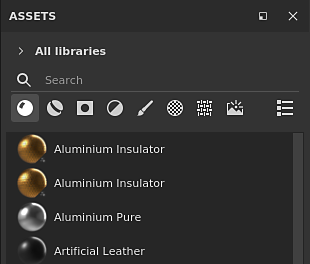

# Version 7.2

**Substance 3D Painter 7.2** offre de nouvelles fonctionnalités de rendu avec le workflow des matériaux standard d&#39;Adobe, de nouvelles façons de partager du contenu entre [les applications Substance 3D](https://www.adobe.com/products/substance3d/3d-augmented-reality.html) et une fenêtre Ressources remaniée.

Date de publication : *23 juin 2021*

## Principales fonctionnalités

### Fenêtre Nouvelles ressources

L’ancienne fenêtre Rayon a été améliorée et renommée en fenêtre Actifs. Cette refonte vise à rendre le contenu plus rapidement accessible et plus facile à filtrer grâce aux nouvelles icônes dédiées. Il est également livré avec un système de navigation plus facile avec les chemins de navigation. Cette refonte vise également à rendre l’expérience similaire à d’autres logiciels Substance 3D afin de faciliter la gestion du contenu entre les applications.

>[!NOTE]
>
> Cette version introduit des modifications dans la façon dont nous gérons les préférences de l’application et le contenu de l’étagère/des ressources. Pour savoir comment migrer vos données, consultez [la page dédiée](../../pipeline-and-integration/resource-management/preferences-and-content-migration.md).

* **Nouvelle conception et mise en page**\
  Le nouveau design se concentre sur la simplicité mais aussi sur une organisation plus facile de la fenêtre. La fenêtre peut désormais être ancrée verticalement sans perdre d’espace. Un nouveau mode d’affichage « liste » permet de rechercher beaucoup plus facilement des actifs par nom.

  

* **Nouvelle navigation dans le chemin de navigation**\
  Les ressources de navigation peuvent être difficiles parfois dans une interface utilisateur minuscule. Avec le chemin de navigation, il n’est pas désormais plus facile de passer d’un dossier à l’autre sans avoir à afficher la hiérarchie complète des dossiers.

  

* **Nouveaux filtres d&#39;utilisation**\
  Il y a beaucoup de contenus différents dans la fenêtre Actifs et les utilisations sont un bon moyen de filtrer le contenu pour isoler des ressources spécifiques. Pour sélectionner un usage spécifique, il suffit de cliquer sur le bouton dédié. Pour ajouter ou supprimer plusieurs utilisations, maintenez la touche CTRL enfoncée tout en cliquant sur un bouton.

  

* **Amélioration du rendu des vignettes**\
  Nous avons pris le temps de retravailler notre système de génération de vignettes pour améliorer leur qualité et les rendre plus cohérentes dans l’écosystème Substance 3D. Nous avons également ajouté l&#39;appui du displacement.

  {width="500px"}

* **Chargement des vignettes à partir des archives de Substance de données (sbsar)**\
  Les vignettes personnalisées incorporées dans les fichiers de Substance ne sont pas chargées et affichées dans la fenêtre Actifs. Le partage des ressources personnalisées est désormais plus facile, car il n’est plus nécessaire d’inclure les métadonnées de ressource pour les icônes personnalisées.

* **Performances améliorées** Le temps de chargement et de génération des vignettes a été amélioré sur plusieurs aspects et devrait désormais être beaucoup plus rapide.

* **Augmentez le budget de la mémoire d&#39;aperçu pour charger davantage de vignettes**\
  Par défaut, une quantité limitée de mémoire est allouée à l&#39;affichage des vignettes pour économiser sur les performances. Toutefois, disposer d’une bibliothèque avec de nombreuses ressources peut entraîner le chargement et le déchargement constants des vignettes, ce qui rend la navigation et la recherche de ressources difficiles. Il existe désormais une nouvelle [variable d&#39;environnement](../../pipeline-and-integration/configuration/environment-variables.md) pour remplacer la valeur budgétaire par défaut.

### Nouveau flux de production de matériaux Adobe Standard

Un nouvel ombrage a été ajouté, nommé **Adobe Standard Material** (ASM), qui prend en charge plusieurs fonctionnalités à la fois, ce qui permet de créer des matériaux plus complexes et plus précis dans un seul ensemble de textures. Avec ce nouvel ombrage, nous avons également saisi l&#39;occasion d&#39;ajouter de nouveaux canaux pour faciliter la création de matériaux.

* **Nouveau nuanceur de matériaux Adobe Standard**\
  Le nouveau shader ASM est un shader qui regroupe plusieurs fonctionnalités ainsi qu&#39;une évolution de notre rendu PBR. Il prend en charge en même temps :
  * **Anisotropie**
  * **Pelage transparent**
  * **Reflet**
  * **Specular edge color**
  * **Méthodes supplémentaires de diffusion sous la surface**
  * Et bien sûr les autres fonctionnalités existantes telles que l&#39;Occlusion Parralax, le Displacement, etc.

* **Nouveaux canaux et canaux utilisateur**\
  Afin de prendre en charge le nouveau shader ASM, de nouveaux canaux ont été ajoutés. Nous avons également doublé le nombre de canaux d’utilisateurs afin d’élargir les possibilités des informations personnalisées et des nuanceurs personnalisés.
  * Couleur du revêtement
  * Rugosité du revêtement
  * Normale du revêtement
  * Opacité du revêtement
  * Niveau spéculaire du revêtement
  * Couleur de dispersion
  * Couleur de l’éclat
  * Rugosité de l’éclat
  * Opacité de l’éclat
  * Couleur du bord spéculaire
  * Canaux utilisateur de 8 à 15

* **Paramètres du jeu de textures améliorés**\
  Le menu de liste des couches dans les paramètres du jeu de textures regroupe désormais les couches en fonction de leur compatibilité avec l&#39;ombrage actuel. Cela permet d’identifier les couches qui auront un effet dans la clôture.

  

* **Nouvelles fonctionnalités de API de shader avec if visible et recompilation**\
  Avec le développement du shader ASM, certaines modifications de l&#39;API ont été apportées avec deux fonctionnalités notables :
  * **Visible si** : les paramètres du shader peuvent être affichés ou masqués en fonction de la condition, ce qui facilite la lecture de l&#39;interface utilisateur du shader.
  * **Recompilation** : en déclarant les paramètres d&#39;une manière spécifique, il est désormais possible de désactiver une partie d&#39;un shader et de la recompiler pour l&#39;optimiser lorsque le paramètre change. Cela permet de supprimer les fonctionnalités inutilisées.

### Nouvel exchange de l’écosystème Substance 3D

Grâce à ce nouveau workflow, l’envoi de ressources et de ressources entre les applications Substance 3D est désormais beaucoup plus facile et accessible en un clic. Il est désormais possible de recevoir des fichiers de Substance de Substance 3D Designer ou Substance 3D Sampler ou d’envoyer un projet dans Substance 3D Stager très facilement pour reproduire rapidement le contenu.

>[!WARNING]
>
> Ces fonctionnalités d’envoi et de réception ne sont disponibles que par le biais de la version pour poste de travail Creative Cloud de l’application, car elle repose sur des technologies spécifiques pour le rendre possible. Cela signifie que la version autonome de Steam ou de Substance 3D ne prend pas en charge ces fonctionnalités.

* **Painter vers Stager**\
  Exportez de Painter vers Stager avec le paramètre prédéfini d&#39;exportation mis à jour ou utilisez l&#39;action **Envoyer vers Substance 3D Stager** pour exporter et importer automatiquement le projet en cours dans Stager. Aucune configuration manuelle n’est nécessaire.

* **Stager vers Painter**\
  Recevez des modèles de Stager vers une texture via une action semblable en un clic directement depuis Stager.

* **Designer ou Sampler vers Painter**\
  Recevez des matériaux de Substance, des filtres et plus encore de Designer ou Sampler directement dans la fenêtre Ressources en un clic.

* **Substance 3D Assets vers Painter**\
  Recevez du contenu, par exemple des Substances, directement du bureau Creative Cloud vers la fenêtre Actifs de Painter.

* **Afficher dans Bridge**\
  Les ressources de la fenêtre Actifs située dans une bibliothèque gérée par Adobe Bridge peuvent être ouvertes directement dans Bridge à l’aide du menu contextuel sur une ressource spécifique.

### Nouveau contenu

De nouveaux contenus ont été ajoutés dans cette version :

* **Nouveaux modèles de projet pour matériau de socle en Adobe (ASM)**\
  Pour faciliter le démarrage de l’utilisation du nouveau shader ASM, de nouveaux modèles de projet ont été créés pour accélérer la création de projets :
  * ASM - Rugosité métallique PBR
  * ASM - Angle d&#39;Anisotropie de la rugosité métallique PBR
  * ASM - Revêtement de rugosité métallique PBR
  * ASM - PBR Rugosité métallique SSS
  * ASM - Lissage de rugosité métallique PBR

* **Nouveaux mappages d&#39;environnement**\
  Plusieurs nouvelles cartes d’environnement ont été ajoutées pour éclairer vos projets, y compris Studio 06 utilisé pour le rendu des nouvelles vignettes Ressources :
  * Intérieur :
    * Atelier
  * Studio :
    * Studio 06
    * Studio 80s Horror Flick A
    * Studio Black Soft
    * Studio White Soft
    * Studio White Umbrella

### Amélioration du déballage UV automatique

Une nouvelle mise à jour du déballage UV automatique a été ajoutée qui apporte le support des tuiles UV et un contrôle supplémentaire sur la génération UV :

* **Quantité de carreaux UV**\
  Lors de la génération d&#39;UV, il est maintenant possible de spécifier le nombre maximal de tuiles UV que l&#39;on souhaite créer. Cela permet également d’utiliser la génération UV avec le workflow de mosaïque UV.

* **Orientation de l&#39;Îlot UV**\
  Un nouveau paramètre a été ajouté pour ajouter une contrainte sur l&#39;orientation de l&#39;Îlot UV lorsqu&#39;il est compressé. Cela permet de faire des Îlots UV un peu plus alignés permettant de texturer certains objets plus facilement (ex : une porte en bois pour aligner le motif en bois).

* **Amélioration des performances de packing**\
  La fonction de packing a également été améliorée pour offrir de bonnes performances avec le nouveau support de tuile UV.

### Améliorations générales

Cette nouvelle version ajoute plusieurs améliorations à la qualité de vie :

* **Amélioration des performances des curseurs avec le stylet de la tablette graphique**\
  Faire glisser les curseurs avec un stylet devrait désormais être beaucoup plus réactif. Les curseurs ne doivent plus être collants.

* **Performances améliorées avec des calques déjà peints**\
  La peinture dans un calque avec un grand nombre de coups de pinceau existants doit désormais être beaucoup plus rapide et ne plus entraîner de ralentissement.

* **Peinture plus rapide après l’ouverture d’un projet**\
  Peindre sur un calque en haut de la pile de calques juste après l’ouverture d’un projet est désormais immédiat. Le calcul du cache du moteur a été reporté à plus tard, ce qui rend la réédition des anciens projets un peu plus rapide dans ce contexte.

* **Méthode normale nette**\
  Un nouveau paramètre de méthode Height à la normale est disponible dans les paramètres du jeu de textures. Il permet de contrôler la façon dont le canal d&#39;Height est converti en texture normale. Ce nouveau paramètre est utile pour améliorer la qualité des surfaces avec beaucoup de détails variés, tels que les matériaux en tissu.

  {width="450px"}

* **Nouveau style d&#39;interface**\
  L’interface générale a été légèrement ajustée pour mieux s’aligner sur l’écosystème général de Substance 3D. Cela rend le passage d’une application à l’autre moins surprenant et plus facile à parcourir.

* **Nouvelles traductions**\
  Trois nouvelles langues ont été ajoutées pour traduire l&#39;interface du programme :
  * Français
  * Deutsch
  * Chinois simplifié

## Notes de mise à jour

### 7.2.0

*(Publié Le 23 Juin 2021)*\
Résumé : **version majeure, elle fournit une mise à jour du panneau des actifs, un nouveau nuanceur avec accès à de nouveaux canaux et paramètres, une actualisation globale de l’interface utilisateur, certaines améliorations des performances très demandées, une prise en charge linguistique étendue, et plus encore !**

**Ajouté :**

* [Bibliothèques] Nouveau panneau Actifs pour remplacer l’étagère
* [Bibliothèques][Interface utilisateur] Nouvelle disposition du panneau Actifs
* [Bibliothèques][Interface utilisateur] Modifier l’orientation et l’interface utilisateur par défaut du panneau Actifs
* [Bibliothèques][Interface utilisateur] Ajout d’une option d’affichage par liste à la bibliothèque
* [Bibliothèques][Interface utilisateur] Nouvelle navigation dans les chemins de navigation dans le panneau Actifs
* [Bibliothèques][Interface utilisateur] Sélectionnez « Toutes les bibliothèques » lors de la sélection d’une recherche enregistrée
* [Bibliothèques][Interface utilisateur] Sélectionnez « Toutes les bibliothèques » lorsque tous les dossiers sont désélectionnés
* [Bibliothèques][Interface utilisateur] Nouvelle balise pour les pinceaux à particules
* [Bibliothèques][Interface utilisateur] Remplacé « étagère » par « Toutes les bibliothèques » dans l’ensemble de l’application
* [Bibliothèques][Interface utilisateur] Autoriser à masquer les dossiers vides
* [Bibliothèques][Interface utilisateur] La bibliothèque utilisateur par défaut doit être visible même si elle est vide
* [Bibliothèques][Interface utilisateur] Nouvelle méthode de filtrage via les icônes de type de ressource
* [Bibliothèques] Raccourci « CTRL » pour sélectionner plusieurs types de ressources
* [Bibliothèques] Nouvelle variable d’environnement pour contrôler le budget de mémoire de l’aperçu des ressources
* [Bibliothèques][Contenu] Nouveaux mappages d’environnement
* [Bibliothèques][Contenu][Interface utilisateur] displacement de rendu sur les matériaux par défaut
* [Bibliothèques][Contenu] Définissez le shader Adobe Standard Material (ASM) comme valeur par défaut pour la génération des aperçus
* [Bibliothèques][Contenu][ASM] Nouveaux modèles de projet pour le nouveau shader ASM
* [Bibliothèques][Vignette] Utiliser le nouveau mappage d&#39;environnement Studio 6
* [Bibliothèques][Vignette] Lire la vignette dans la ressource au lieu de la générer
* [Bibliothèques][Vignette] Ajouter un displacement à la génération de vignettes
* [Paramètres du jeu de textures]
* [Paramètres de l’ensemble de textures][Interface utilisateur] Exposer le nouvel height à la méthode de conversion habituelle
* [Paramètres de l’ensemble de textures][Interface utilisateur] Refonte de l’organisation de l’interface utilisateur des canaux
* [Paramètres du jeu de textures] Limite de couches utilisateur élevée à 16 couches
* [Paramètres du jeu de textures][UI] Indiquez les canaux compatibles avec le shader actuellement sélectionné
* [Shader][ASM] Nouveau shader de matériau Adobe Standard
* [Shader][ASM] Ajout de la prise en charge de l’Anisotropie, de la couche transparente, de la diffusion sous la surface, du Specular edge color et du reflet
* [Shader][ASM] Modification des valeurs de couleur des couches par défaut
* [Shader][ASM][Export] Modèle d’exportation mis à jour Adobe Dimension vers Adobe Substance 3D Stager
* [Shader][ASM] Ajout d’étiquettes et d’info-bulles pour les paramètres Shader et MDL
* [Shader][ASM] Rendre la couleur de Dispersion visible dans la vue 2D même si SSS n’est pas pris en charge
* [Shader][ASM][Iray] Prendre en charge ASM Shader dans Iray avec le nouveau MDL
* [Shader][ASM][Iray] Dispersion de sous-surface mise à jour dans la spécification PBR héritée brillante et revêtue
* [Shader][ASM][Content] Modification du type SSS par défaut pour les échantillons
* [Shader][ASM] Ajout de la documentation pour l’API ASM
* [Shader][ASM] Optimiser les shaders pour ignorer les canaux inutilisés
* [Shader] Exposer les nouveaux canaux du jeu de textures
* [Shader] Amélioration De La Diffusion Sous La Surface
* [Shader] Nouveaux paramètres de shader masqués pour certains shaders
* [Shader] Visible si pour les paramètres du shader
* [Performance]
* [Bibliothèques] Amélioration du temps de chargement de l’aperçu des ressources et des performances de calcul
* [Moteur] Amélioration des performances de peinture
* [Déballage automatique] Amélioration des performances du Packing
* [Déplier automatiquement]
* [Déballage automatique] Déballage automatique compatible avec le flux de travaux UV Tile
* [Dépliage automatique] Nouvelle option pour positionner les UV en fonction de l’orientation du filet
* [Autre]
* [Paramètres] Modification du sens de zoom par défaut
* [UI] Actualisation globale de l’interface utilisateur
* [UI] Modification du menu Aide
* [UI] Icône Remplacer l’inversion
* [UI][Plugin] Icône Remplacer pour le lien dcc du plug-in
* [UI][AMD] Mise à jour de la version minimale requise et du message contextuel
* [Pile de calques] Créer un calque dans le dossier vide sélectionné
* Mise À Jour De La Documentation Python
* [Branding]
* [Identité visuelle][Interface utilisateur] Nom de l’application mis à jour vers Adobe Substance 3D Painter
* [Branding][UI] Mise à jour de la version autonome vers « Substance Edition »
* [Identité visuelle][Interface utilisateur] Mise à jour du nom du fichier exécutable de l’application, du chemin d’installation, du pack et des icônes
* [Identité visuelle][Interface utilisateur] Bibliothèque et chemin par défaut renommés
* [Branding][UI] Fenêtre À propos de mise à jour
* [Identité visuelle][Interface utilisateur] Mise à jour de l’écran d’accueil
* [Branding][Interface utilisateur] Numéro de version basé sur l’année supprimé
* [Localisation] Nouvelles traductions en allemand, français et chinois simplifié
* [Interopérabilité] Non disponible pour les éditions Steam et Substance
* [Interopérabilité] Interopérabilité avec l’écosystème de l’Adobe : Designer, Sampler, Stager et Bridge
* [Interopérabilité][Interface utilisateur] Réception et mise à jour des ressources depuis Designer
* [Interopérabilité][Interface utilisateur] Recevoir la ressource de Sampler
* [Interopérabilité][Interface utilisateur] Envoyer la ressource vers Stager
* [Interopérabilité][Interface utilisateur] Afficher dans Adobe Bridge
* [Interopérabilité][Interface utilisateur] Permettre d’accéder rapidement aux ressources Adobe 3D
* [Interopérabilité] Nouvelles balises d&#39;utilisation de sbsar
* [Interopérabilité] Gestion des types de ressources reçus
* [Interopérabilité] Les ressources reçues de Adobe Substance 3D Designer ou Adobe Substance 3D Sampler sont stockées dans la bibliothèque choisie par défaut de l’utilisateur
* [Interopérabilité][Interface utilisateur] Nouvelle icône dans la barre d’outils de gauche à envoyer à Stager ou Photoshop

**Fixe :**

* [Tablette] Basse performance lors de la peinture avec pression
* [Tablette] Problème sur les tablettes dotées de curseurs
* [Blocage] Incompatibilité de nom entre la liste des ensembles de textures et l’exportateur
* [Blocage][Bibliothèques] Double-cliquez sur une sous-bibliothèque
* [Bibliothèques] Problème lors de l’analyse des répertoires de bibliothèques
* [Bibliothèques] La ligne de commande de génération d’aperçu forcé ne fonctionne pas comme prévu
* [Bibliothèques][Contenu] Le filtre Environnement d’éclairage cuit est noir par défaut
* [Linux][MacOS][Export Mesh] Impossible d’importer glTF créé sous Linux/MacOS
* [Linux] Faire glisser et déposer un fichier dans le panneau Actifs peut entraîner un blocage
* [Déballage automatique] La fonction Déballage automatique est disponible même si aucun filet n’a été sélectionné pour le rechargement
* [Particules] Mauvais comportement des particules avec la gravité
* [Pile de calques] L’histogramme de niveau ne peut utiliser la luminance que pour certaines couches
* [Masque de géométrie] Le menu contextuel d&#39;un dossier lors de la modification du masque de géométrie ne fonctionne pas
* [Projection] Couture avec projection sphérique et filtrage bilinéaire
* [Tuiles UV] Exporter le masque dans un fichier exporte uniquement la tuile 0, 0
* [Exporter le filet] L’exportation du filet FBX est vide
* [Iris] La carte normale n’est pas prise en compte dans les nouveaux projets lors du rendu
* [Enregistrer] Problèmes d’enregistrement sur les lecteurs partagés
* [Cuisson] La rectification d’un maillage avec des paramètres modifiés affiche un avertissement
* [Cuisson][Régression] Résultat incorrect lorsque le cadre de sélection global des maillages poly élevés n’inclut pas l’origine de la scène
* [Python] Les bibliothèques utilisateur personnalisées ne sont pas prises en compte

**Problèmes Connus :**

* [Bibliothèques] Recherches enregistrées non enregistrées si aucun projet n’est ouvert
* [NVIDIA] Message pour un pilote obsolète même si le pilote est à jour
