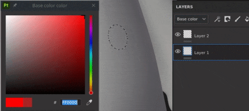

# Version 7.3

**Substance 3D Painter 7.3** offre de nouvelles façons de texturer les maillages avec les nouvelles projections de déformation et de cylindre pour les calques de remplissage.

Date de publication : *13 octobre 2021*

## Principales fonctionnalités

### Nouvelle projection de déformation

Cette version introduit la nouvelle projection de déformation 3D pour les calques de remplissage et les effets de remplissage. Cette projection permet de déformer une texture ou une image à l&#39;aide d&#39;une grille de déformation et de points contrôlables.

* **Configuration rapide par glisser-déposer** Choisissez un matériau, une alpha, une texture ou un procédural dans la bibliothèque de ressources, puis faites-le glisser sur la partie souhaitée du maillage (raccourci **ALT** requis pour les Matériaux). Si votre ressource n’est pas un matériau, une fenêtre contextuelle s’affiche et vous invite à rechercher le canal auquel vous souhaitez l’affecter.\
  Une fois le calque créé, vous verrez que la nouvelle *projection de déformation* est automatiquement sélectionnée. Le calque dispose des commandes de mode de projection 3D standard, mais également d&#39;un nouveau paramètre *Profondeur de Projection* qui permet de définir la profondeur de la projection de déformation (représentée par des flèches vertes sous la forme d&#39;une file d&#39;attente visuelle).\
  Vous pouvez également sélectionner ce mode de projection manuellement sur n’importe quel calque de remplissage ou effet sans avoir à faire glisser et déposer une ressource dans le viewport.

  

* **Placement automatique avec l’outil Surface** Lorsque le nouveau calque de déformation est créé, l’outil Surface est automatiquement sélectionné. Cela vous permet de déplacer l’image afin qu’elle reste à tout moment sur la surface de votre maillage. Cependant, vous pouvez toujours passer à l’un des autres manipulateurs et ajuster sa traduction (raccourci **W**), sa rotation (raccourci **E**) ou son échelle (raccourci **R**). Pour revenir à l&#39;outil Surface, utilisez raccourci **MAJ + W**. Lorsque vous passez en mode *Modifier les vertex*, l&#39;outil Surface est également la sélection par défaut et contraint le mouvement du vertex à la surface de votre maillage. Cependant, vous pouvez remplacer temporairement et rapidement l&#39;outil Surface en **maintenant la touche CTRL** enfoncée, ce qui vous permet de déplacer le point sélectionné dans n&#39;importe quelle direction, pas seulement sur la surface.

* **grille de déformation facilement modifiable** Une fois le placement global de l’image terminé, il est également possible de modifier la grille de déformation elle-même pour plus de précision et de flexibilité. Pour passer en mode de modification de grille, vous pouvez utiliser le menu Déformation nouvellement ajouté ou le raccourci **MAJ + V**. Cela permettra de modifier les vertex existants de la grille.\
  Vous pouvez subdiviser uniformément la grille dans son ensemble, mais gardez à l’esprit que si vous aviez précédemment déplacé les vertex, ils seront réinitialisés à leur position d’origine. La subdivision de grille peut être effectuée via le nouveau menu d’options de déformation.\
  Alternativement, il est possible d&#39;ajouter des fractionnements placés individuellement qui permettraient d&#39;avoir plus de détails seulement si nécessaire. Pour ajouter des fractionnements, sélectionnez l’une des trois options du menu Déformation : transversale, horizontale ou verticale. Lorsque l’un d’eux est sélectionné, placez le curseur sur la projection de déformation et cliquez n’importe où à l’intérieur pour ajouter un nouveau fractionnement. Cela ne modifiera pas la position des points existants.

  
* **Le réglage automatique de l&#39;orientation du vertex** Par défaut, les tangentes des vertex individuels sont ajustées à la surface du maillage, ce qui signifie qu&#39;ils seront toujours correctement orientés par rapport au maillage, quel que soit l&#39;endroit où ils sont déplacés. Cette option de tangente automatique peut être désactivée via un nouveau bouton dans la barre d’outils contextuelle, auquel cas l’orientation reste fixe à tout moment.

  

Pour plus d&#39;informations sur les paramètres et les propriétés de la projection de déformation, consultez la [page de documentation dédiée](../../painting/fill-projections/warp-projection.md).

### Nouvelle projection de cylindre

Cette version ajoute une méthode de projection cylindrique pour les calques de remplissage et les effets de remplissage. La nouvelle projection permet d&#39;ajuster une image ou une texture autour d&#39;objets tels que des colonnes, des piliers ou des formes plus organiques comme les bras d&#39;un personnage.

* **Habiller un maillage avec une image**\
  Vous pouvez facilement habiller une image autour d&#39;une surface cylindrique en utilisant un effet de calque de remplissage ou de remplissage et en sélectionnant *projection cylindrique* dans le menu déroulant Projection. Si l&#39;image n&#39;a pas besoin d&#39;être reproduite en dehors de l&#39;objet projection, vous devez sélectionner *Sans* pour *Envelopper* et *Rogner en forme* dans *Recadrage de forme* pour vous assurer que votre image ne dépasse pas les limites. Il vous suffit ensuite d’utiliser le manipulateur pour ajuster la projection à la position souhaitée.

* **Ajuster l&#39;angle de projection**\
  Une fois votre image en place, un nouveau paramètre d’angle est disponible. Ce paramètre permet de définir si l’image doit être projetée sur toute la longueur de la forme cylindrique ou limitée à un certain angle. Il ne recadre pas l’image, mais réduit sa largeur.

  

Pour plus d&#39;informations, consultez la [page de documentation dédiée](../../painting/fill-projections/cylindrical-projection.md).

### Sélecteur de couleurs amélioré

Cette version apporte plusieurs améliorations à la qualité de vie du sélecteur de couleurs.

* **Nouvelle disposition de fenêtre**\
  La fenêtre améliorée du sélecteur de couleurs a été remaniée pour s’adapter à une disposition plus verticale, similaire à la dernière version de Sampler. Il est divisé en trois sections : le champ de couleur principal qui inclut la sélection en cours et la dernière, le champ hexadécimal, la pipette et le curseur de teinte ; la section des curseurs RGB/HSV manuels ; et les nuanciers.\
  

* **Nouvelles valeurs de mot de RGB de 0 à 255**\
  Outre le portage des méthodes existantes de saisie de la valeur chromatique, le sélecteur de couleurs amélioré permet également de travailler avec des valeurs RGB comprises entre 0 et 255. Cette option est disponible lorsque l&#39;option *Valeurs de point flottant* est désélectionnée dans le menu déroulant de la section des curseurs.

  
* **Enregistrement des nuances de couleurs**\
  Les nuances de couleurs peuvent désormais être enregistrées dans Painter. Une fois la couleur souhaitée sélectionnée, il est possible d’appuyer sur le bouton Plus dans la section Nuancier du sélecteur de couleurs. La couleur est alors stockée dans les sessions et les projets. Vous pouvez effacer une nuance en cliquant dessus avec le bouton droit de la souris ou en supprimant toutes les nuances en bloc à la fois via le menu déroulant de cette section. Le nombre de nuances pouvant être enregistrées est illimité.

  
* **La fenêtre du sélecteur de couleurs reste ouverte**\
  La fenêtre du sélecteur de couleurs peut désormais être déplacée et placée n’importe où, même sur un écran différent, et elle restera ouverte tant qu’il n’y a pas de changement de contexte, ce qui signifie que lorsque vous passez d’un calque de peinture à l’autre pendant que vous peignez des textures à la main, vous pouvez garder la fenêtre du sélecteur de couleurs ouverte pour y accéder plus facilement.

  

* **Pipette plus accessible**\
  Désormais, la pipette de sélection des couleurs se trouve directement à côté du champ de couleur, mais vous pouvez également la trouver dans le sélecteur de couleurs. La pipette plus accessible conserve toutes les fonctionnalités précédentes. Vous pouvez toujours cliquer longuement pour choisir une couleur n’importe où sur votre ou vos écrans. Cette pipette exposée se trouve à côté de tous les champs de couleur dans Painter, pas seulement des couches de calque.

  

Pour plus d&#39;informations, consultez la [page de documentation dédiée](../../interface/color-picker.md).

### Autres fonctionnalités et améliorations

* **Améliorations du glisser-déposer de ressources**\
  Avec l’introduction de la déformation, la fonction de décalcomanie permettant de faire glisser des ressources de la bibliothèque vers le viewport tout en conservant la touche ALT a été remaniée. Désormais, lorsqu’une décalcomanie est créée de cette manière, elle n’utilise plus la projection Planaire, mais la projection Déformation. La sélection automatique de la projection de déformation doit améliorer la vitesse et l’efficacité des réglages de décalcomanie sur le maillage.\
  En outre, il est désormais possible de faire glisser et de déposer non seulement des matériaux, mais également des ressources de type image dans le viewport. Lors de la sélection d’un alpha, d’une texture ou d’un procédural, il n’est pas nécessaire d’utiliser le modificateur ALT. Il peut être déposé sur le maillage. Un menu s’affichera alors et vous pourrez choisir d’utiliser cette image dans un masque ou dans l’une des couches du calque.

  

* **Amélioration du plug-in d&#39;enregistrement automatique**\
  L’enregistrement automatique ne se déclenche plus lors d’opérations plus longues ou plus lourdes, telles que le rechargement du maillage, le baking ou l’exportation.

* **Améliorations des performances**\
  Une maintenance et une optimisation ont été effectuées pour la manipulation des curseurs et les performances de peinture.

* **Nouvelles fonctions de l&#39;API Python**\
  L&#39;API Python a vu des ajouts récents, qui permettent de recharger le maillage, de mettre à jour les Tuiles UV, ainsi que de définir et d&#39;interroger la résolution des utilisateurs via le scripting.

* **Mise à jour du moteur de Substances 8.3.0**\
  Parallèlement à quelques correctifs et améliorations générales, cette mise à jour du moteur de Substance prend désormais en compte les nouveaux types de graphes. Il est également possible de vérifier la version .fichier sbsar, ce qui devrait améliorer l&#39;utilisation et le téléchargement des versions Substance 3D Assets appropriées.

* **Réception de Substance 3D Assets à partir de CC Desktop**\
  Il est désormais possible d’accéder à Substance 3D Assets, comme les Matériaux, les atlas et les décalcomanies, à partir de l’application de bureau CC. De plus, ils peuvent être envoyés directement à la bibliothèque Painter.

## Notes de mise à jour

### 7.3.0

*(Publié Le 13 Août 2021)*\
Résumé : **version majeure. Il contient une nouvelle projection de déformation 3D, une nouvelle projection cylindrique, des améliorations du sélecteur de couleurs, de nouvelles fonctions dans l&#39;API Python et des correctifs de bogues**

**Ajouté :**

* [Projection]&#x200B;[Déformation] Exposer la déformation 3D comme nouveau mode de projection
* [Projection]&#x200B;[Déformation] Autoriser le mode décalcomanie pour les Alpha, les Textures et les procédures avec glisser-déposer dans le viewport
* [Projection]&#x200B;[Déformation] Utiliser la projection de déformation avec le raccourci de décalcomanie (ALT)
* [Projection]&#x200B;[Déformation]&#x200B;[Barre d’outils] Transformer la déformation en entier ou par vertex
* [Projection]&#x200B;[Déformation]&#x200B;[Barre d’outils] Ajouter des points de grille avec des options de déformation fractionnée en diagonale, horizontalement ou verticalement
* [Projection]&#x200B;[Déformation]&#x200B;[Barre d’outils] Menu dédié aux actions de réinitialisation
* [Projection]&#x200B;[Déformation]&#x200B;[Barre d’outils] Option permettant d’ajuster automatiquement les tangentes lors du déplacement de points
* [Projection]&#x200B;[Déformation]&#x200B;[Barre d’outils] Menu dédié à l’édition de grille (taille, réinitialisation, couleur et taille de poignée)
* [Projection]&#x200B;[Déformation] Nouveau raccourci du clavier pour changer le mode d’édition de déformation de vertex entiers (MAJ+V)
* [Projection]&#x200B;[Déformation] Cliquer + Ctrl permet de basculer entre l’outil Surface et d’autres outils
* [Projection]&#x200B;[Cylindrique] Exposer le mode de projection cylindrique
* [Projection]&#x200B;[Barre d’outils] Paramètres du manipulateur de groupe (taille, pas de grille, pas d’angle)
* [Sélecteur de couleurs] Nouvelle interface utilisateur du sélecteur de couleurs
* [Sélecteur de couleurs] Utiliser les valeurs sRVB dans les widgets du sélecteur de couleurs
* [Sélecteur de couleurs] Autoriser l’enregistrement et la suppression d’échantillons de couleurs
* [Sélecteur de couleurs] Pipette accessible à partir des emplacements de couleur et normaux
* [Sélecteur de couleurs] Permet de modifier une couleur dynamique entre 0 et 255 valeurs
* [Sélecteur de couleurs] Rendre l’état HSV/RGB commun à l’ensemble de l’application
* [Sélecteur de couleurs] La fenêtre Sélecteur de couleurs est semi-persistante
* [Sélecteur de couleurs] Appuyez sur Echap pour fermer la fenêtre du sélecteur de couleurs
* Amélioration des performances pour l’interaction avec l’interface utilisateur et la peinture
* [Moteur] Mise à jour vers une nouvelle version du moteur de Substance de données (8.3.0)
* [Scripting]&#x200B;[Python] Autoriser à recharger le maillage du projet en cours
* [Scripting]&#x200B;[Python] Autoriser la mise à jour des ressources dans les projets
* [Scripting]&#x200B;[Python] Autoriser à définir et interroger la résolution des Tuiles UV
* [Interopérabilité] Non disponible pour les éditions Steam et Substance
* [Interopérabilité] Recevoir plusieurs ressources de Bridge

**Fixe :**

* Le sélecteur de couleurs n’affiche pas la bonne couleur
* La liste de Jeux de textures [Baker] n&#39;est pas ordonnée correctement
* [importation FBX] Les transformations de pivot de groupe 3ds Max ne sont pas prises en compte
* [Substance Engine] Crash avec importation de SBSAR corrompu
* [MacOS] L’option de configuration de projet dans différentes langues n’est pas présente
* Les enregistrements automatiques peuvent bloquer Painter pendant les processus longs

**Problèmes Connus :**

* [Projection]&#x200B;[Déformation] L’option Fractionner reste sélectionnée une fois le fractionnement terminé
* [Projection]&#x200B;[Déformation] La symétrie ne fonctionne pas lorsque la transformation est définie sur espace monde
* [Projection]&#x200B;[Déformation] Lignes d’artefact entre les correctifs dans de rares cas
* [Projection]&#x200B;[UV] Le point de pivot est réinitialisé lors de la symétrie de la projection
* Les Matériaux adaptables [Mac M1] ne s’affichent pas correctement
* [M1]&#x200B;[Régression] La superposition de Matériaux ne fonctionne pas
