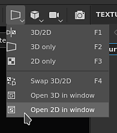

# Version 7.4

**Substance 3D Painter 7.4** ajoute la prise en charge d&#39;OpenColorIO avec l&#39;introduction du nouveau workflow de gestion des couleurs.

Date de publication : *24 novembre 2021*

## Principales fonctionnalités

### Nouvelle gestion des couleurs

Cette version introduit la gestion des couleurs avec la prise en charge de la version 2 d&#39;[OpenColorIO](https://opencolorio.org/) (OCIO pour faire court).

Ce nouveau workflow permet de gérer et d’étalonner les couleurs, de l’importation à l’exportation et à l’intérieur de la fenêtre d’affichage, ce qui facilite la correspondance de n’importe quel contenu entre différentes applications.

* **Paramètres du projet**\
  Lors de la création d’un nouveau projet, il est désormais possible d’activer la gestion des couleurs. Le projet existant peut également activer la gestion des couleurs via les paramètres du projet.\
  Pour activer la gestion des couleurs, passez de l&#39;**ancienne** (par défaut) à l&#39;**OpenColorIO** et utilisez l&#39;une des configurations par défaut ou une configuration personnalisée.

  {width="400px"}

* **Paramètres d&#39;affichage de l&#39;aire d&#39;affichage**\
  En haut des vues 2D et 3D se trouvent deux commandes pour la gestion des couleurs :\
  **Bouton Couleur** : activez ou désactivez la transformation des couleurs de la fenêtre d&#39;affichage.\
  **Liste déroulante de transformation d&#39;affichage** : sélectionnez la transformation d&#39;affichage à utiliser pour convertir les couleurs.

  {width="500px"}

* **Paramètres du sélecteur de couleurs**\
  Lorsque la gestion des couleurs est activée, les sélecteurs de couleurs offrent de nouvelles commandes. Les couleurs sont modifiées dans l’espace colorimétrique de travail spécifié par la configuration.\
  La valeur chromatique finale, transformée de l’espace de travail à l’espace colorimétrique d’affichage, s’affiche sous les curseurs TSL/RGB.

  

  

* **Importer des images bitmap et des matériaux de Substance avec un espace colorimétrique personnalisé**\
  Des paramètres dédiés sont disponibles pour spécifier comment les ressources doivent être traitées, y compris comment la sortie des matériaux de Substance doit être interprétée.\
  Il est également possible de savoir quel espace colorimétrique une ressource utilise en analysant son nom de fichier.

  

* **Paramètres d&#39;exportation**\
  Lors de l&#39;exportation de textures, les canaux avec gestion des couleurs affichent dans leurs noms de fichier le nom de l&#39;espace colorimétrique utilisé à l&#39;aide du nouveau mot-clé **$colorSpace**.

  {width="250px"}

  

>[!NOTE]
>
> Pour en savoir plus sur la gestion des couleurs dans l&#39;application, consultez la [page dédiée](../../features/color-management/color-management.md).

### Nouvelle désancrage de l’aire d’affichage 2D et 3D

Les vues 2D et 3D peuvent désormais être désancrées pour être déplacées ailleurs. Par exemple, en affichant la vue 3D sur un écran principal alors que la vue 2D est affichée sur un autre écran.

L’utilisation d’une vue non ancrée est plus facile pour organiser la mise en page de l’application et garder un œil sur les éléments sans perdre trop de zone de peinture.

* **Annuler une vue**\
  Pour annuler l’ancrage d’une vue, il vous suffit d’ouvrir le menu Vue et de choisir l’une des deux options. Chaque option ouvre une nouvelle fenêtre avec sa vue à l’intérieur, tandis que l’autre vue reste ancrée à l’intérieur de l’interface principale.

  

* **Permuter même avec une vue non ancrée**\
  Lorsqu’une vue n’est pas ancrée, l’action de permutation du menu Vue peut être utilisée pour les échanger.

  {width="500px"}

* **Compatible avec la gestion des couleurs**\
  La vue non ancrée possède sa propre transformation d’affichage de gestion des couleurs, ce qui facilite la gestion dans différents moniteurs.

  {width="500px"}

### Nouvelle prise en charge de SpaceMouse® par 3Dconnection

La **SpaceMouse®** est un appareil de 3Dconnection qui permet de manipuler la caméra de la fenêtre d&#39;affichage 3D de manière plus intuitive et conviviale. Il est désormais pris en charge en mode natif et directement compatible avec Painter.

Pour plus d&#39;informations, consultez la [page de documentation](../../features/spacemouse-by-3dconnexion.md) dédiée.

>[!NOTE]
>
> * Disponible avec la version 7.4.2 et ultérieure.
> * Assurez-vous d’installer les derniers pilotes SpaceMouse® pour bénéficier du schéma de contrôle Painter.

### Nouveau contenu

Un nouvel ensemble de ressources a été ajouté au contenu par défaut disponible avec l’application :

* Nouvelles décalcomanies, outils prédéfinis et filtre (par **Käy Vriend**) :
  * **Décalcomanies**
    * Plaine cicatricielle droite
    * Pièce de poche normale
  * **Paramètres prédéfinis**
    * Ruban adhésif à fermeture éclair avancée
    * Arrêt avancé de la fermeture éclair
    * Curseur avancé de fermeture à glissière
    * Dentelle De Serrage
    * Oeillet De Cordon De Serrage
    * Étoiles à paillettes dorées
    * Glitter Party
    * Pastel des points pailletés
  * **Générateur**
    * Dilatation - Rétrécir/Renvoi à la ligne

* Nouvelles images bitmap usure/salissures (par **Emiel Sleegers**) :
  * Peinture au plâtre Usure/salissures
  * Usure/salissures Plaster Faded
  * Peinture à l’Usure/salissures pelée
  * Humidité de l&#39;Usure/salissures
  * Usure/salissures Fluff
  * Usure/salissures Cobweb
  * Usure/salissures Bush
  * Usure/salissures Bois doux
  * Papier Usure/salissures déchiré
  * Usure/salissures fissurée en profondeur
  * Dust Usure/salissures Brossé

### Amélioration du déballage UV automatique

Le déballage UV automatique a été mis à jour avec une nouvelle option qui améliore la prise en charge des modèles 3D avec des surfaces étendues.

Ce nouveau paramètre appelé **Éviter les Îlots UV allongés** tire mieux parti de l&#39;espace UV en fractionnant les Îlots UV qui peuvent être trop longs.

Vous trouverez ci-dessous un exemple de ces nouveaux paramètres, qu’ils soient utilisés ou non :

{width="500px"}

### Amélioration des scripts Python

L&#39;API Python a une nouvelle méthode qui permet d&#39;appeler l&#39;API JavaScript.

Cette nouvelle méthode facilite la migration des anciens plug-ins vers la nouvelle API Python. Cela permet également de déverrouiller certaines fonctionnalités telles que la gestion **Baking** et **Shader** qui n&#39;ont pas encore été exposées dans Python.

Pour exécuter une commande Javascript à partir de Python, utilisez la fonction **assessment()** du nouveau sous-module **js**. Pour plus d’informations, consultez la documentation de l’API (disponible via le menu Aide de l’application).

## Notes de mise à jour

### 7.4.2

*(Publié Le 8 Mars 2022)*

**Ajouté :**

* [SpaceMouse][Windows] Prise en charge de la souris SpaceMouse 3D Connection dans la fenêtre 3D pour la navigation
* [SpaceMouse][Windows] Raccourcis/touches de base pour les modèles Pro et Enterprise SpaceMouse dans la fenêtre 3D
* [Souris spatiale][Windows] Icône de centre de rotation dédié dans la fenêtre 3D
* [Gestion des couleurs] Utilisez les rôles de la configuration OCIO pour modifier les paramètres par défaut
* [Gestion des couleurs] La gestion des couleurs s’affiche dans la fenêtre des propriétés des widgets de couleur
* [Gestion des couleurs] La fenêtre des propriétés de gestion des couleurs pour l’aperçu du matériau
* [Gestion des couleurs] Gestion des couleurs des nuances dans le sélecteur de couleurs
* [Gestion des couleurs] Ajoutez un paramètre pour définir l’espace colorimétrique sRVB standard
* [Gestion des couleurs] Ajoutez l’espace colorimétrique standard sRVB à partir de la configuration OCIO dans le sélecteur de couleurs.
* [Gestion des couleurs] Améliorations du menu de remplacement de l’espace colorimétrique
* [Gestion des couleurs] Permet de remplacer l’espace colorimétrique de la carte d’environnement dans les paramètres d’affichage
* [Gestion des couleurs] Dessinez des dégradés de sélecteur de couleurs en fonction de l’affichage actuel
* [Gestion des couleurs] Verrouillage des valeurs HDR par défaut dans l’éditeur de couleurs
* [Gestion des couleurs] Utiliser le mode transparent (sans espace colorimétrique) pour les filtres en mode hérité
* [Gestion des couleurs] Limiter l’affichage des dégradés dans l’éditeur de couleurs à la plage [0-1]
* [Gestion des couleurs] Masquer le sélecteur d’affichage dans le sélecteur de couleurs en mode hérité
* [Gestion des couleurs] Configurer toujours les champs hexadécimaux du sélecteur de couleurs dans l’espace colorimétrique sRVB
* [Gestion des couleurs] Désactiver la liste déroulante Affichage du sélecteur de couleurs pour les canaux de données
* [Optimisation] La grille de déformation recalcule uniquement les carreaux UV recouverts
* [Exporter] Autoriser l’exportation de projets de mosaïque UV pour Sketchfab, USD et glTF
* [Scripting][Python] Autoriser à modifier la fonction de mappage de tonalité

**Fixe :**

* [Sketchfab] La mise à jour d&#39;un modèle existant crée un nouveau modèle
* [Sketchfab] Blocage lors de la recherche d’un modèle précédemment mis à jour
* Blocage lors de l’exportation vers le dollar américain
* Blocage lors de la création d&#39;une nouvelle instance d&#39;ombrage dans le masque de géométrie ou lorsque la géométrie est masquée
* [Fenêtre Importer une ressource] Blocage lors de la modification du type de ressources importées
* Les cartes de maillage normal sont inversées lorsqu’elles sont utilisées dans une pile de calques
* [Substance] Le mode de fusion des données utilisateur n&#39;est pas pris en compte
* [Gestion des couleurs] Les bitmaps dont le nom comporte un espace colorimétrique sont importés sous forme de séquences de mosaïque UV.
* [Gestion des couleurs] Les sorties avec gestion des couleurs du graphique en Substance ne se trouvent pas dans le bon espace colorimétrique.
* [Gestion des couleurs] L’outil Remplissage polygonal affiche une couleur incorrecte
* [Gestion des couleurs] Le mappeur de tonalité ACES est appliqué aux couches en mode solo.
* [Gestion des couleurs] L’éclairage de la sphère d’aperçu de l’outil n’est pas géré par les couleurs
* [Gestion des couleurs][Exportation] Les mappages convertis appliquent une conversion incorrecte
* [Scripts][Python][Gestion des couleurs] Les projets créés avec le modèle et la variable d’environnement OCIO sont en mode hérité.
* [Scripting][Python] Impossible d&#39;utiliser la fonction d&#39;évaluation JavaScript au démarrage
* [Offre d’Adobe 3D] Impossible de lancer Painter lors de l’utilisation de paramètres régionaux avec des langues non prises en charge par défaut

**Problèmes Connus :**

* 3Dconnection SpaceMouse non prise en charge sur MacOS
* [UI] Barre de défilement horizontale avec gestion des couleurs apparaissant dans certains cas dans la nouvelle fenêtre de projet
* [Boulangers] Le paramètre « Normales moyennes » n’a aucun effet dans les projets de mosaïque UV
* [Mac M1] Les matériaux intelligents ne s’affichent pas correctement
* [Gestion des couleurs] Les ressources utilisées en mode de projection ne sont pas gérées dans l’incrustation

### 7.4.1

*(Publié Le 14 Décembre 2021)*

**Ajouté :**

* [Gestion des couleurs] Utiliser le rôle de données dans les noms de fichiers exportés
* [Gestion des couleurs] Par défaut, développez la section Gestion des couleurs lorsqu’OCIO est sélectionné dans les fenêtres de nouveaux paramètres de projet
* [Gestion des couleurs] Ajout du mappeur de tonalité ACES en mode hérité
* [Gestion des couleurs] Ajustement des paramètres de configuration par défaut
* [Gestion des couleurs][Exportation] Remplir $colorSpace dans les noms de fichiers pour les canaux de données
* [Export] Exporter le projet de mosaïque UV vers Stager
* [Interopérabilité] Non disponible pour les éditions Steam et Substance
* [Interopérabilité] Autoriser à envoyer un projet de vignette UV à Stager

**Fixe :**

* [MacOS][Plantage] Painter ne commence pas par Catalina
* [Gestion des couleurs][Blocage] Blocage aléatoire lors de la lecture avec la gestion des types de données/des couleurs sur le canal utilisateur
* [Gestion des couleurs] Les ressources utilisées en tant que niveaux de gris dans le masque affichent l’espace colorimétrique nouveau menu
* [Gestion des couleurs] Le canal utilisateur est plus sombre dans la clôture en mode hérité + mode solo.
* [Gestion des couleurs] La courbe d’env. est toujours linéaire lorsqu’elle est utilisée dans iRay
* [Gestion des couleurs] Le sélecteur de couleurs ne sélectionne pas la bonne valeur pour le canal de données en mode hérité.
* [Gestion des couleurs] Le sélecteur de couleurs est rompu à l’intérieur d’une Substance en mode hérité
* [Gestion des couleurs] Le basculement entre les vues de couche solo dans la clôture s’affiche avec le bon espace colorimétrique lors de l’utilisation du menu déroulant
* [Gestion des couleurs] L’option Exporter applique une conversion incorrecte aux couches utilisateur avec gestion des couleurs en mode hérité
* Les contours réalisés dans le masque d’affichage en solo ne sont pas affichés lors du retour à l’affichage Matière
* [Export] Les mappages convertis ne sont pas exportés en tant que canaux de gestion des couleurs
* [Ensemble de textures] L’info-bulle avec le nom d’origine est manquante sur les couches utilisateur renommées
* [Steam] Fichiers manquants lors de la vérification de l’intégrité des fichiers avec Steam

**Problèmes Connus :**

* [Mac M1] Les matériaux intelligents ne s’affichent pas correctement

### 7.4.0

*(Publié Le 24 Novembre 2021)*

**Ajouté :**

* [Gestion des couleurs] Prise en charge de Color Management OpenColorIO version 2
* [Gestion des couleurs] Ajout de paramètres de gestion des couleurs aux paramètres du projet
* [Gestion des couleurs] Fenêtre d’avertissement sur les modifications de configuration de la gestion des couleurs lors de l’ouverture d’un projet
* [Gestion des couleurs] Affiche un message d’erreur si un fichier de configuration OCIO non valide est sélectionné
* [Gestion des couleurs] Autoriser à remplacer la configuration par la variable d’environnement OCIO
* [Gestion des couleurs] Plusieurs configurations OCIO intégrées par défaut à l’application
* [Gestion des couleurs] Extraction du nom de l’espace colorimétrique à partir du nom du fichier bitmap importé
* [Gestion des couleurs] Permet de remplacer l’espace colorimétrique par un espace colorimétrique de la configuration dans la fenêtre Propriétés
* [Gestion des couleurs] Ajout d’options de gestion des couleurs dans les Paramètres du jeu de textures
* [Gestion des couleurs][Fenêtre] Permet de gérer les couleurs séparément pour les vues 2D et 3D
* [Gestion des couleurs] Charger et convertir la carte d’environnement dans l’espace colorimétrique de travail
* [Gestion des couleurs] Ajustez le sélecteur de couleurs et l’éditeur avec l’espace colorimétrique actuel
* [Gestion des couleurs] Permet de sélectionner l’espace colorimétrique de transformation d’affichage dans la fenêtre d’affichage avec un nouveau menu déroulant
* [Gestion des couleurs] Application d’une transformation d’affichage avec les résultats de rendu Iray
* [Gestion des couleurs] Exportation de textures avec différents espaces colorimétriques
* [Gestion des couleurs][Python] Appliquez les paramètres de gestion des couleurs de la variable d’environnement (OCIO) aux nouveaux projets
* [Fenêtre d’affichage] Permet de désancrer la fenêtre d’affichage 2D ou 3D
* [Déballage automatique] Nouvelle option pour éviter les îlots allongés
* [Scripting Python] Appeler les fonctions JavaScript à partir de l’API Python
* [Nouvelle fenêtre de projet] Rendre la section des mappages importés réductible
* [Projection][Déformation] Option permettant de masquer les normales dans les paramètres de déformation
* [Contenu] 11 nouvelles cartes usure/salissures
* [Contenu] 8 nouveaux outils prédéfinis (fermeture éclair, cordon de serrage, paillettes)
* [Contenu] 8 nouveaux matériaux (cicatrice, poche, ...)
* [Contenu] 1 nouveau générateur (déformation dilatée)

**Problèmes Connus :**

* [Mac M1] Les matériaux intelligents ne s’affichent pas correctement
* [Gestion des couleurs][Blocage] Blocage aléatoire lors de la lecture avec la gestion des types de données/des couleurs sur le canal utilisateur
* [Gestion des couleurs] Le sélecteur de couleurs ne sélectionne pas la bonne valeur pour le canal de données en mode hérité.
* [Gestion des couleurs][Iray] L’enregistrement du rendu dans EXR ou TIFF alors que la gestion des couleurs est activée dans la fenêtre enregistre toujours de manière linéaire.
* [Gestion des couleurs] Les ressources utilisées comme niveaux de gris dans le masque affichent un menu d’espace colorimétrique incorrect
* [Gestion des couleurs][Iray] La texture Env est toujours linéaire lorsqu’elle est utilisée en Iray
* [Gestion des couleurs][Exportation] Les mappages convertis ne sont pas exportés en tant que canaux avec gestion des couleurs
* [Gestion des couleurs][Exporter] Ignore si la couche utilisateur est gérée en couleurs ou non avec le mode hérité.
