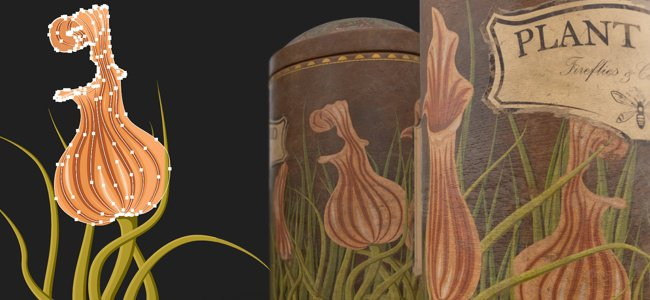
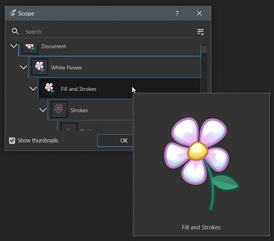
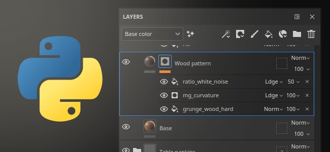

# Version 10.0

<b>Substance 3D Painter 10.0</b> prend en charge les fichiers Illustrator (.ai), intègre Substance 3D Assets, importe des polices via les ressources Texte, ajoute des fonctionnalités de pile de calques dans l’API Python et apporte plusieurs améliorations à la qualité de vie.

Date de publication : *16 mai 2024*

## Principales fonctionnalités

### Nouvelle ressource de texte

Cette nouvelle version introduit la <b>ressource Texte</b>, qui permet de charger des fichiers de polices pour écrire du texte dans différents contextes (pinceaux, projection du remplissage, entrées d&#39;image de Substance, etc.) pour embellir vos textures.

* <b>Parcourez vos polices dans la fenêtre Actifs</b>\
  Les polices sont désormais répertoriées dans la fenêtre Actifs sous leur propre filtre. Ils sont rassemblés à partir de différents emplacements sur le système d’exploitation (et également à partir des bibliothèques).

  
* <b>Faites glisser et déposez des polices comme n’importe quelle autre ressource</b>\
  Les polices peuvent être utilisées comme ressources de texte comme n’importe quel autre type de ressource. Faites-les glisser et déposez-les pour créer automatiquement une projection de remplissage. Ils peuvent également être utilisés dans les pinceaux ou comme entrée dans les filtres de Substance.

  
* <b>Paramètres de ressources de texte</b>\
  Lors de la création d’une ressource de texte, vous pouvez ajuster quelques paramètres pour ajuster l’aspect de votre texte : alignement vertical et horizontal, taille automatique ou manuelle, espacement des lignes et des caractères, couleur, etc.

  
* <b>Large éventail de caractères et de fonctionnalités pris en charge</b>\
  La ressource Texte prend en charge l&#39;écriture de droite à gauche ainsi que les [ligatures](https://en.wikipedia.org/wiki/Ligature_(writing)). (Pour pouvoir écrire des caractères non latins, une police compatible est requise.)

  
* <b>Importer des polices personnalisées comme la ressource régulière</b>\
  Vous pouvez importer vos propres fichiers de polices directement dans votre bibliothèque ou projet comme n’importe quelle autre ressource. Certains types de polices ne sont toutefois pas pris en charge. Pour plus d&#39;informations, consultez cette [page de documentation](../technical-support/workflow-issues/shelf-issues/font-import.md).

>[!NOTE]
>
> Pour plus d&#39;informations sur la <b>ressource Texte</b>, consultez la [page de documentation dédiée](../painting/text-resource.md).

### Nouvelle importation de fichiers Illustrator (.Ai)

Suite à la prise en charge des fichiers <b>.svg</b>, cette nouvelle version ajoute également la possibilité d&#39;importer des fichiers Illustrator (<b>.ai</b>).

* <b>Prise en charge des fichiers Illustrator (.Ai)</b>\
  Dans cette nouvelle version, les fichiers .ai peuvent désormais être importés et rendus dans Painter pour être utilisés comme ressource dans les pinceaux, les projections de remplissage ou comme entrées d’image de Substance.
* <b> les fichiers .svg et .ai partagent des paramètres communs</b>\
  Les documents SVG et Illustrator partagent des paramètres similaires, notamment la résolution, la zone de recadrage et les paramètres de sélection de l’étendue. Cela signifie que les ressources vectorielles peuvent être gérées de manière similaire.

  
* <b>Sélection du plan de travail</b>\
  Les documents Illustrator prennent en charge les plans de travail. Lorsque vous utilisez un fichier .ai, vous pouvez également choisir entre différents plans de travail disponibles via le paramètre dédié.

  
* <b>Sélection de l&#39;étendue améliorée</b>\
  La fenêtre de sélection de l’étendue a été améliorée grâce à la prise en charge des vignettes, ce qui facilite la navigation et la sélection d’éléments spécifiques uniquement.\
  Pour des raisons de performances, les vignettes sont désactivées par défaut et peuvent être activées avec la case à cocher <b>Afficher les vignettes</b>.

  

>[!NOTE]
>
> L&#39;importation de fichiers Illustrator (<b>.ai</b>) est actuellement prise en charge uniquement sous Windows et MacOS.

### Nouvelle intégration Substance 3D Assets

Une nouvelle fenêtre est disponible pour intégrer le site web Substance 3D Assets directement dans Painter. Cette intégration facilite la recherche et le téléchargement de ressources directement dans votre propre bibliothèque.

* <b>Nouvelle fenêtre Substance 3D Assets</b>\
  Un nouveau dock est disponible dans l’interface pour parcourir Substance 3D Assets. Si le dock n&#39;est pas visible et fermé, il peut être retrouvé dans la barre d&#39;outils du dock à droite de l&#39;interface.

  
* <b>Gestionnaire de téléchargement</b>\
  Vous pouvez voir les actifs en cours de téléchargement via le gestionnaire dédié en utilisant le bouton inférieur gauche de la fenêtre. Les ressources dont le téléchargement a échoué peuvent être redémarrées à partir de cette liste.

  
* <b>Recherchez facilement les ressources téléchargées</b>\
  Le bouton en bas à droite de la fenêtre ouvre un menu avec quelques actions pour aider à naviguer sur le site Web, mais aussi pour afficher où les actifs ont été téléchargés.

  

>[!NOTE]
>
> Lors du premier lancement, une connexion à votre compte sera nécessaire pour télécharger les ressources. Cette connexion est ensuite mise en cache pour des utilisations futures.

>[!NOTE]
>
> Le dock Substance 3D Assets n&#39;est pas disponible dans la version Steam.

### Nouveau module de pile de calques dans l’API Python

Cette version voit l’ajout du nouveau module de pile de calques dans notre API Python. Cette API permet de contrôler la pile de calques d’un projet, ce qui ouvre la porte à la création de plug-ins de pile de calques avancés et d’outils personnalisés.

* <b>Nouvelle API de pile de calques</b>\
  Le nouveau module <b>layerstack</b> permet de contrôler la pile de calques d&#39;un projet de plusieurs façons. Vous pouvez :

  * Recherchez et définissez la sélection des calques et des effets.
  * Créez de nouveaux calques, dossiers et effets (notamment des filtres, des points d’ancrage, etc.).
  * Instanciez des calques.
  * Obtenez et définissez les paramètres des calques et des effets, chargez des ressources dans ceux-ci.
  * Obtention et définition des paramètres de Substance.
* <b>Modifications de portée et pause du moteur</b>\
  La manipulation de la pile de calques peut entraîner de longs calculs. C’est pourquoi nous avons également exposé la possibilité de suspendre et de reprendre le moteur à partir de l’API (comme dans l’interface utilisateur). Nous avons également permis de regrouper des modifications, pour des raisons de performances mais aussi d&#39;annuler une seule fois plusieurs opérations.
* <b>Gestion de base des couleurs</b>\
  Avec l’exposition de la pile de calques, nous devions introduire la notion de gestion des couleurs dans notre API. Un nouveau module de <b>gestion des couleurs</b> a été ajouté pour créer, ajuster les couleurs et choisir l&#39;espace colorimétrique des bitmaps. (Cette partie de l’API n’est pas encore terminée et sera développée dans les versions futures.)
* <b>Informations sur le paramètre prédéfini d&#39;exportation de requête</b>\
  Les paramètres prédéfinis d’exportation sont désormais affichés dans notre API, ce qui permet de consulter la liste des paramètres prédéfinis (à la fois prédéfinis et personnalisés). Leur contenu peut également être récupéré dans un format similaire à notre API d’exportation de textures existante.
* <b>De nouvelles possibilités à venir !\
  </b> Cette nouvelle partie de l’API permet d’effectuer de nombreuses nouvelles opérations, telles que l’enregistrement et la restauration d’une sélection de calques ou la modification de la vitesse aléatoire de toutes les ressources d’un projet, par exemple :

  

>[!NOTE]
>
> Pour plus d&#39;informations sur l&#39;API, consultez la documentation incluse avec l&#39;application (via <b>Aide > Documentation sur les scripts > API Python</b>) qui inclut de nombreux fragments de code pour démarrer facilement.

>[!NOTE]
>
> Des exemples de plug-ins de pile de calques sont également disponibles dans notre [documentation en ligne](https://adobedocs.github.io/painter-python-api/).

### Amélioration de la peinture de cartes normales

Dans cette version, nous avons retravaillé le workflow normal de peinture de mappage. Nous avons notamment modifié la façon dont nous accumulons et mélangeons les tampons de pinceaux normaux. Ces modifications ont été apportées pour résoudre les problèmes liés à la peinture de cartes de flux.

* <b>Problème d’accumulation résolu</b>\
  Peindre par-dessus et sur une zone du canal normal ne sature ni ne serre plus et ne crée plus de trous ou d’artefacts. Il n&#39;est plus nécessaire non plus de basculer le canal normal sur RGB 32F.

  
* <b>Correction de l’annulation de la rupture des traits peints</b>\
  L’annulation d’un tracé ne casse plus les tracés déjà peints.

  
* <b>Transparence sur alpha zéro</b>\
  Les tampons de pinceau réalisés avec une texture avec un alpha à zéro dessinent désormais comme transparents. L’exemple ci-dessous présente un tampon de pinceau (à gauche) et une projection plane (à droite).

  

>[!NOTE]
>
> Pour plus d&#39;informations sur la cartographie du flux de peinture, consultez la [page de documentation](../painting/advanced-channel-painting/flow-map-painting.md).

### Manipulateurs de transformation améliorés

Plusieurs améliorations ont été apportées pour améliorer l&#39;utilisation des manipulateurs de transformation.

* <b>Mode Précision avec CTRL</b>\
  Appuyer sur la commande tout en faisant glisser sur un manipulateur va maintenant entrer dans un nouveau mode de précision qui permet des opérations plus méticuleuses. Cette modification s’applique aux manipulateurs de translation, de rotation et de mise à l’échelle.\
  Voici un exemple avant et après avoir appuyé sur CTRL tout en faisant glisser :

  
* <b>Nouveau comportement d&#39;échelle</b>\
  L’intensité de l’échelle est désormais basée sur la valeur d’échelle actuelle elle-même et non plus sur la taille de la scène. Cela facilite les changements relatifs, en particulier pour les valeurs faibles. Associée au mode précis, elle rend la mise à l’échelle beaucoup plus agréable.\
  Une autre modification consiste à réduire l’échelle jusqu’à ce que la valeur 0 ne passe plus en valeurs négatives. Cela évite de vouloir réduire une projection et de la retourner par accident.

  
* <b>Rotation améliorée du manipulateur de surface</b>\
  Le manipulateur de décalcomanie de surface est désormais beaucoup plus stable lorsqu’il fait glisser autour d’une surface. Il n&#39;augmente pas sa rotation simplement en faisant des allers-retours.\
  Voici le comportement <b>ancien</b> comparé au comportement <b>nouveau</b> :

  

  
* <b>Projection alignée sur la caméra lors du glisser-déposer</b>\
  Glisser-déposer une ressource dans la fenêtre permet de créer une projection de déformation directement sur la surface du filet. Cette projection a été incorrectement tournée précédemment, elle est maintenant alignée sur la caméra.

  

Quelques autres améliorations ont été apportées, notamment :

* <b>Mot De Tile Generator Mis À Jour</b>\
  Le paramètre de mode de fusion <b>Tile Generator</b> peut maintenant être modifié et modifiera le résultat comme prévu. La ressource a également été mise à jour vers la dernière version disponible dans <b>Substance 3D Designer</b>.
* <b>Problèmes de bande/qualité résolus sur certains filtres</b>\
  Plusieurs filtres étaient bloqués sur une précision de 8 bits au lieu de 16 bits, ce qui a entraîné des effets de bande/artefacts lors de leur utilisation (comme le balayage de l’histogramme ou le flou directionnel). Ce problème est maintenant résolu.
* <b>Espace colorimétrique dans la sortie SBSAR</b>\
  Lorsque le workflow de gestion des couleurs Hérité ou OCIO est activé, l’exportation SBSAR fait désormais référence aux noms d’espace colorimétrique utilisés dans le projet sur les sorties respectives.
* <b>Découverte des ressources plus rapide</b>\
  Avec l&#39;introduction de la <b>ressource de texte</b>, nous avons ajouté un nouveau cache pour accélérer l&#39;analyse de liens des ressources sur le disque au prochain démarrage. Ceci est particulièrement remarquable lorsque les ressources sont installées sur un disque dur ou lorsqu’une bibliothèque dispose de gigaoctets de ressources. Ce nouveau cache peut être désactivé à l&#39;aide d&#39;une ligne de commande. Pour plus d&#39;informations, consultez la [page de documentation](../pipeline-and-integration/configuration/command-lines.md) dédiée.

Merci beaucoup au site web [cet arabe ?](https://isthisarabic.com/) Ce qui a été d&#39;une grande aide lors du développement de cette version.

Référence aux illustrations utilisées dans les médias ci-dessus :

* [Homme en chemise noire](https://unsplash.com/photos/man-wearing-black-shirt-aoEwuEH7YAs) de Lucas Gouvêa
* [Rose et vert](https://unsplash.com/photos/pink-and-green-abstract-art-ruJm3dBXCqw) de Pawel Czerwinski
* [Retirer des illustrations](https://undraw.co/illustrations)
* Claude Monet

## Tutoriels

## Notes de mise à jour

### 10.0.0

Date de publication : <b>2024/05/16</b>\
Résumé : <b>version majeure, édition de la pile de calques avec l’API Python, lecture de fichiers Illustrator natifs, intégration de ressources 3D et nouvelle ressource de texte</b>

<b>Ajouté</b> :

* [Illustrator] Utilisation de fichiers Illustrator avec des tableaux dans Painter
* [Illustrator]&#x200B;[SVG] Ajout d’aperçus dans la sélection de l’étendue
* [Substance 3D Assets] Parcourir, sélectionner et télécharger des ressources 3D directement dans Painter
* [Substance 3D Assets]&#x200B;[UI] Nouveau panneau
* [Substance 3D Assets] Prise en charge des cartes et des matériaux d’environnement
* [Substance 3D Assets] Autoriser le rechargement, la navigation et l’ouverture du dossier d’emplacement dans le nouveau panneau Substance 3D Assets
* [Substance 3D Assets] Ajout d’un gestionnaire de téléchargement
* [Ressource de texte] Autoriser l’utilisation de polices incorporables
* [Text Resource] Autoriser le rendu d’une police/d’un texte sur un filet
* [Ressource de texte] Affichez les polices de l’utilisateur et d’autres chemins partagés dans le panneau Actifs avec une nouvelle catégorie
* [Ressource de texte]&#x200B;[Propriétés] Ajout de la prise en charge pour les propriétés de police avancées
* [Text Resource] Autoriser la recherche/l’affichage des polices dans les mini-tablettes
* [Ressource de texte] Ajouter un message/une boîte de dialogue d’erreur lors de l’importation d’une police incompatible
* Divers
* [Projection du fond] Amélioration du comportement du manipulateur d’échelle lors de l’utilisation de petites valeurs
* [Manipulateurs] Ajouter un nouveau mode précis en appuyant sur le raccourci CTRL
* [Manipulateurs] Améliorer la stabilité du manipulateur de surface lors de la translation
* [Exporter] Ajout d’un nom d’espace colorimétrique dans les sorties SBSAR
* [Performances] Amélioration du temps de découverte des ressources sur disque dans les bibliothèques
* [Substance] Mise à jour vers la version 9.1.2 du moteur de Substance
* [Glisser-déposer] Aligner la rotation de la décalcomanie sur la caméra lors de la dépose dans la clôture
* [Python] Édition de la pile de calques
* [Python] Autoriser à sélectionner un calque, un effet, un masque, un géomasque dans l’interface utilisateur
* [Python] Autoriser à obtenir/définir les modes de fusion des calques
* [Python] Autoriser à obtenir/définir les paramètres de projection du calque de remplissage
* [Python] Autoriser à interroger la couleur du matériau de Substance à partir d&#39;un calque de remplissage
* [Python] Autoriser à interroger et à définir des couleurs et des ressources uniformes dans les calques et les effets
* [Python] Autoriser la création et la modification de ressources de texte dans la pile de calques
* [Python] Autoriser la modification des canaux actifs sur les calques et les effets
* [Python] Autoriser les actions par lots à avoir une seule action Annuler/Rétablir
* [Python] Autoriser le chargement/la modification des paramètres de la source vectorielle
* [Python] Autoriser la modification des propriétés de couleur des calques et des effets avec la gestion des couleurs
* [Python] Autoriser à interroger et à créer des calques instanciés
* [Python] Autoriser l&#39;ajout de l&#39;effet de sélection de couleur
* [Python] Permet de contrôler la gestion des couleurs des images bitmap
* [Python] Autoriser à suspendre/reprendre le moteur
* [Python] Autoriser à naviguer vers les nœuds frères et parents
* [Python] Autoriser à créer un effet de filtre/générateur
* [Python] Autoriser à ajouter un effet de niveau
* [Python] Autoriser l&#39;ajout d&#39;un masque dynamique sur un calque
* [Python] Autoriser à créer/modifier des points d’ancrage
* [Python] Autoriser à obtenir/définir le masque sur les calques
* [Python] Autoriser à créer l&#39;effet de masque de comparaison
* [Python] Autoriser à interroger et à utiliser des paramètres prédéfinis à partir de ressources de Substance de données
* [Python] Autoriser à répertorier les paramètres prédéfinis et leurs valeurs via la fonction interne\_properties pour les ressources de Substance
* [Python] Autoriser la liste des paramètres prédéfinis d’exportation
* [Python] Autoriser à répertorier les paramètres prédéfinis d’exportation disponibles dans la bibliothèque
* [Python] Autoriser à récupérer le contenu des paramètres prédéfinis d’exportation

<b>Fixe</b> :

* [Crash] Annulation de « Supprimer l’instance de nuanceur » avec Ctrl-Z
* [Crash] Créer un calque sur une pile vide si la dernière sélection était un effet
* [SVG] Problème avec la valeur de zone recadrée personnalisée
* [Dépliage automatique] Le recalcul du packing uniquement sans aucune modification de l’orientation UV entraîne un blocage
* [Glisser-déposer] Les décalages dus à des ressources externes sont préchargés plusieurs fois
* [UI] La miniature de ressource glisser-déposer peut masquer le message d’avertissement dans la pile de calques
* [Performance] Les tuiles UV masquées sont toujours calculées
* [USD] Mise en surbrillance incorrecte pour la sélection de l’étendue
* [Ressource] L’image bitmap est corrompue après avoir peint dans un canal normal et enregistré le projet.
* [USD] Prise en charge de l’ordre des filets de sommet pour les gauchers
* [Substance] La réinitialisation à la valeur par défaut revient toujours à zéro pour le widget d’angle
* [Moteur] Peindre avec un SVG dans un pochoir ne fonctionne pas
* [Engine] Les coups de pinceau de mappage normaux s’interrompent après une annulation
* [Contenu] Le filtre Graphique vers Matériau a un mélange alpha et un espace colorimétrique incorrects
* [Contenu] Les modes de fusion du Tile Generator ne fonctionnent pas
* [Contenu] Le filtre de numérisation de l&#39;histogramme produit des effets de bande dans certains cas
* [Contenu] L’éclairage cuit stylisé ne prend pas en compte l’height peint
* [Python] Erreur inattendue lors de la récupération des informations de calque instanciées après le changement de shader

<b>Problèmes connus</b> :

* [Gestion des couleurs] Les conversions d’espace colorimétrique HDR avec ACE sous Linux produisent des couleurs condensées
* [Crash]&#x200B;[Linux]&#x200B;[AMD] Glissement et dépôt de ressources dans la pile de calques sur le système d’exploitation Wayland
* [Régression]&#x200B;[Interface utilisateur] Le menu contextuel est trop petit sur les écrans HD
* [Crash]&#x200B;[Python] Exportation USD déclenchée par TextureStateEvent
* [Enregistrer] Le fichier de projet d’application est perdu lorsque l’option « Enregistrer sous » échoue
* [MacOS Intel] Blocage lors de l’importation de certains paramètres prédéfinis
* [Illustrator] Impossible d’importer des fichiers Ai après un plantage du serveur sans redémarrer Painter
* [Importer] Les ressources portant le même nom mais avec des extensions différentes sont remplacées
