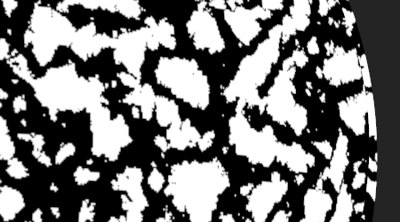
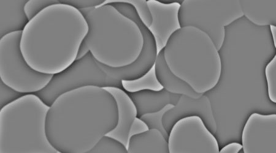

# Version 10.1

<b>Substance 3D Painter 10.1</b> ajoute de nouveaux filtres puissants, des fonctionnalités USD améliorées et une prise en charge de la plateforme VFX et de Linux mise à jour.

Date de publication : *17 septembre 2024*

>[!NOTE]
>
> Cette version de Painter utilise désormais Qt version 6, ce qui affecte la prise en charge des plug-ins Python et JavaScript. Voir ci-dessous pour plus de détails.

## Principales fonctionnalités

### Nouveaux filtres par défaut

Dans cette version, plusieurs nouveaux filtres ont été ajoutés pour développer considérablement le processus de texturation :

* <b>Nouveau matériau de décalcomanie de broderie</b>\
  Dans la section Matières de la fenêtre Actifs, vous pouvez trouver une nouvelle décalcomanie de broderie. Faites-le glisser n’importe où sur votre maillage, branchez n’importe quelle ressource (comme une texture ou même une police) et vous pourrez facilement créer de nouveaux détails de tissu.

  
* <b>Nouvelle couleur de la zone de remplissage/nouveau filtre de masque</b>\
  Ces deux nouveaux filtres permettent de remplir tous les tracés ou contours fermés. Ceci est utile pour remplir rapidement des tracés 3D par exemple. Comme il s’agit de filtres, ils peuvent également être utilisés pour des coups de pinceau manuels ou dans d’autres situations.

  
* <b>Nouveau filtre FXAA</b>\
  Ce nouveau filtre permet de réduire rapidement le crénelage, en particulier sur les contours nets qui peuvent apparaître après un niveau par exemple ou sur les masques réalisés avec l’effet de sélection de couleur.

  
* <b>Nouveau filtre passe-haut</b>\
  Avec ce filtre générique, vous pouvez générer une texture en niveaux de gris pour l’utiliser pour des effets plus avancés (comme adoucir, flouter ou renforcer la netteté des détails).

  
* <b>Nouveau filtre pixellisé</b>\
  Le filtre pixellisé peut simuler une réduction de la résolution, ce qui peut être utile pour styliser les couleurs et les motifs.

  
* <b>Nouveau filtre de postérisation</b>\
  Ce filtre peut être utile pour réduire le nombre de couleurs dans une image, ce qui peut aider à créer des contrastes dans les formes et à créer des effets stylisés.

  
* <b>Nouveau filtre de seuil</b>\
  Le filtre de seuil permet de créer rapidement des masques binaires en noir et blanc nets à partir d’une entrée en niveaux de gris.

  
* <b>Nouveau filtre Smoothstep</b>\
  Le filtre Pas à pas fluide est une autre façon d’effectuer un niveau ou un contraste pour affiner les informations en niveaux de gris. Ce filtre applique également une courbe exponentielle au résultat, ce qui permet de convertir des dégradés linéaires en courbes lisses.

  
* <b>Amélioration des filtres de transformation et de mise en miroir</b>\
  Le filtre de transformation a été mis à jour pour prendre en charge la mise à l’échelle non uniforme, le basculement horizontal ou vertical et des paramètres plus simples à utiliser. Le filtre miroir a également été actualisé avec des paramètres plus simples.

  
* <b>Icônes améliorées</b>\
  Pour rendre les filtres standard plus visibles et plus faciles à trouver, leurs icônes ont été refaites. Les icônes teintées de jaune sont destinées à être utilisées sur le contenu d’un calque, tandis que les icônes en niveaux de gris sont génériques et peuvent être utilisées à la fois dans le contenu des calques et le masque.

  
* <b>Correctifs mineurs sur les filtres</b>\
  D’autres filtres ont été ajustés pour résoudre certains problèmes :

  * Le filtre d’ajustement de l’height affectait l’alpha d’un calque, ce qui le rendait difficile à utiliser dans certains cas.
  * Le filtre de flou n’utilisait pas d’espace colorimétrique linéaire en mode de gestion des couleurs hérité, ce qui créait des couleurs incorrectes lors de la fusion/mélange de ses entrées.

### Mise à jour de la prise en charge des plateformes USD et VFX

Dans cette version de Painter, de nombreux composants tiers ont été améliorés et mis à jour :

* <b>Exportation de textures avec Adobe Standard Material en USD\
  </b>Lors de l’exportation de textures de Painter dans un fichier USD, vous obtiendrez désormais les propriétés de matière Adobe Standard avec elles. Cela rend ces fichiers USD prêts à être utilisés dans des applications qui prennent également en charge ces propriétés.
* <b>Importer des textures à partir de fichiers USD</b>\
  Désormais, l’importation d’un fichier USD permet également d’importer sa texture dans le projet qu’il crée, ce qui facilite les allers-retours entre les applications. Si le fichier USD utilise le matériau Adobe Standard, les paramètres du nuanceur sont également configurés, de sorte que le résultat dans la clôture corresponde à celui de l’autre application source.
* <b>Modifications Gltf\
  </b>Suite à la mise à jour de USD, un changement de comportement pour le format GLTF a été nécessaire pour assurer la parité. Lors de l’importation d’un fichier gltf, Painter suppose désormais que le mappage normal est au format OpenGL.\
  Certains fichiers gltf peuvent utiliser le format DirectX à la place. Par conséquent, un nouveau paramètre a été ajouté dans la nouvelle fenêtre de projet pour en tenir compte (notez que le format normal peut également être remplacé à partir de la pile de calques).

  
* <b>Dépendances mises à jour</b>\
  Plusieurs bibliothèques utilisées par Painter ont été mises à jour, notamment pour correspondre à la référence de la plateforme VFX. Voici les nouvelles versions utilisées dans Painter 10.1 :

  * Qt 6.5.6 (et PySide6 6.5.6)
  * Substance Engine 9.1.3
  * OpenEXR 3.2
  * Python 3.11
  * OCIO 2.3.2
  * OpenSubdiv 3.6.0
* <b>Prise en charge de Linux mise à jour\
  </b>Cette nouvelle version de Painter prend désormais en charge Red Hat Enterprise Linux (RHEL) version 8.6 au minimum, mais doit également être compatible avec la version 9.x.

### Performances améliorées

Quelques domaines de l’application ont fait l’objet d’améliorations de performances :

* <b>Amélioration du temps d’ouverture des projets\
  </b>L’ouverture des projets qui utilisaient beaucoup de coups de pinceau devrait désormais être plus rapide dans Painter. Le gain de temps de ces projets devrait également être légèrement amélioré.\
  Dans certains de nos projets de test, nous avons observé une réduction de 50 à seulement 6 heures du temps de chargement lors de l&#39;ouverture d&#39;un projet. La consommation de mémoire lors de l’ouverture d’anciens projets et de leur conversion vers la dernière version a également été améliorée.
* <b>Amélioration des performances de facettisation\
  </b>Nous utilisons désormais une optimisation automatique lorsque la tessélation est activée dans les paramètres du nuanceur. Les triangles plus petits qu’un pixel à l’écran ne sont plus recadrés, ce qui réduit le nombre de triangles à dessiner et accélère les temps de rendu.\
  Cette modification ne produit aucune différence visuelle et n’affecte pas le processus d’exportation du maillage.
* <b>Les vignettes simplifiées sont désormais les valeurs par défaut</b>\
  Dans la version 6.2, nous avons introduit les miniatures simplifiées pour les projets de tuiles UV afin d’améliorer les performances, mais les projets standard pouvaient toujours utiliser l’ancienne façon de calculer les miniatures de calques. Ce comportement a été contrôlé via un paramètre d’application.\
  Ce paramètre est désormais défini par défaut sur les vignettes optimisées pour améliorer les performances de tous les projets. Il peut être restauré dans les préférences principales si vous le souhaitez.

  

### Notes de migration de Painter 10.1

>[!NOTE]
>
> * Les plug-ins Python devront peut-être être mis à jour après la mise à jour vers Qt6. Voir [cette page pour plus de détails](https://adobedocs.github.io/painter-python-api/guides/qt6-migration/).
> * <b>Les plug-ins JavaScript </b> ont été déplacés dans un sous-dossier du répertoire Documents utilisateur. Les plug-ins existants n’apparaîtront plus dans l’application, car ils doivent être déplacés manuellement dans ce dossier.
> * Sur Steam/Ubuntu, une bibliothèque système est nécessaire pour que Painter fonctionne correctement. Assurez-vous que le curseur libxcb est installé avant de lancer l&#39;application.

## Notes de mise à jour

### 10.1.0

Date de publication : <b>2024/09/17</b>

Résumé : <b>version majeure, nouveau contenu : masque de zone de remplissage/filtre coloré, filtre de décalcomanie de broderie et six filtres de Substance génériques, importation de fichiers USD avec propriétés de matière et de nuanceur, amélioration des performances, conformité à la plateforme VFX 2024 et migration vers Linux RedHat</b>

<b>Ajouté</b> :

* [Contenu] Ajouter un nouveau masque de zone de remplissage/filtre coloré
* [Contenu] Ajouter un nouveau filtre Décalcomanie de broderie
* [Contenu] Ajout de 6 nouveaux filtres de Substance génériques (FXAA, pixelliser, passe-haut, postérisation, smoothstep, threshold)
* [USD] Exporter un calque USD avec un matériau ASM défini
* [USD] Importer des USD avec les propriétés de matière et d’ombrage
* [Performances] Activation par défaut des vignettes de pile de calques optimisées
* [Performances] Réduction du temps d’ouverture des fichiers de projet et de la consommation de mémoire (décodage des données)
* Compatible VFX platform 2024
* [VFX Platform 2024] Mise à jour vers Python 3.11
* [VFX Platform 2024] Mise à jour vers OpenEXR 3.2
* [VFX Platform 2024] [USD] Mise à jour OpenSubdiv 3.6.0
* [VFX Platform 2024][Gestion des couleurs] Mise à jour vers OCIO 2.3.2
* [Linux] Migration vers Linux RedHat
* [Linux] Mise à jour du pilote Nvidia version min vers 535.171.04
* [Importer] Ajout d’une option pour retourner la carte normale lors de l’importation d’un filet GLTF
* [UI] Utiliser la valeur par défaut du système d’exploitation pour la distance de détection des événements de glissement
* [Substance Engine] Ajouter une fonction de bande d&#39;appel pour supprimer les symboles de l&#39;exécutable
* [Écran de démarrage] Mise à jour vers le nouveau format d’écran de démarrage
* Mettre à jour la Substance Engine à la version 9.1.3
* [Python] Afficher le lien vers des exemples dans le menu de documentation de la pile de calques
* [JavaScript] Déplacement des plug-ins JavaScript dans le sous-dossier javascript/plugins

<b>Fixe</b> :

* [Illustrator] Blocage lors de l’exportation d’une vignette UV avec un graphique .ai dans des cas spécifiques
* [Traits dynamiques][Tracé] Un tracé aléatoire ne fonctionne pas sur un tracé
* [UI][Propriétés] Le verrouillage est activé lorsque la mosaïque n’est pas uniforme
* &#x200B;Le fichier TXT de débogage est créé lorsque vous double-cliquez sur le projet Painter
* [USD][Export] Certaines textures peuvent être manquantes
* [ASM] La couche Couleur de diffusion ignore les couleurs métalliques
* [Contenu] Le filtre Flou ne fonctionne pas dans l’espace colorimétrique de travail
* Le filtre Ajustement de l’Height [Contenu] modifie également l’alpha du calque

<b>Problèmes connus</b> :

* [Gestion des couleurs] Les conversions d’espace colorimétrique HDR avec ACE sous Linux produisent des couleurs condensées
* [Win][Blocage] [ACE] N’utilise pas l’espace colorimétrique sRGB ICE pour la transformation d’affichage
* [Régression][Interface utilisateur] Le menu contextuel est trop petit sur les écrans HD
* [Crash][Python] Exportation USD déclenchée par TextureStateEvent
* [MacOS Intel] Blocage lors de l’importation de certains paramètres prédéfinis
* [Blocage] Déplacer la ressource et enregistrer le projet
* [Moteur] Lorsque vous peignez avec l’outil Dupliquer dans des couleurs de décalage de couche normales, cela ne fonctionne pas correctement
* [Python] Le widget Fantôme apparaît supprimé par le script et fonctionne toujours
* [RedHat] Problèmes de sélecteur de couleurs
