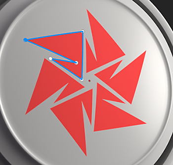
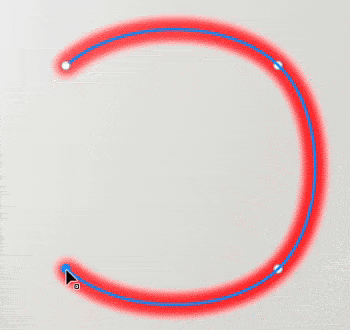
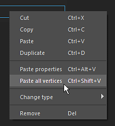
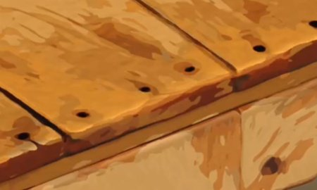
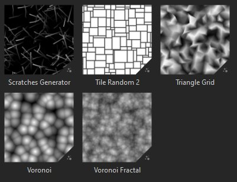
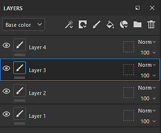

# Version 11.0

<b>Substance 3D Painter 11.0</b> ajoute un nouveau workflow de mise à jour automatique des ressources, un outil de tracé rempli, ainsi que des améliorations générales pour les tracés, une cage automatique pour le baking et plusieurs nouveaux filtres pour la création de textures stylisées.

Date de publication : <b>11 mars 2025</b>

>[!NOTE]
>
> Cette version de Painter supprime la prise en charge des configurations Mac Intel. Voir ci-dessous pour plus de détails.
> 
> Cette version élève également la version minimale prise en charge de Windows 10 à 22H2.
> 
> Pour plus d&#39;informations, consultez notre [page Configuration requise](../getting-started/system-requirements.md).

## Principales fonctionnalités

### Nouvelle mise à jour automatique des ressources

Il est désormais possible de tenir les bibliothèques et les projets à jour avec les dernières versions de vos ressources grâce au nouveau workflow de mise à jour automatique. Grâce à ce nouveau processus, Painter peut surveiller les ressources sur le disque pour rechercher les modifications, les recharger automatiquement et les remplacer par vos bibliothèques et projets.

* <b>Activation de la mise à jour automatique dans la fenêtre Actifs</b>\
  En bas à droite de la fenêtre Actifs est maintenant disponible un bouton et un menu pour configurer le système de mise à jour automatique (la petite icône de doubles flèches). Activez l&#39;option <b>Panneau Actifs</b> pour surveiller les bibliothèques et les recharger.

  
* <b>Mise à jour des ressources dans les projets</b>\
  Le rechargement d’une ressource ne met pas automatiquement à jour la version utilisée dans un projet via la pile de calques, les paramètres d’affichage, les paramètres des nuanceurs, etc. Pour ce faire, veillez à activer également l&#39;option <b>Ressources utilisées dans le projet</b>.

  
* <b>Fréquence de mise à jour </b>\
  La fréquence à laquelle Painter doit rechercher une mise à jour des ressources peut être définie en quelques minutes via un paramètre dédié. L’utilisation de 0 minute actualise l’application toutes les quelques secondes. Notez toutefois qu’une valeur aussi faible peut entraîner des problèmes de performances. L’application s’actualise automatiquement lors de la réactivation du focus.
* <b>Mise à jour manuelle des ressources</b>\
  Le processus d’actualisation et de mise à jour peut également être déclenché manuellement à l’aide des boutons dédiés situés au bas du menu de mise à jour automatique. Cela peut être plus pratique que d’utiliser et d’attendre le démarrage du processus automatique.

  
* <b>Incohérence et erreurs dans la fenêtre du journal</b>\
  La mise à jour des ressources, en particulier si la différence entre l’ancienne et la nouvelle version est importante, peut entraîner des problèmes. Par exemple, les résultats de texturation peuvent être très différents ou interrompus en raison de paramètres manquants/changeants sur une Substance de données. C&#39;est pourquoi <b>Ignorer les ressources lorsque leurs paramètres ne correspondent pas</b> est activé par défaut. Les problèmes seront signalés dans la fenêtre du journal.\
  Pour forcer une mise à jour, il suffit de désactiver ce paramètre.

  

  
* <b>Disponible dans l&#39;API Python pour automatiser la maintenance du projet </b>\
  Le workflow de mise à jour automatique a également été exposé à Python. De nouvelles fonctions ont été ajoutées pour aider à répertorier les ressources obsolètes et à les remplacer.\
  Pour plus d’informations, consultez la documentation dédiée via le menu Aide de l’application.

>[!NOTE]
>
> Pour plus d&#39;informations, consultez la [page de documentation dédiée](../features/auto-update.md).

### Nouvel outil de tracé avec fond

L’outil Tracé rempli est un nouveau type d’outil de tracé qui permet de créer des formes sur la surface du modèle 3D rempli d’une couleur uniforme. Elle permet la création de motifs complexes.

* <b>Nouvel outil pour créer un tracé avec une couleur remplie</b>\
  Un nouvel outil appelé <b>Tracé rempli</b> est disponible dans le menu Tracé. Cet outil peut remplir la zone intérieure d’un tracé lorsqu’il est fermé. Le remplissage se fait avec une couleur uniforme pour chaque canal du Jeu de textures.

  
* <b>S&#39;adapter à la surface automatiquement</b>\
  L’outil Tracé rempli peut s’adapter à n’importe quel type de surface et ne se limite pas aux zones planaires. Il peut franchir les espaces et les limites des objets.

  
* <b>Compatible avec le miroir et la symétrie radiale</b>\
  Ce nouvel outil prend également en charge les propriétés de symétrie, ce qui permet de créer des formes complexes.

  
* <b>Basculement facile entre les outils de tracé</b>\
  Une nouvelle façon de basculer entre les différents types d’outils de tracé a été ajoutée dans la fenêtre Propriétés. Il est ainsi plus facile d’essayer des outils et de dupliquer des tracés. Par exemple, vous pouvez créer un contour de tracé, puis le dupliquer pour le convertir en tracé rempli, ce qui permet d’obtenir rapidement une forme avec un contour.

  

### Outils de tracé améliorés avec contraint, lignes droites et bien plus encore

Dans cette nouvelle version, de nombreuses améliorations ont été apportées au comportement et à la qualité de vie pour faciliter l’utilisation des outils de tracé :

* <b>Aperçu du tracé (basculer avec Maj + P)</b>\
  Lors de la modification d’un tracé, une nouvelle ligne pointillée apparaît pour indiquer comment le tracé réagira lors de l’ajout d’un nouveau point à la fin de la courbe. Cela rend les changements plus prévisibles. Cet aperçu peut être désactivé via le menu des paramètres dédié ou en utilisant le raccourci clavier <b>Maj+P</b>.

  
* <b>contraint linéaire et angulaire</b>\
  Le modificateur de clavier <b>Maj</b>peut désormais être utilisé pour créer automatiquement des lignes droites entre les points. Maintenir la touche <b>Ctrl</b> peut également être utilisée pour appliquer un contraint d&#39;angle qui aide à créer des formes géométriques.\
  Les paramètres de contraint d’angle peuvent être modifiés via le menu des paramètres de tracé de la barre d’outils contextuelle.

  
* <b>Contraindre des points de tracé vers des polygones de maillage</b>\
  Pour faciliter le placement des points, un nouveau contraint (icône en forme d’aimant) peut être activé. Cette option permet de placer des points sur les vertex du modèle 3D et de suivre une surface ou une arête.\
  Le contraint peut être effectué de trois manières différentes :

  * Contraindre sur les vertex
  * Contraindre sur les bords
  * Contraindre au centre des contours

  Tous ces modes sont disponibles via le menu des paramètres de chemin dans la barre d’outils contextuelle.

  

  
* <b>Fermeture automatique en cliquant sur le dernier vertex</b>\
  Pour faciliter l&#39;<b>utilisation de l&#39;outil Tracé rempli </b>, cliquez sur le premier vertex lorsque le dernier est sélectionné pour fermer automatiquement le tracé. Pour sélectionner un point au lieu de fermer le tracé, vous pouvez utiliser la touche <b>CTRL</b>. (Ce comportement était inversé dans la version précédente.)

  
* <b>Copier les positions des vertex de tracé du contenu vers le masque</b>\
  Il est désormais possible de <b>copier</b> un tracé en mode de matériau, puis d&#39;utiliser l&#39;<b>option Coller tous les vertex</b> sur un tracé dans un masque. Cela permet de synchroniser différents tracés entre les matériaux et les masques.

  
* <b>Amélioration du comportement d&#39;affichage de l&#39;interface utilisateur</b>\
  Appuyez sur les raccourcis clavier viewports manipulateur (<b>W</b>, <b>S</b> ou <b>D</b>) pour les activer à la volée. Ils peuvent également être activés/désactivés à partir des boutons dédiés de la barre d’outils contextuelle. Cette modification permet de les afficher ou de les masquer rapidement sans masquer les autres éléments visuels du viewport (comme la courbe et les points du tracé).

  
* <b>La rotation et l’échelle sont désormais accessibles sur les vertex du tracé</b>\
  Dans cette version, l&#39;outil <b>Rotation </b> et <b>Mise à l&#39;échelle </b> peut désormais être utilisé lorsque plusieurs vertex sont sélectionnés. Cela permet d’ajuster et d’aligner les vertex ensemble.

  
* <b>Afficher les informations de chemin dans la fenêtre Propriétés</b>\
  La fenêtre des propriétés comporte désormais une nouvelle section lorsqu’un outil de tracé est sélectionné. Cette nouvelle section regroupe les informations et les actions spécifiques aux tracés, telles que la longueur d’un tracé, la profondeur de la projection et les actions permettant de passer d’un type à l’autre.

  
* <b>Amélioration de l’édition de Tangente lorsqu’elle est vue sous un angle</b>\
  La modification de tangentes personnalisées peut s’avérer difficile en fonction de l’angle de vue. Cette disposition a été modifiée afin que les tangentes soient contraintes à leur propre régime.

  
* <b>Garder la liste des tracés ouverte entre les calques</b>\
  Lors du basculement entre différents calques de peinture et effets, si le panneau Tracé du viewport était fermé, il le resterait également sur les autres calques. Le panneau reste maintenant ouvert pour faciliter les allers-retours.

  
* <b>Se concentrer sur le chemin actuellement sélectionné </b>\
  Lorsque vous appuyez sur le raccourci du clavier <b>F</b>, lors de la modification d&#39;un tracé, vous vous concentrez désormais sur un tracé au lieu de l&#39;ensemble du modèle 3D.
* <b>Supprimer le chemin avec le retour arrière </b>\
  Les tracés peuvent désormais être rapidement supprimés en appuyant sur le raccourci clavier <b>Retour arrière </b>.

### Nouveaux filtres de Substance et générateurs de texture

La nouvelle version introduit quelques nouveaux filtres ainsi que quelques motifs procéduraux.

<b>Filtres :</b>

* <b>Stylisation</b>\
  Ce nouveau filtre peut être utilisé pour convertir une texture existante en une version plus stylisée. Il simule les coups de pinceau dans l’espace 3D et peut appliquer quelques autres effets pour obtenir un aspect pictural. Il contient plusieurs paramètres prédéfinis pour faciliter la lecture.

  
* <b>Quantifier</b>\
  Le filtre Quantifier peut être utilisé pour réduire le nombre de couleurs dans une image et créer des zones plates avec des limites strictes. Il peut également être utilisé pour styliser des textures.

  
* <b>Kuwahara anisotrope</b>\
  Ce filtre applique le [filtre Kuwahara](https://en.wikipedia.org/wiki/Kuwahara_filter "https://en.wikipedia.org/wiki/Kuwahara_filter") qui peut être utilisé pour la réduction de bruit et pour la stylisation de textures également.

  
* <b>Directional distance</b>\
  Il s’agit d’un filtre simple pour étirer des pixels dans une direction donnée dans l’espace 2D. Il peut être utilisé pour étaler les coups de pinceau ou créer facilement des fuites.

  
* <b>Bevel smooth</b>\
  Le bevel smooth est une nouvelle version du filtre en biseau, offrant de meilleurs résultats et commandes. Il est disponible en plus du filtre existant.

  
* <b>Conversion en niveaux de gris </b>\
  Ce nouveau filtre peut être utilisé pour convertir facilement des images ou des couches en niveaux de gris, permettant ainsi de contrôler les couches Rouge, Vert et Bleu si nécessaire.

<b>Générateurs et bruits de Textures</b> :

* <b>Générateur Scratches </b>\
  L&#39;invention concerne un générateur de rayures amélioré simulant des filetages minces avec diverses commandes permettant d&#39;obtenir un rendu aléatoire.
* <b>Triangle Grid </b>\
  Bruit créé à partir des connexions de triangles, avec des commandes pour le caractère aléatoire et le smoothness.
* <b>Mosaïque aléatoire </b>\
  Un générateur de texture adapté à la construction de motifs de carreaux.
* <b>bruits fractaux Voronoi et Voronoi </b>\
  Déjà disponibles en tant que bruits 3D, ces nouvelles versions 2D peuvent être utilisées pour le travail et la répétition en 2D ou dans l’espace UV.
* <b>Mise à jour des bruits vers la dernière version de Designer </b>\
  La plupart des bruits disponibles dans Painter ont été mis à jour avec la dernière version de Substance 3D Designer. Les paramètres des bruits ne sont plus masqués dans un groupe pour les rendre plus rapides à modifier.

### Nouvelle cage automatique pour le baking (expérimental)

Lors du baking d&#39;un maillage à haute densité sur des maillages à faible densité, vous pouvez désormais sélectionner une nouvelle option <b>Automatique</b> lors de la spécification du mode de cage. Cette nouvelle méthode tente de calculer un maillage de cage automatique qui correspond le mieux aux maillages à haut niveau de concurrence pour éviter les artefacts.

* <b>Nouveau paramètre dans les paramètres de baking communs </b>\
  Dans le paramètre de baking commun, le paramètre de cage a été remplacé par une sélection entre trois options :\
  <b>Distance</b> : paramètres de distance avant/arrière par défaut.\
  <b>Automatique (expérimental)</b> : la nouvelle cage automatique.\
  <b>Fichier personnalisé</b> : la méthode précédente de chargement d&#39;un fichier de maillage personnalisé en tant que cage.

  

>[!NOTE]
>
> Cette fonction est considérée comme expérimentale. Nous prévoyons d’améliorer l’algorithme dans les versions futures. Nous recherchons également des commentaires sur la qualité des résultats et les bogues possibles.

### Rendu avec Metal sur Mac OS

Des modifications spécifiques liées à la plateforme Mac ont été apportées dans cette version :

* <b>L’API graphique Metal est désormais utilisée à la place d’OpenGL dans Mac </b>\
  À partir de cette version, Painter utilise désormais l&#39;API graphique <b>Metal </b> sur Mac, à la fois pour le rendu de ses textures de viewport et de calcul. Ce commutateur améliore considérablement les performances et la stabilité de l’application. Il sera également plus facile d’intégrer de nouvelles fonctionnalités à l’avenir, car OpenGL a été abandonné sur MacOS.
* <b>Suppression de la prise en charge de l’architecture Intel sur le système d’exploitation Mac </b>\
  Avec cette version, la compatibilité avec les processeurs Intel sur MacOS a été supprimée. Architecture ARM (M1, M2, etc.) est maintenant le seul pris en charge.

### Divers

Quelques autres fonctionnalités ont également été ajoutées dans cette version :

* <b>Activer uniquement le canal de base color sur le nouveau calque de remplissage/effet</b>\
  Désormais, par défaut, lors de la création d’un calque de remplissage ou d’un effet, seule la couche Base color est activée. (Cette modification ne s’applique pas en cas de glisser-déposer d’une ressource qui se créerait elle-même un calque de remplissage/effet.)\
  Sur la base des commentaires de la communauté, nous avons apporté cette modification pour améliorer les performances en évitant le calcul de canaux qui sont désactivés par la suite. Cela devrait favoriser la réactivité lors du travail en haute résolution ou avec des UV.\
  Notez que vous pouvez rapidement réactiver tous les canaux en cliquant sur le bouton Base color tout en conservant le raccourci du clavier <b>ALT</b>.

  
* <b>Renommer les Tuiles UV pour l&#39;exportation des textures</b>\
  Dans la fenêtre de liste de Jeux de textures, il n’est pas possible d’ajouter un nom personnalisé sur les Tuiles UV. Contrairement à la description, le nom personnalisé peut être récupéré dans les paramètres prédéfinis d&#39;exportation via la balise dédiée <b>$uvTileName</b>.\
  Cette nouvelle fonctionnalité permet de remplacer les numéros d’UDIM par des noms spécifiques lors de l’exportation.

  
* <b>Nouveau bouton d&#39;exportation disponible dans la barre d&#39;outils Ancrer</b>\
  Les actions <b>Envoyer vers</b> qui permettent d&#39;exporter vers d&#39;autres applications ont été déplacées dans une fenêtre dédiée, désormais disponible à partir de la barre d&#39;outils Ancrer sur le côté droit de l&#39;application.

  
* <b>Amélioration de la dénomination des tracés et calques copiés/collés</b>\
  Le schéma de dénomination des calques lors de la duplication ou du copier/coller de calques et de tracés a été amélioré pour être plus cohérent et prévisible.

  

## Tutoriels

## Notes de mise à jour

### 11.0.0

Date de publication : <b>2025/03/11</b>\
Résumé : <b>version majeure, nouvelle fonctionnalité de mise à jour automatique, outil Chemin rempli et autres améliorations des chemins, ainsi que de nouveaux filtres et une génération expérimentale de cage automatique pour le baking</b>

<b>Ajouté</b> :

* Mise à jour automatique
* [Mise à jour automatique] Mise à jour automatique des actifs modifiés dans le panneau Actifs
* [Mise à jour automatique] Mise à jour automatique des actifs modifiés dans l’ensemble du projet
* [Mise à jour automatique] Désactiver la mise à jour automatique par défaut
* [Mise à jour automatique] Rendre la mise à jour facultative si les paramètres de ressource ne correspondent pas (.sbsar, .glsl, .ai, .svg)
* [Mise à jour automatique] Ajouter une variable d’environnement pour désactiver la fonction de mise à jour automatique
* [Mise à jour automatique][SBSAR] Rendre la mise à jour facultative si les paramètres de la ressource ne correspondent pas
* Tracé plein
* [Tracé][Remplissage] Ajouter un nouvel outil pour créer des tracés remplis
* Améliorations des tracés
* [Tracé] Création d’un tracé contraignant aux polygones
* [Chemin] Permettre de changer de type de chemin
* [Chemin] Autoriser à copier et coller les données de vertex de chemin entre le contenu et le masque
* [Tracé] Permettre de conserver un angle lors de la création d’un nouveau point
* [Tracé] Autoriser à contraindre la création de point à une ligne
* [Tracé] Fermer la forme en un seul clic
* [Chemin] Afficher les informations de chemin
* [Tracé] Permet de mettre à l’échelle et de faire pivoter les vertex de tracé
* [Chemin][UX] Faciliter l’accès aux gadgets de transformation
* [Chemin] Ajouter un aperçu du chemin
* [Tracé] Désactiver l’aperçu du tracé avec les touches Maj + P
* [Tracé] Amélioration de l’édition de tangente à partir de la vue latérale
* [Tracé] Permet de se concentrer sur un tracé 3D
* [Chemin] Les Vertex doivent conserver l’état de sélection lorsque l’interface utilisateur est activée et désactivée
* [Chemin] Autoriser à supprimer le chemin à l’aide de la touche Retour arrière
* [Chemin] Garder la liste des chemins ouverte si l’utilisateur la développe
* [Chemin][Pile de calques] Renommer correctement les doublons lors du copier/coller
* Améliorations de l’interface utilisateur et de l’info-bulle de [Path]
* Performance
* [Performances] Amélioration des performances du viewport lors de l’utilisation de niveaux de tessellation élevés
* [Performances] Activer uniquement la première couche sur les nouveaux calques de remplissage/effets
* [Performance] calcul de contour du pinceau parallélisé
* Baking
* [Baking] Ajouter une nouvelle option de génération de cage entièrement automatique pour le baking avec des maillages à polychromie élevé (expérimental)
* Contenu
* [Contenu] Ajouter 6 nouveaux filtres : stylisation, quantification, kuwahara anisotrope, bevel smooth, directional distance, conversion en niveaux de gris
* [Contenu] Mise à jour de Bruit et Grunges vers la dernière version de Designer (avec le nouveau 2D Voronoi)
* [Content] Ajouter 3 nouveaux générateurs de textures (Tile Random, Triangle Grid, Scratches Generator)
* [Contenu] Renommer le modèle de Moteur irréel et les paramètres prédéfinis d’exportation
* Python
* [Étagère][Python] Enregistrer le matériau adaptable ou le masque adaptable sur le disque depuis Python
* [Python] Ajout de la cage automatique de baking à l’API Python
* [Python] Autoriser la modification des noms et descriptions des Jeux de textures/Tuiles UV
* [Python] Partage des paramètres de résolution sur les sources de vecteurs et de polices
* [Mise à jour automatique][Python] Exposer les fonctionnalités de mise à jour automatique du projet dans Python
* Divers
* [Exporter] Accédez plus facilement aux options Envoyer vers avec un nouveau panneau
* [Nvidia] Ajouter un avertissement concernant les derniers pilotes Nvidia (572.16)
* Le contraint angulaire doit être affecté par la sélection Objet/Espace monde &#x200B;
* [Liste de Jeux de textures] Permet d’ajouter un nom personnalisé aux Tuiles UV et de les utiliser lors de l’exportation
* Mac
* [Mac] Utilisation de Metal au lieu d’OpenGL pour le rendu graphique
* [Mac] Suppression de la prise en charge de Mac par Intel

<b>Fixe</b> :

* Les résultats du baker d’Ambient occlusion [Nvidia][Baker] présentent des artefacts
* [Crash] Cliquez sur Alt pour activer/désactiver la visibilité sur les affaires de Jeu de textures désactivées vers un crash
* [Baking] La Cage est prise en compte avec un poly faible comme un poly param élevé
* [Baking] La couleur du Matériau pour le baker Map id ne fonctionne pas avec le format de fichier USD
* [Performance] Rendu lent dans le viewport avec des maillages et beaucoup d’objets qui se chevauchent
* [Qt] Le sélecteur de couleurs personnalisé n&#39;a pas de paramètres de gestion des couleurs
* [Viewport] Les Manipulateurs 3D scintillent lorsque l’anticrénelage est activé
* Emplacement en niveaux de gris de la gomme dans l’état de pinceau des blocs de masque
* [Journal] Les messages d’erreur très longs ne sont pas signalés lors de l’importation de maillages
* [Contenu] Erreur de frappe dans la liste des noms du paramètre prédéfini du paramètre prédéfini d&#39;outil Topstitches
* [Python] Le remplacement d’un fichier SVG/Ai par un autre ne met pas à jour ses propriétés
* [Python] L’ID du plan de travail de la ressource vectorielle est vide dans certains cas lorsqu’il est interrogé à partir de Python
* [Python] Les erreurs imprimées dans le journal comportent parfois beaucoup de retours de ligne

<b>Problèmes connus</b> :

* [Gestion des couleurs] Les conversions de l’espace colorimétrique HDR avec ACE sous Linux produisent des couleurs condensées
* [Régression][Interface utilisateur] Le menu contextuel est trop petit sur les écrans HD
* [Crash][Python] Exportation USD déclenchée par TextureStateEvent
* [Moteur] Lorsque vous peignez avec l’outil Clone dans des couleurs de décalage de couche normales, cela ne fonctionne pas correctement
* [Python] Le widget de Fantôme apparaît supprimé par le script et fonctionne toujours
* [RedHat] Problèmes de sélecteur de couleurs
