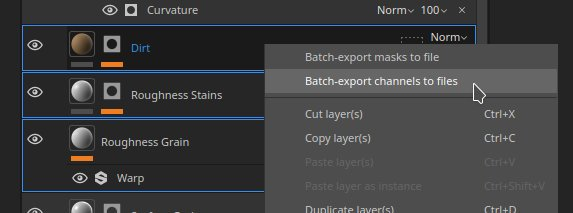
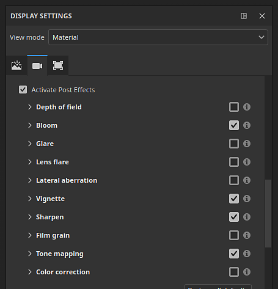

# Version 12.0

<b>Substance 3D Painter 12.0</b> offre l&#39;aplatissement de la texture directement dans la pile de calques, un nouveau mode automatique de projection de déformation, un ensemble remanié d&#39;effets de post-traitement, ainsi qu&#39;un workflow amélioré de création et de paramètres de projet.

Date de publication : <b>9 mars 2026</b>

>[!NOTE]
>
> Dans cette version, la prise en charge des <b>GPU intégrés</b> avec <b>mémoire unifiée/partagée</b> a été améliorée. On peut s&#39;attendre à une meilleure détection de la mémoire vidéo, ce qui devrait conduire à de meilleures performances et à moins de problèmes graphiques.

## Principales fonctionnalités

### Nouvel aplatissement des CALQUES

Une nouvelle action <b>Aplatir</b> est désormais disponible dans le menu contextuel par clic droit de la pile de calques. Plusieurs calques peuvent être rapidement fusionnés en les regroupant (<b>Ctrl/Cmd + G</b>) et en créant une copie aplatie (<b>Ctrl/Cmd + M</b>). Le groupe source est automatiquement désactivé, ce qui vous laisse le choix de le supprimer ou de l&#39;enregistrer en tant que <b>matériau dynamique</b> pour modification ultérieure.

Les éléments aplatis de la pile de calques peuvent également être exportés directement sur le disque pour des itérations rapides dans d’autres applications. Les groupes, calques ou masques peuvent être exportés individuellement ou par lots via le menu contextuel de la pile de calques.

* <b>Aplatir les textures directement dans la pile de calques</b>\
  N&#39;importe quel groupe peut être aplati en appuyant sur <b>Ctrl/Cmd + M</b> ou en sélectionnant l&#39;entrée <b>Aplatir le groupe</b> dans le menu contextuel accessible via un clic droit. Cela génère une copie fusionnée du contenu sélectionné tout en désactivant automatiquement le groupe source, en conservant les calques d’origine intacts jusqu’à ce qu’une décision soit prise de les supprimer ou de les restaurer.

  
* <b>Aplatissement et exportation de textures sur le disque</b>\
  Une action d’exportation dédiée dans le menu contextuel permet de transformer le résultat aplati d’un calque, d’un masque ou d’un groupe et de l’enregistrer directement sur le disque. Cela est utile pour transférer le contenu cuit vers d’autres applications sans passer par le pipeline d’exportation de texture complet.
* <b>Opérations par lots</b>\
  Plusieurs calques, groupes ou masques peuvent être sélectionnés à la fois et aplatis ou exportés individuellement en une seule opération, ce qui permet de traiter efficacement de grandes parties d’une pile de calques en une seule étape.

  

>[!NOTE]
>
> Pour plus d&#39;informations sur l&#39;aplatissement des calques, consultez la [page de documentation dédiée](../interface/layer-stack/flatten-layers.md).

### Nouvelle déformation en mode géométrie pour les projections

Les décalcomanies peuvent désormais s&#39;adapter automatiquement aux surfaces complexes, ce qui réduit le besoin de réglages manuels. L&#39;option <b>Déformer en géométrie</b> est disponible dans la barre d&#39;outils contextuelle lorsque la projection de déformation est active.

* <b>Nouveau paramètre dans la barre d&#39;outils contextuelle</b>\
  Un nouveau bouton d&#39;activation/désactivation <b>Déformation de la géométrie</b> est disponible dans la barre d&#39;outils contextuelle lorsque le mode de projection Déformation est actif. Il peut être désactivé à tout moment sans réinitialiser la configuration de projection actuelle.

  
* <b>Habillage automatique sur la surface maillée</b>\
  Lorsque cette option est activée, la projection de déformation suit automatiquement la courbure et la topologie du maillage sous-jacent. En faisant glisser la projection sur la surface, celle-ci s&#39;adapte parfaitement à la géométrie, ce qui réduit considérablement le réglage manuel des décalcomanies lorsque vous placez des formes complexes ou courbes.

  
* <b>Conservation des déformations locales</b>\
  Lors de la modification des sommets de la grille de projection de déformation, le mode de déformation en géométrie tente de conserver la déformation prédéfinie pour s’assurer que la même forme est toujours projetée.

  

>[!NOTE]
>
> Pour plus d&#39;informations sur la projection de déformation, consultez la [page de documentation dédiée](../painting/fill-projections/warp-projection.md).

### Nouveaux effets de post

Les rendus dans Painter peuvent désormais être améliorés avec un tout nouvel ensemble d&#39;effets de post-traitement disponibles dans la fenêtre <b>Paramètres d&#39;affichage</b>. De nouveaux ajouts, tels que <b>Halo</b> et <b>Grain de film</b>, sont désormais disponibles, ainsi que des effets améliorés de <b>Profondeur de champ</b> et de <b>reflet</b>, entre autres.

Voici un exemple de ce que vous pouvez obtenir avec les nouveaux effets :

* <b>Nouveaux effets de post-traitement</b>\
  Tous les effets de post-traitement peuvent être activés et configurés individuellement dans la fenêtre <b>Paramètres d&#39;affichage</b>. Les effets sont appliqués dans l’ordre de superposition et chacun peut être activé ou désactivé indépendamment, ce qui facilite leur combinaison et leur expérimentation avec des résultats différents.

  
* <b>Nouvelle liste d&#39;effets :</b>

  * <b>Profondeur de champ</b> : applique un flou aux objets en dehors de la plage focale pour simuler la mise au point de l’objectif de l’appareil photo.
  * <b>Fleur</b> : ajoute une lueur douce émanant des zones lumineuses de l&#39;image.
  * <b>Éblouissement</b> : crée des traînées de lumière autour des sources de lumière.
  * <b>Halo</b> : simule les reflets optiques de l&#39;objectif lorsqu&#39;une lumière vive brille dans l&#39;appareil photo.
  * <b>Aberration latérale</b> : simule la frange chromatique des contours de l&#39;image causée par les imperfections de l&#39;objectif.
  * <b>Vignette</b> : assombrit les coins et les bords de l&#39;image pour attirer l&#39;attention vers le centre.
  * <b>Accentuer</b> : augmente le contraste des bords pour rendre l&#39;image rendue plus nette.
  * <b>Grain de film</b> : superpose un bruit subtil pour reproduire la texture d&#39;un film analogique.
  * <b>Mappage de tonalité</b> : remappe les valeurs de luminance HDR dans une plage affichable pour un aspect plus cinématographique.
  * <b>Correction colorimétrique</b> : ajuste le contraste, la saturation, la luminosité et la température pour affiner la balance des couleurs globale.

>[!NOTE]
>
> Pour plus d&#39;informations sur les nouveaux effets, consultez la [documentation dédiée](../features/post-processing/post-processing.md).

### Amélioration de la fenêtre Nouveau projet et paramètres

La nouvelle fenêtre de projet et la boîte de dialogue des paramètres du projet ont été repensées pour faciliter la navigation. Les paramètres ont été réorganisés et regroupés pour une meilleure lisibilité, et le flux de travail de réimportation de maillage a été amélioré pour réduire les étapes répétitives lors de l’itération sur un projet.

* <b>Fenêtre de nouveau projet améliorée</b>\
  Les paramètres de la nouvelle fenêtre de projet ont été réorganisés et réordonnés afin que les paramètres les plus couramment utilisés soient placés de manière plus visible. La disposition globale est désormais plus facile à analyser, ce qui réduit le temps nécessaire à la configuration d’un nouveau projet.
* <b>Nouveau workflow pour la réimportation des maillages dans les paramètres du projet</b>\
  Une nouvelle case à cocher <b>Réimporter le filet</b> dans les paramètres du projet permet de réimporter plus facilement le filet du projet grâce au chemin du fichier précédemment chargé qui est désormais enregistré et prérempli automatiquement.

  

## Notes de mise à jour

## Version 12

### 12.0.0

Date de publication : <b>2026/03/09</b>\
Résumé : <b>Il s&#39;agit d&#39;une version majeure. Cette version contient les fonctionnalités suivantes : aplatissement des calques, déformation de la géométrie, nouveaux effets de post-traitement, amélioration de la nouvelle fenêtre de projet et autres améliorations.</b>

<b>Ajouté</b> :

* [Aplatir les calques] Aplatir les calques dans la pile de calques
* [Aplatir les calques] Exporter les calques aplatis vers le disque
* [Déformation de la géométrie] Ajout d’une nouvelle fonctionnalité de déformation automatique aux projections de déformation
* [Post-effets] Remplacez les post-effets par de nouveaux effets
* [Post-effects] Mettre à jour le mappeur de tonalité
* [Post-effects] Ajouter une nouvelle utilisation pour les ressources Post-effects
* [Contenu]&#x200B;[Effets postérieurs] Intégrer les actifs d’effets postérieurs par défaut dans la bibliothèque
* [Nouveau projet] Améliorer l’interface utilisateur pour la création de projets
* [Nouveau projet] Modifications apportées à la fonctionnalité de réimportation des filets
* [Nouveau projet] Autoriser l’ouverture des fichiers \*.geo.usd
* [Configuration du projet] Amélioration de l’interface utilisateur pour la configuration du projet
* Mettre à jour la bibliothèque USD vers la version 25.05
* Mettre à jour la Substance Engine à la version 9.3.4
* Augmentez le nombre de pilotes minimum à 25.3.1/25.Q2 pour les GPU AMD
* Mettre à jour Qt vers 6.8.6
* [Scripting] Mise à jour de l’API JavaScript vers la version 1.1.20
* Mise à jour de Python vers la version 3.13

<b>Fixe :</b>

* [Blocage] La modification d’une sortie de canal de matériau dans un masque peut se bloquer
* [Importation] Les textures EXR sont forcées dans sRVB au lieu d’être linéaires lors de l’importation de fichiers USD
* [Tuiles UV] La séquence d&#39;images avec une seule image remplit également d&#39;autres tuiles UV
* [Cuisson] AO est différent entre la cuisson CPU et GPU
* [Gestion des couleurs]&#x200B;[MacOS] La couleur de base de la fenêtre ne correspond pas au sélecteur de couleurs
* [USD] Dans certains cas, les valeurs uniformes ne sont pas importées
