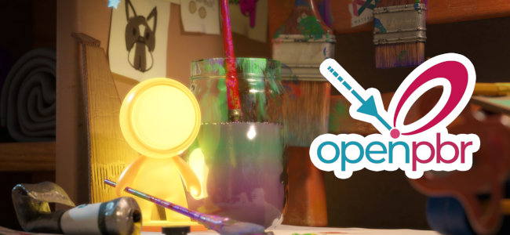

# Version 12.1

<b>Substance 3D Painter 12.1</b> apporte un flux de travail de cuisson amélioré avec le recadrage automatique et la peinture de correction d&#39;inclinaison, la prise en charge de la définition de l&#39;OpenPBR et un nouveau mode de surface dure pour le déballage UV automatique.

Date de publication : <b>22 juin 2026</b>

>[!NOTE]
>
> Cette version élève la version minimale prise en charge de macOS à 13.0 (Ventura). Pour plus d&#39;informations, consultez notre [page Configuration requise](../getting-started/system-requirements.md).

## Principales fonctionnalités

### Amélioration du processus de cuisson avec peinture inclinée

Le flux de production de la cuisson a été remanié pour prendre en charge le recadrage continu, la peinture de correction d’inclinaison sur le maillage, la protection des bords et une liste de cartes de maillage repensée.

* <b>Rétablissement automatique</b>

  Une texture de maillage peut être recadrée en continu à mesure que ses paramètres de recadrage sont ajustés, ce qui élimine la nécessité de déclencher manuellement un recadrage après chaque modification. Le recadrage automatique est activé par mappage et s’applique à un seul mappage à la fois. Cela est particulièrement pratique pour le flux de peinture inclinée, mais également lors du réglage des paramètres généraux de cuisson.

  

* <b>Peinture avec correction d’inclinaison</b>

  Lorsque la cage est réglée sur le mode <b>Distance</b>, les corrections d&#39;inclinaison peuvent être peintes directement sur le filet à faible polygone pour contrôler la direction de projection utilisée pendant la cuisson. Les outils Pinceau, Gomme et Fond polygonal sont disponibles avec un sélecteur de valeur de gris compact, la symétrie et les commandes de pinceau habituelles (<b>Ctrl + clic droit</b> pour redimensionner le pinceau, <b>X</b> pour inverser la valeur peinte). Les actions de peinture inclinée peuvent être annulées.

  

* <b>Protection des contours</b>

  Lorsque vous peignez une correction d’inclinaison, une nouvelle option de protection des bords préserve la douceur intense projetée sur les bords durs. Son résultat est contrôlé par les paramètres <b>Distance des bords</b> et <b>Contraste des bords</b>.

  

* <b>Liste de cartes maillées repensée</b>

  La liste de mappage de maillage fournit des contrôles par mappage : basculez un mappage en tant que <b>prévisualisation</b>, <b>recadrage rapide</b> d&#39;un seul mappage, basculez son <b>recadrage automatique</b> et <b>synchronisation</b> de ses paramètres entre les ensembles de textures (disponible lorsque le projet comporte plusieurs ensembles de textures). Chaque contrôle dispose d&#39;une info-bulle au survol.

  

* <b>Bouton de cuisson simplifié</b>

  Le bouton Cuire de la fenêtre a été remplacé par un seul bouton <b>Cuire</b> qui affiche le nombre de cartes à cuire (Ensembles de textures x Carreaux UV x cartes de maillage sélectionnées).

  

>[!NOTE]
>
> Pour plus d&#39;informations sur la cuisson, consultez la [page de documentation dédiée](../baking/baking.md).

### Prise en charge d’OpenPBR

Le modèle OpenPBR est désormais pris en charge dans Painter et est utilisé comme workflow par défaut. Il fournit une définition de matériau normalisée qui peut être transmise d’une application à l’autre.

* <b>Nouveau nuanceur d&#39;OpenPBR et workflow par défaut</b>

  Un shader implémentant la spécification OpenPBR 1.1 est disponible et utilisé par défaut. Un nouveau projet créé sans modèle utilise le nuanceur d&#39;OpenPBR, et la première entrée de la nouvelle fenêtre de projet est désormais étiquetée <b>OpenPBR</b> au lieu de <b>ASM</b>. De nouveaux modèles de projet pour l’OpenPBR sont inclus et les exemples de projet ont été mis à jour pour l’utiliser.

  

* <b>Nuanceur sélectionné à partir du modèle de projet à l&#39;importation</b>

  Lors de l’importation d’un fichier USD ou GLTF, le shader est désormais défini à partir du modèle de projet et non plus à partir du contenu du fichier. Un message est signalé dans le journal lorsqu’un matériau et un modèle utilisent des workflows incompatibles.

  

* <b>Convention d&#39;OpenPBR à l&#39;exportation</b>

  La fenêtre <b>Exporter les textures</b> comporte une nouvelle liste déroulante permettant de choisir la convention de dénomination. Il est défini par défaut sur OpenPBR lorsqu’au moins un nuanceur du projet l’utilise et que le schéma sélectionné est reflété dans la liste des textures de chaque ensemble.

  

* Prise en charge de <b>USD et MDL</b>

  Les matériaux OpenPBR sont pris en charge au format USD. Une nouvelle norme MDL a également été ajoutée pour permettre le rendu des matériaux OpenPBR en Iray, fournissant des représentations de matériau plus précises.

>[!NOTE]
>
> Les nuanceurs personnalisés peuvent nécessiter une mise à jour. Le API de shader a été modifié pour prendre en charge l’OpenPBR. Pour plus d’informations, consultez le journal des modifications disponible dans le menu Aide de l’application.

### Nouveau déballage automatique de la surface dure

Un nouveau mode de déballage automatique adapté aux éléments de surface dure a été ajouté.

* <b>Mode de déballage de la surface dure</b>

  Une option <b>Surface dure</b> est disponible dans les paramètres de déballage automatique. Il réduit la distorsion UV et produit des mises en page UV alignées orthographiquement, ce qui le rend mieux adapté aux maillages mécaniques et à surface dure.

  

>[!NOTE]
>
> Pour plus d&#39;informations sur le déballage automatique, consultez la [page de documentation dédiée](../features/automatic-uv-unwrapping.md).

### Divers

Des fonctionnalités et améliorations supplémentaires ont été ajoutées dans cette version :

* <b>Ajouter ou supprimer plusieurs canaux à la fois</b>

  Après l&#39;introduction de l&#39;OpenPBR, une nouvelle fenêtre accessible à partir des <b>paramètres de l&#39;ensemble de textures</b> permet de sélectionner plusieurs canaux à la fois, ce qui est pratique lors de la configuration de la grande liste de canaux utilisée par le workflow d&#39;OpenPBR.

  * La nouvelle fenêtre est accessible dans les paramètres du jeu de textures via le bouton <b>Ajouter ou supprimer des couches</b>.

    

  * La fenêtre donne un aperçu de tous les canaux qui peuvent être utilisés dans Painter.

    

  * Le bouton <b>Appliquer à tous les ensembles de textures</b> peut être utilisé pour modifier la configuration des canaux de tous les ensembles de textures à la fois.

    

* <b>Aplatir toutes les instances des ensembles de textures</b>

  Une nouvelle option <b>Aplatir toutes les instances</b> est disponible sur les calques et groupes instanciés. Il produit un résultat aplati sur tous les ensembles de textures où l’occurrence apparaît, tout au long de l’arborescence de l’occurrence. Il est enregistré comme une seule opération d’annulation.

  

* <b>Historique des annulations unifié</b>

  Les modes Baking et Peinture partagent désormais le même historique d’annulation. Le passage du mode Cuisson au mode Peinture est enregistré comme une étape annulable, de sorte que les actions ne peuvent être annulées que dans le mode où elles se sont produites.

## Tutoriels

Jetez un œil à notre dernier tutoriel sur Youtube :

## Notes de mise à jour

### 12.1.2

Date de publication : **2026/08/03**

Résumé : **version mineure**

**Fixe :**

* \[Blocage\] Certaines Substances peuvent entraîner un blocage lors du rendu
* \[Blocage\] Réimporter le filet en mode cuisson
* \[Blocage\] L’échec de l’initialisation de l’affichage graphique peut entraîner un blocage
* \[Blocage\] L’exportation de textures peut se bloquer dans certains cas lors de la mise à jour du journal
* \[Blocage\] Blocage en mode d’ancrage dans certains cas lors du chargement/de la mise à jour de la carte d’environnement
* \[Cuisson\] Relancer le cuisson après avoir modifié le fichier en poly élevé peut entraîner un gel
* \[Envoyer à Photoshop\] Échec de l’exportation du masque de calque
* \[Moteur\] Le rendu du point d’ancrage ne s’effectue pas entre un masque et une couche de couleur

### 12.1.1

Date de publication : <b>2026/07/09</b>

Résumé : version mineure

Ajouté :

* [Cuisson inclinée] exposer le mode normal de base incliné : filet ou par triangle
* [Propriétés] : réinitialisez toujours les couleurs uniformes sur la valeur par défaut de leur couche
* [OpenPBR] Regrouper les canaux par catégories dans la fenêtre Exporter les textures pour la création de modèles de sortie
* Mettre à jour le moteur de Substance vers la version 9.4.5

Fixe :

* [Projet] L&#39;ouverture et l&#39;enregistrement de certains projets peuvent prendre plus de temps que d&#39;habitude
* [Blocage] Le rechargement de plusieurs maillages peut entraîner un blocage
* [Blocage] La suppression d’un canal en mode Affichage du masque entraîne un blocage
* [Blocage] Certaines Substances peuvent entraîner un blocage lors du rendu
* [Inclinaison de peinture] L’outil sélectionné dans l’inclinaison de peinture reste sélectionné après le passage en mode Peinture
* [Les paramètres courants de cuisson] des paramètres de distance de cage ne mettent pas à jour la visualisation de la structure filaire de cage et de l&#39;ombrage
* Le mode de remplissage UV « Voisin de l&#39;espace 3D » du [moteur] ne fonctionne pas bien sur les triangles fins
* Le rendu du point d&#39;ancrage du [moteur] ne s&#39;effectue pas entre un masque et une couche de couleur

### 12.1.0

Date de publication : <b>2026/06/23</b>

Résumé : <b>Cette mise à jour est une version majeure. Elle contient des améliorations pour les boulangers avec l’état d’interface utilisateur Nouveau boulonnage par défaut, la carte d’inclinaison de la peinture, le rebake automatique, une nouvelle option pour le déballage UV automatique pour les maillages et l’OpenPBR de surfaces dures. Pour plus de détails, consultez les notes de mise à jour complètes.</b>

<b>Ajouté</b> :

* [Cuisson inclinée] Outils de peinture inclinée
* [Inclinaison] Ajout des visuels d’ombrage d’aperçu d’inclinaison et de vecteur d’inclinaison lors de la peinture de carte d’inclinaison
* [Inclinaison] Ajouter une option de protection des contours
* [Inclinaison] Recadrage automatique
* [Inclinaison] Interface utilisateur de la liste des cartes de maillage de reprise
* [Inclinaison] Fractionner la carte de maillage / Paramètres de cuisson communs + Déplacer les paramètres communs hors de la liste de carte de maillage couleur de base ou masque uniquement
* [Inclinaison] Modification des boutons de la barre d’outils de la fenêtre
* [Inclinaison] Afficher la symétrie du pinceau dans la barre d’outils supérieure
* [Inclinaison] Menu de synchronisation des listes dans les options de renommage du maillage
* [Inclinaison] Boîtes de dialogue Mettre à jour la synchronisation et l’état vérifié
* [Inclinaison] Créer une variante du sélecteur de couleurs en niveaux de gris
* [Inclinaison] Mettre à jour l’icône du mode d’inflexion
* [Dépliage automatique] Option Intégrer une surface dure
* [OpenPBR] Prise en charge d’OpenPBR 1.1
* [OpenPBR] Définir OpenPBR comme workflow et nuanceur par défaut
* [OpenPBR] Importation de matières premières et de textures via USD
* [OpenPBR] Exporter des matières et des textures OpenPBR via USD
* [OpenPBR] Mise à jour de la fenêtre Exporter les textures pour afficher la convention d’OpenPBR
* [OpenPBR] Ajout de documentation sur les modifications apportées à l’OpenPBR de prise en charge
* [OpenPBR][Iray] Ajouter une nouvelle MDL pour prendre en charge OpenPBR 1.1 dans Iray
* Plusieurs améliorations mineures des exportations en dollars américains
* [UI] Ajout d’un avertissement dans la clôture lorsque vous essayez de peindre sur un autre ensemble de textures
* [Aplatir] Permet d’aplatir tous les calques d’instance sur les ensembles de textures
* [Paramètres du jeu de textures] Permet de sélectionner plusieurs couches à la fois via une nouvelle fenêtre
* [Historique] Mise à jour du libellé de l’entrée « value » Undo pour refléter le nom du paramètre
* [Pile de calques] Définissez les effets de remplissage des masques par défaut sur blanc (1,0)
* [Substance] Ajouter une nouvelle entrée de mappage de moteur « mesh_hard_edge_triangle »
* [Substance] Ajouter une nouvelle entrée de mappage de moteur « mesh_hard_edge »
* [Shader] Empêcher les instances de shader de partager les mêmes noms
* [Shader] Utilisez le shader du modèle de projet lors de l’importation d’un fichier USD ou GLTF
* Mettre à jour l’Adobe Color Engine à la version 7.0
* Mettre à niveau la version minimale de MacOSX vers 13.0 (Ventura)
* [Contenu] Nouveaux modèles de projet pour l’OpenPBR
* [Content] Mettez à jour les exemples de projets pour utiliser le nouveau nuanceur d’OpenPBR
* [Python] Développez l&#39;API Geometry Mask pour autoriser les modes d&#39;inclusion et d&#39;exclusion comme dans l&#39;interface utilisateur

<b>Fixe</b> :

* [Blocage][Paramètres de maillage] Appliquer des paramètres à d’autres ensembles de textures
* [Crash] Lors de la courbure d’une carte sans espace universel normal
* [Blocage][Baking] La restauration avec cage personnalisée activée, mais aucun fichier sélectionné ne se bloque
* [Blocage] Annulation de la cuisson AOP
* [Cage automatique] Charge infinie lorsque le chemin d’accès au fichier poly élevé n’est pas valide
* [Linux][Windows] Le sélecteur de couleurs peut parfois être entièrement noir ou ne pas apparaître
* [Outil Remplissage polygonal] L’outil ne fonctionne pas avec les fichiers non PBR
* &lbrack;[Paint] La suppression de la couche de couleur de base ne supprime pas la couleur précédemment peinte
* [USD] Les instances de nuanceur ne sont pas toutes correctement détectées
* [Substance] Seule la première utilisation d&#39;un nœud d&#39;entrée/sortie est prise en compte
* [Shader] L’Occlusion ambiante est appliquée deux fois avec les ensembles de textures en utilisant différentes méthodes de mélange
* [Moteur] Des textures normales avec une couche bleue vide (noire) peuvent entraîner des résultats de fusion incorrects
* [Importation GLTF] La fusion d’Alpha est activée sur tous les ensembles de textures
* [GLTF Export] La fusion d’Alpha est toujours activée à l’exportation
* [Export] La géométrie double face est toujours désactivée lors de l&#39;importation d&#39;un fichier GLTF
* [Javascript] La modification des paramètres des nuanceurs ne contribue pas à annuler l’historique
* [Échantillons] La diffusion de sous-surface n’est pas activée dans les paramètres d’affichage pour le cache de rencontre
