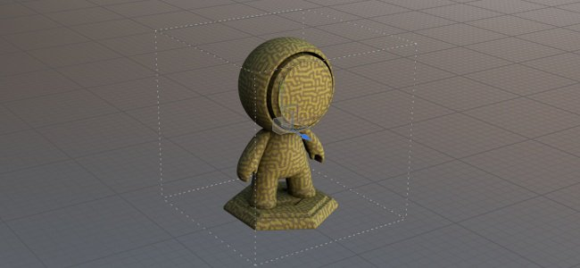
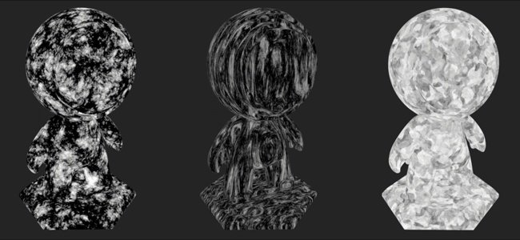
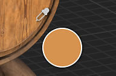

# Version 8.1

**Substance 3D Painter 8.1** intègre l&#39;Adobe Color Engine (ACE) avec prise en charge des profils ICC, des nouveaux bakers, des nouveaux bruits 3D et 20 cartes usure/salissures, ainsi qu&#39;une pipette améliorée.

Date de publication : *7 juin 2022*

## Principales fonctionnalités

### Nouvelle gestion des couleurs avec Adobe Color Engine (prise en charge ICC)

Dans cette nouvelle version, le système de gestion des couleurs a été étendu avec la prise en charge de l’Adobe Color Engine (ACE) qui déverrouille l’utilisation des profils ICC. Ce nouveau système permet de faire correspondre les couleurs dans un large éventail d’applications, y compris Photoshop.

* **Paramètres du nouveau projet**\
  Lors de la création d&#39;un nouveau projet, il est désormais possible de spécifier le moteur de gestion des couleurs avec le nouvel **Adobe Color Engine** (ACE) ajouté.

  {width="400px"}

  ACE est fourni avec l’espace colorimétrique de travail suivant :

  * **SRVB linéaire**
  * **ACEScg**
  * **Adobe RGB linéaire**
* **Surveillance de la prise en charge des profils ICC**\
  Vous pouvez utiliser votre profil ICC pour ajuster l’aspect du viewport et faire correspondre vos couleurs à celles de votre moniteur.

  {width="400px"}

* **Importation et exportation d’images avec des profils ICC intégrés**\
  Lors de l’importation de bitmaps, le profil ICC peut être extrait automatiquement. Il est également possible de remplacer ce profil dans les propriétés du calque.\
  Lors de l’exportation, il est possible de spécifier le profil ICC prévu qui sera incorporé dans les fichiers de texture de données.

  {width="400px"}

* **Nouveaux paramètres de modèle json** Pour partager et réutiliser les paramètres entre les projets, il est possible de spécifier un fichier prédéfini. Pour en savoir plus sur les spécifications prédéfinies, consultez la [documentation dédiée](../features/color-management/color-management-with-adobe-ace-icc.md).

>[!NOTE]
>
> Pour plus d&#39;informations, consultez la documentation sur la [gestion des couleurs](../features/color-management/color-management.md).

### Prise en charge de nouvelles tailles physiques pour les matériaux de Substance

La taille à l&#39;intérieur des matériaux de Substance peut désormais être utilisée pour piloter leur échelle et leur répétition à l&#39;intérieur des projections de calque de remplissage. C&#39;est un outil utile pour faire correspondre correctement les matériaux sur les surfaces en fonction de leur taille réelle sans avoir besoin de deviner.

* **Nouveaux paramètres de calque de remplissage**\
  Un calque de remplissage (ou effet) comporte de nouveaux paramètres pour contrôler la répétition/répétition d&#39;un matériau si une taille physique est définie. Ces nouveaux paramètres sont uniquement disponibles avec les projections 3D.

  {width="400px"}

* **Nouvelle grille De viewport**\
  Pour faciliter la compréhension et la visualisation de la taille physique, il est désormais possible d&#39;activer une grille dans le viewport 3D via la fenêtre [Paramètres d&#39;affichage](../interface/display-settings/display-settings.md).\
  Une fois activée, la grille est automatiquement divisée en fonction du niveau de zoom. L’unité de grille est indiquée en bas à gauche du viewport.

  {width="400px"}

  {width="400px"}

>[!NOTE]
>
> Pour plus d&#39;informations, consultez la [documentation dédiée](../features/physical-size.md).

### Nouveaux bakers

Ces trois nouveaux ajouts comblent l’écart entre Designer et Painter et étendent les possibilités de texturation et de rendu.

Ils ont été ajoutés à la liste par baker, mais ils sont désactivés par défaut :

Les nouveaux bakers sont les suivants :

* **baker Bents normals** Le baker Bents normals permet de baker une direction d&#39;occlusion (sous forme de vecteur, similaire aux maps normal). Cette texture peut être utilisée pour améliorer l&#39;ombrage dans le viewport en activant le paramètre **Courbure normale** dans la fenêtre [Paramètres de Shader](../interface/shader-settings/shader-settings.md). Les bents normals améliorent considérablement la précision de l’ombrage du viewport en temps réel.\
  Pour l&#39;**ombrage diffus**, il donne une occlusion plus précise et peut même ressembler à une illumination globale approximative (premier exemple ci-dessous).\
  Pour les **reflets de specular**, il permet de simuler l&#39;ombrage et de réduire la quantité de lumière qui fuit, ce qui donne à l&#39;objet un aspect beaucoup plus terre-à-terre, en particulier avec des surfaces métalliques (deuxième exemple ci-dessous).

  {width="350px"}

  {width="400px"}

* **baker Height**\
  Le baker de l&#39;Height permet de baker la différence entre le maillage à faible et à fort poly comme une texture en niveaux de gris qui pourrait ensuite être utilisée pour produire du displacement sur des maillages en tesselle. Par exemple, pour baker des informations de balayage par rapport à un plan.

  {width="400px"}

* **baker d&#39;opacité**\
  Le baker Opacité génère une courbe en noir et blanc représentant les trous d’un maillage en polychromie. Par exemple, il peut être utilisé pour baker des clôtures ou même des trous à l&#39;intérieur d&#39;une surface en tissu.

### Nouveau contenu

Divers nouveaux contenus ont été ajoutés à cette version, notamment :

* **Nouveaux bruits 3D améliorés avec plus de 100 paramètres prédéfinis**\
  Les bruits 3D existants ont été remaniés et trois nouveaux ont été ajoutés. Chacun d’eux inclut désormais des paramètres prédéfinis, ce qui porte le total à 105 paramètres prédéfinis sur 7 bruits. Ces paramètres prédéfinis peuvent être utilisés comme point de départ pour manipuler leurs paramètres et obtenir un aspect spécifique. Comme toujours avec les bruits 3D, ils sont homogènes et peuvent très facilement se répéter sans motif perceptible.

  Pour rechercher les bruits 3D, il vous suffit d’accéder à la section Procédures du panneau Actifs :

  {width="400px"}

  Les bruits offrent un très large éventail de possibilités, voici par exemple les paramètres prédéfinis disponibles avec le **3D voronoi fractal** :

  {width="300px"}

* **20 nouvelles images bitmap usure/salissures et 2 motifs de tissu**\
  Un nouvel ensemble de grunges a été ajouté avec le contenu par défaut pour étendre la gamme existante de motifs. Ils se trouvent sous **Procédures > Bitmap Grunges**.\
  Deux motifs de tissu sont également disponibles sous **Procédures > Tissu**.

  {width="400px"}

>[!NOTE]
>
> Certains bruits 3D peuvent prendre quelques secondes à calculer lors de leur première utilisation.

### Pipette et sélecteur de matériau améliorés

Plusieurs améliorations ont été apportées à la pipette pour faciliter l’extraction et la gestion des couleurs.

* **Nouveau mode de sélection**\
  Lorsque vous choisissez des couleurs, il n’est plus nécessaire d’appuyer et de maintenir le clic de la souris tout en déplaçant la souris. Désormais, il est possible de cliquer une fois sur la pipette, de déplacer la souris à l’emplacement souhaité, puis de cliquer à nouveau pour capturer une couleur.

* **Nouveaux boutons de pipette**\
  En regard des boutons de couleur se trouve une nouvelle icône de pipette qui peut être utilisée pour capturer des couleurs sans avoir à ouvrir le sélecteur de couleurs au préalable.

  {width="400px"}

* **Nouveau raccourci du clavier de la pipette**\
  Lorsque la fenêtre du sélecteur de couleurs est ouverte, vous pouvez également appuyer sur **I** pour passer en mode Pipette sans avoir à cliquer sur l’icône dédiée, ce qui facilite l’itération rapide entre la sélection et la peinture.

* **Nouvel aperçu pendant la pipette**\
  Lorsque vous utilisez la pipette pour sélectionner une couleur, aucun nouvel aperçu n’est visible à côté de la souris. Cet aperçu prend également en charge la gestion des couleurs.

  

* **Nouvelle sélection directement dans un canal**\
  Avec le nouveau comportement de la pipette, il est désormais possible de sélectionner directement un canal sur le maillage. Pour ce faire, il vous suffit d’appuyer sur la touche MAJ et de la maintenir enfoncée pour choisir une couleur directement dans la couche. Le canal est déterminé à partir de l’endroit où la pipette a été lancée. Cette méthode évite toute transformation de couleur qui est importante dans la gestion des couleurs pour récupérer des couleurs précises. Une info-bulle s’affiche pour indiquer la couche à partir de laquelle la couleur est capturée.

  

* **Nouveaux paramètres d&#39;espace colorimétrique lors de l&#39;acquisition d&#39;une couleur**\
  Lorsque la gestion des couleurs est activée, un nouveau paramètre est disponible dans le sélecteur de couleurs pour spécifier l’espace colorimétrique utilisé lors de la capture des couleurs. Ce paramètre est global pour la session de Painter et s’applique également au bouton Pipette en regard des boutons de couleur dans la fenêtre des propriétés.

  

* **Amélioration du comportement du sélecteur de matériau**\
  Le sélecteur de matériau de la barre d’outils (raccourci P du clavier) respecte désormais la sélection de canal dans la fenêtre des propriétés. Il ne sera plus activé par les canaux eux-mêmes.

  {width="400px"}

### Amélioration du déplié automatique

Le processus d’UV automatique offre désormais une segmentation plus naturelle.

Maintenant, les maillages sont découpés en Îlots UV séparés à l&#39;aide d&#39;une méthode qui se rapproche de ce qui peut être fait à la main, en particulier sur les maillages biologiques.

## Notes de mise à jour

### 8.1.0

*(Publié Le 7 Juin 2022)*

**Ajouté :**

* [Gestion des couleurs] Prise en charge supplémentaire des profils ICC avec Adobe Color Engine (ACE)
* [Gestion des couleurs] Ajout de la prise en charge du RGB Adobe 98 en tant qu’espace colorimétrique de travail pour ICC
* [Gestion des couleurs] Permet de configurer les paramètres ACE/ICC via un fichier de configuration
* [Gestion des couleurs] Permet d’entrer des valeurs de couleur linéaires dans le sélecteur de couleurs avec le mode hérité
* [Gestion des couleurs] Permet de spécifier le profil colorimétrique utilisé pour sélectionner des couleurs en dehors de l’interface utilisateur
* [Gestion des couleurs] Mémoriser la dernière valeur Affichage choisie dans le viewport
* [Gestion des couleurs][Substance] Faites fonctionner correctement les générateurs/filtres avec la gestion des couleurs
* [Gestion des couleurs][Substance] Ajouter de nouveaux mots-clés de remplacement d’espace colorimétrique $working et $standardsrgb
* [Taille physique][Moteur] Extraire les informations de taille physique du maillage
* [Taille physique][Moteur] calcul de Taille physique
* [Taille physique] Exposer des options pour utiliser la taille physique dans l’interface utilisateur
* [Taille physique] Ajout d’assistants visuels dans le viewport
* [Baking] Ajouter un baker Height
* [Baking] Ajouter un baker de Bents normals
* [Baking] Ajouter un baker d’opacité
* [Pipette] Nouvel aperçu du sélecteur de couleurs
* [Pipette] Le panneau Sélecteur de couleurs réapparaît à sa dernière position lorsqu’il est rouvert
* [Pipette] Nouvelle icône pour le sélecteur de Matériaux
* [Pipette] La gestion des couleurs permet de gérer l’aperçu de la couche du sélecteur de couleurs
* [Pipette] Ajouter la fonctionnalité Cliquer pour sélectionner à la pipette
* [Pipette] Le sélecteur de Matériau n’active plus les canaux non actifs
* [Pipette] Autoriser à utiliser la pipette avec un raccourci
* [Pipette] La pipette prélève le canal correspondant, le cas échéant
* [Pipette] Le fait de passer en mode Sélecteur de couleurs désactive tous les raccourcis
* [Pipette] Supprimer la sélection automatique du champ hexadécimal
* [Pipette] Ne fermez pas le panneau lors de l’utilisation du sélecteur de matériau
* [Pipette] Nouvel état désactivé lorsque le canal n’est pas disponible pour la sélection
* [Export] Ajouter un attribut de tangente à l&#39;export glTF
* Mettre à jour la Substance Engine vers la version 8.4
* Mettre à jour le Déplie automatique à 0.9.0
* Mise à jour vers Qt 5.15.8
* Mise à jour vers Python 3.9
* [Shader] Ajout de la prise en charge pour Bent normals ombrage
* [MacOS] Prise en charge de 3DConnection SpaceMouse
* [Python] Documentation de la version de Python utilisée dans l&#39;API
* [Contenu] Ajoutez 6 nouveaux bruits 3D avec 105 paramètres prédéfinis
* [Contenu] 20 nouvelles cartes usure/salissures et 2 motifs de plis en tissu
* [Contenu] Mise à jour du paramètre prédéfini d’exportation « Maps de maillage » pour utiliser les nouveaux bakers
* [Contenu] La Pente de flou et le filtre de déformation dépendent de la résolution du jeu de textures
* [Content] Mettez à jour les exemples de projets pour utiliser les 3 nouveaux bakers

**Fixe :**

* [glTF] Impossible d&#39;ouvrir glTF avec un caractère spécial
* [Moteur] Artefacts avec anisotropie et SVT désactivés
* Les Matériaux adaptables [MacOS][M1] ne s’affichent pas correctement
* [Traitement du Maillage] Impossible d’importer des maillages depuis Modeler
* [UI] Barre de défilement horizontale dans la nouvelle fenêtre de projet avec la gestion des couleurs activée
* [Gestion des couleurs] Valeur d’espace de travail manquante dans le sélecteur de couleurs avec certaines configurations OCIO
* [Gestion des couleurs] L’aperçu du pinceau dans le viewport ne prend pas en charge la gestion des couleurs
* [SpaceMouse] Le pivot n’est pas immédiatement mis à jour avec le changement de focus et se trouve parfois en dehors du modèle
* [Export][USD] Les fichiers USD exportés ont une structure incorrecte
* Problème d’Ambient occlusion [USD] lors de l’exportation
* [Contenu] Mettez à jour le maillage de la vignette pour qu’il corresponde à l’exemple de projet Preview Sphere

**Problèmes Connus :**

* L’exportation de textures à l’aide de la diffusion de remplissage rend les cartes noires
* Le mélange normal/Ambient occlusion est rompu
* [MacOS] Crash lors du lancement d’Iray dans de rares cas
* [Vignette d’aperçu] Les vignettes simplifiées ne sont pas mises à jour lorsqu’une ancre est utilisée
* [Gestion des couleurs] Les conversions de l’espace colorimétrique HDR avec ACE sous Linux produisent des couleurs condensées
