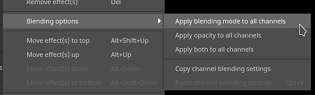
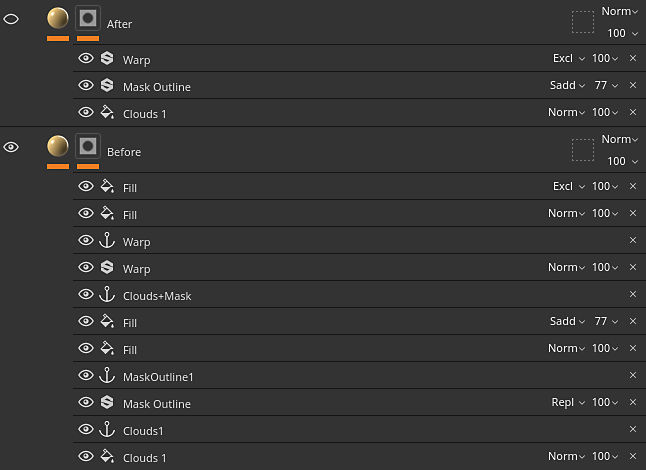
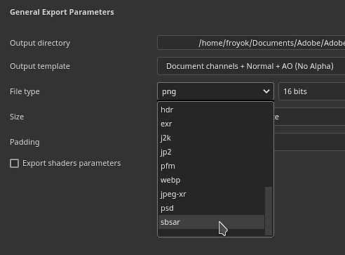
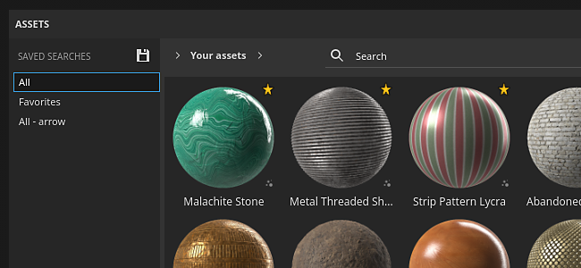

# Version 8.2

**Substance 3D Painter 8.2** met l&#39;accent sur de nombreuses améliorations de la qualité de vie grâce à des fonctionnalités dédiées dans plusieurs domaines de l&#39;application.

Date de publication : *6 octobre 2022*

## Principales fonctionnalités

### Nouvelles options d’application des modes de fusion et de l’opacité

Plusieurs raccourcis et actions ont été ajoutés pour copier et appliquer rapidement et facilement les modes de fusion et l’opacité sur plusieurs couches dans la pile de calques.

* **Cliquez avec le bouton droit de la souris sur un mode de fusion ou un contrôle d&#39;opacité**\
  Lorsque vous cliquez avec le bouton droit de la souris sur un mode de fusion ou une opacité, sélectionnez l&#39;action **Appliquer à toutes les couches** pour utiliser ce mode de fusion sur toutes les autres couches du calque. Cette action est également disponible pour les effets dotés de modes de fusion et d’opacité.

  

* **Cliquez avec le bouton droit de la souris sur un calque et choisissez Options de fusion**\
  Il est également possible de cliquer avec le bouton droit de la souris sur un calque (ou un effet) et de choisir l’une des actions suivantes :

  * **Appliquer la fusion à toutes les couches** : appliquez le mode de fusion de couche actuel à toutes les autres couches du calque/de l’effet actuel.
  * **Appliquer l’opacité à tous les canaux** : appliquez l’opacité de canal actuelle à tous les autres canaux du calque/de l’effet actuel.
  * **Appliquer les deux à toutes les couches** : appliquez le mode de fusion et l’opacité de la couche actuelle à toutes les autres couches du calque/de l’effet actuel.
  * **Copier les paramètres de fusion des couches** : copiez tous les modes de fusion et les valeurs d’opacité du calque/de l’effet actuel dans le Presse-papiers.
  * **Coller les paramètres de fusion des couches** : appliquez les modes de fusion et les valeurs d’opacité actuellement dans le Presse-papiers au calque/à l’effet ciblé.

  

### Nouveau mode de fusion et nouvelle opacité sur les effets de filtre et de sélection de couleur

Les effets de filtre et de sélection de couleur peuvent désormais utiliser les modes de fusion et les commandes d’opacité.

* **Mode de fusion et opacité sur les filtres**\
  Les filtres peuvent désormais utiliser des modes de fusion et des valeurs d’opacité. Ils utilisent par défaut la valeur **Remplacer** afin de conserver le même comportement qu&#39;auparavant et d&#39;éviter de doubler les informations de composant alpha. Les modes de fusion appliqués aux filtres permettent de calculer les effets et de combiner leurs résultats directement sur les calques, ce qui évite d’avoir à utiliser des points d’ancrage et des effets de remplissage pour obtenir le même résultat. Cela évite également d’avoir à implémenter manuellement les modes de fusion à l’intérieur du filtre lui-même.

  

* **Mode de fusion et opacité sur la sélection de couleurs**\
  L’effet de sélection de couleurs a été modifié pour prendre en charge les modes de fusion et les commandes d’opacité. Auparavant, cet effet produisait un résultat alpha. Afin que les modes de fusion fonctionnent comme prévu, un nouveau paramètre a été ajouté pour spécifier la couleur d’arrière-plan en cours de sortie. Il est défini sur noir au lieu de transparent (ce qui est le comportement hérité).

  

  

* **Pile d&#39;effets simplifiée**\
  Auparavant, lorsqu’il était nécessaire de combiner des effets d’une certaine manière (à l’aide des modes de fusion, par exemple), l’utilisation de points d’ancrage et d’effets de remplissage était nécessaire. Désormais, avec les modes de fusion directement sur les filtres, ce n’est plus nécessairement celui qui peut réduire considérablement la complexité de la pile d’effets.

  {width="400px"}

### Nouveaux effets sur les dossiers

Le contenu du dossier (la partie couleur d’un calque) peut désormais recevoir des effets de tout type. Auparavant, il était nécessaire de créer des configurations de calques complexes (comme des calques intermédiaires ou des points d’ancrage) pour obtenir le même résultat.

### Nouvelle exportation d’archive de Substance (SBSAR)

Le format de fichier SBSAR (Substance Archive) est désormais disponible lors de l’exportation de textures. Un SBSAR est un conteneur qui peut être ouvert dans de nombreuses applications avec intégration de Substances, ce qui peut le rendre plus rapide et facile à «plug-and-play» textures personnalisées.

* **Exportation d&#39;une archive de Substance (SBSAR)**\
  Il est désormais possible de spécifier le format de fichier SBSAR dans la liste des formats de fichiers de la fenêtre **Exporter des textures**. Cette opération exportera un seul fichier SBSAR contenant toutes les textures spécifiées. Le nom des nœuds de sortie et leur utilisation sont définis à partir du paramètre prédéfini d’exportation sélectionné et de ses types de canaux.

  

* **Paramètres prédéfinis d’exportation hybrides avec les formats de fichier PSD et SBSAR**\
  Les paramètres prédéfinis d’exportation peuvent désormais spécifier des mappages de sortie comme PSD ou SBSAR en plus de tous les autres formats d’image. Les formats PSD et SBSAR sont considérés comme des « conteneurs », ce qui signifie que plusieurs textures peuvent être stockées à l’intérieur. Lorsqu’un paramètre prédéfini d’exportation spécifie à la fois des formats de conteneur et des formats d’image autonomes, chaque sortie du modèle qui cible un fichier SBSAR est regroupée, tandis que les autres sorties sont exportées en tant que fichiers individuels.

  

### Nouvelle option d’environnement pour éclairer sous les modèles 3D

Un nouveau paramètre dans les [Paramètres d&#39;affichage](../interface/display-settings/environment-settings.md) permet d&#39;aligner la carte d&#39;environnement sur l&#39;appareil photo, ce qui permet de régler l&#39;angle d&#39;éclairage et d&#39;éclairer les pièces sous le modèle 3D.

Pour utiliser ce nouveau paramètre, accédez à [Paramètres d&#39;affichage](../interface/display-settings/environment-settings.md) et modifiez le paramètre **Alignement de l&#39;environnement** :

* **Monde** : la carte d&#39;environnement est alignée sur la scène.
* **Local** : la carte d&#39;environnement est alignée sur la caméra.

Les tons foncés s’ajustent automatiquement en fonction de la configuration de ce paramètre.

### Nouveaux favoris et supprimer/recharger dans la fenêtre Actifs

De nouvelles actions ont été ajoutées à la fenêtre [Actifs](../interface/assets/assets.md) pour faciliter la gestion des ressources.

* **Ressources favorites pour les trouver rapidement**\
  Cliquez avec le bouton droit de la souris sur n’importe quelle ressource dans la fenêtre Actifs pour la mettre en favori (ou l’annuler). Les ressources favorites apparaissent toujours en premier dans les requêtes de recherche avec une petite balise en forme d’étoile dans le coin, ce qui les fait ressortir et les rend accessibles. Une requête de recherche dédiée a également été ajoutée, ce qui facilite l’affichage de toutes vos ressources préférées.

  {width="350px"}

* **Supprimer et recharger les ressources sur le disque**\
  Les ressources situées dans les bibliothèques d’utilisateurs peuvent désormais être supprimées, rechargées ou renommées (à l’exception des ressources faisant partie d’un pack, telles que les graphes en Substances ou les pinceaux ABR).

### Fonctionnalités et améliorations diverses

De nombreuses petites améliorations et fonctionnalités supplémentaires ont été ajoutées dans cette nouvelle version :

* **Fenêtre Nouveautés et bienvenue**\
  Pour rester informé des nouvelles fonctionnalités ajoutées à l’application, nous introduisons désormais une nouvelle fenêtre Bienvenue et Nouveautés au lancement de l’application. Ces fenêtres peuvent être facilement fermées et ne réapparaîtront pas lors des prochains lancements. Vous pouvez toujours les rouvrir via le menu **Aide**.

  {width="400px"}

  {width="400px"}

* **Nouvelle action pour réimporter rapidement un modèle 3D**\
  Un nouveau raccourci clavier (**CTRL+SHIFT+R** par défaut) a été ajouté et permet de réimporter rapidement le modèle 3D du projet actuel. Cela facilite et accélère l’itération d’une ressource. Si le fichier source est introuvable, un message d’erreur s’affiche dans le journal. Une action a également été ajoutée au menu **Modifier**.

  

* **Prise en charge améliorée du HDPI**\
  Plusieurs correctifs ont été apportés concernant les écrans HDPI et la mise à l’échelle du système. Nous prenons désormais en charge les valeurs de mise à l&#39;échelle intermédiaires (ex. 125%) qui devrait éviter que l&#39;interface soit trop grande ou trop petite sur certains écrans. Le déplacement de fenêtres entre des écrans HDPI avec des valeurs de mise à l’échelle différentes doit également se comporter correctement.

* **Réinitialiser les paramètres du graphique de Substance à leur valeur par défaut**\
  Partout où un graphique de Substance est utilisé (alpha, matières, filtre, etc.) il est désormais possible de réinitialiser ses paramètres par défaut.

  * **Réinitialiser tous les paramètres** : utilisez le bouton Restaurer les paramètres par défaut sous la liste des paramètres pour réinitialiser l&#39;ensemble de la ressource de Substance de données.
  * **Clic droit** : cliquez avec le bouton droit de la souris sur un paramètre spécifique pour ouvrir un menu avec une action de réinitialisation spécifique à ce paramètre.

   

* **Afficher les composants RGBA individuels dans les fenêtres**\
  Lorsque vous examinez un canal dans les fenêtres, un nouveau paramètre nommé **Couches de couleur** sous **Paramètres d&#39;affichage > Affichage du canal** permet d&#39;examiner les composants RVBA individuellement. Cela peut être utile pour analyser des textures ou isoler des composants spécifiques dans les couches utilisateur.

  

  {width="450px"}

* **Mosaïque de calques de remplissage et d&#39;effets au-delà de 128**\
  Le paramètre de mosaïque des calques de remplissage et des effets a été modifié pour avoir une plage floue. Cela permet désormais de saisir n’importe quelle valeur de mosaïque souhaitée. La plage par défaut du curseur a également été réduite de [-128,128] à [-32,32] pour faciliter le glissement.

  

* **Nouveau paramètre d’exportation de texture EXR 16f et 32f**\
  Auparavant, l’exportation de textures EXR était forcée à 32 f bits dans l’interface, mais à l’intérieur du fichier réel, elle produisait des données 16 f bits (semi-flottantes). Il a maintenant été corrigé, et il existe une possibilité explicite de choisir entre 16f et 32f bits. Les anciens projets et les paramètres prédéfinis d’exportation utilisant EXR comme format de fichier adoptent par défaut la valeur 16f bits pour respecter l’ancien comportement (principalement pour éviter de produire des fichiers plus lourds qu’auparavant).

  

* **Exporter et recharger les mises en page de l&#39;interface utilisateur**\
  Les nouvelles actions permettant d&#39;enregistrer et de recharger la disposition de l&#39;interface utilisateur se trouvent dans le menu **Windows**. Cela facilite le basculement entre les différentes mises en page ou l’enregistrement et la réutilisation d’une interface utilisateur sur plusieurs ordinateurs. Les deux modes Painter actuels (Rendu et Peinture) ont leurs propres dispositions. Quelques fonctions sont également disponibles dans Python pour permettre d&#39;enregistrer et de réimporter la mise en page de l&#39;interface utilisateur (voir ci-dessous).

  

* **Menu Fichier réorganisé**\
  Nous avons désencombré le menu Fichier en regroupant plusieurs fonctionnalités d’enregistrement avancées. Certaines de ces actions ont également été renommées pour clarifier leur comportement.

  

* **Message d’erreur amélioré lors de l’ouverture de projets trop récents.**\
  Un message plus utile s’affiche désormais lors de l’ouverture de projets réalisés avec une version plus récente de l’application. Le message comprend désormais les versions du projet et de l’application, ce qui permet d’être mieux informé sur la version requise.

  {width="400px"}

### Amélioration des scripts Python

Plusieurs nouvelles fonctionnalités ont été ajoutées à l’API Python. Pour plus de détails, consultez la documentation disponible dans le menu Aide de l’application.

* **substance\_painter.resource**\
  **substance\_painter.resource.Type** permet désormais d&#39;identifier davantage de types de ressources, notamment les packages de pinceaux Substance et Photoshop.\
  Les objets de ressource peuvent désormais répertorier leurs parents et enfants, ce qui permet de naviguer entre les packages de Substances et les graphiques de Substances, par exemple.

* **substance\_painter.textureset**\
  Deux nouvelles fonctions (et une énumération) ont été ajoutées pour obtenir et définir des mappages de maillage dans les paramètres de l&#39;ensemble de textures : **get\_mesh\_map\_resource()** et **set\_mesh\_map\_resource()**.

* **substance\_painter.ui**\
  Plusieurs fonctions ont été ajoutées pour enregistrer et recharger la disposition de l’interface utilisateur. Notez que la disposition dépend également du mode d’application actuel (Peinture ou Rendu).

* **substance\_painter.event**\
  Un nouvel **TextureStateEvent** a été ajouté pour faciliter le suivi des modifications apportées à la pile de calques des ensembles de textures, ainsi que d&#39;autres modifications de paramètres. Cet événement se déclenche sur les tracés de peinture ou lors de l’ajout/la suppression de couches.

## Notes de mise à jour

### 8.2.0

*(Publié Le 6 Octobre 2022)*\
Résumé : **version majeure avec de nouveaux panneaux d’intégration (nouveau panneau de bienvenue et nouveau panneau Nouveautés), exportation vers SBSAR, effets pour le dossier, plusieurs améliorations pour la qualité de vie et des correctifs de bogues.**

**Ajouté :**

* [Intégration] Panneau d’intégration pour accueillir les nouveaux utilisateurs

  Ajout d’un nouvel écran de bienvenue lorsque les nouveaux utilisateurs de CC ouvrent Painter pour la toute première fois.
* [Intégration] Panneau Nouveautés pour améliorer la découvrabilité des nouvelles fonctionnalités

  Ajout d’un nouvel écran Nouveautés affichant les principales nouveautés. Il s’affiche automatiquement à la toute première ouverture de Painter après une mise à jour majeure et est à nouveau accessible via Aide > Nouveautés.
* [Intégration] Renommer l’ancien écran d’accueil

  L’ancien écran d’accueil a été renommé Écran d’accueil pour éviter toute confusion avec le nouvel écran d’accueil.
* [UI] Résolution des problèmes de mise à l’échelle des écrans haute résolution

  Amélioration de l’adaptation de l’interface utilisateur de Painter sur les écrans haute définition avec mise à l’échelle personnalisée.
* [UI] Éviter les messages d’erreur persistants dans l’interface utilisateur

  Les messages d’erreur des projets précédents sont maintenant supprimés de la barre d’état inférieure.
* [UI] Retravailler le menu d’enregistrement

  Les autres options d’enregistrement sont désormais regroupées dans un sous-menu et certaines sont renommées par souci de cohérence.
* [UI] Enregistrement et exportation/partage des mises en page de l’interface utilisateur

  Le menu Fenêtre contient de nouvelles actions permettant d’enregistrer la mise en page de l’interface utilisateur dans des fichiers et de les recharger. Les dispositions Peinture et Rendu sont enregistrées séparément.\
  Diverses fonctions ont été ajoutées à « substance\_painter.ui » pour enregistrer, réinitialiser et charger également les mises en page de l’interface utilisateur.
* Ajouter des actions de copier/coller pour les modes de fusion/l’opacité d’un calque

  Ajout d’une nouvelle entrée Options de fusion dans le menu contextuel des calques. Il permet de copier et coller le mode de fusion et l’opacité de toutes les couches d’un calque à un autre.
* Application d’un mode de fusion/opacité à tous les canaux d’un calque

  Ajout d’une fonctionnalité de clic droit au mode de fusion et à l’opacité des calques qui permet d’appliquer la configuration sélectionnée à tous les canaux.
* Recharger le filet à l’aide d’un raccourci clavier (CTRL+MAJ+R)

  Ajout d’un raccourci modifiable pour recharger le fichier de filet avec les derniers paramètres disponibles. Est également accessible via Modifier > Réimporter le maillage.
* Rétablir les paramètres de Substance par défaut

  Ajout d’un nouveau bouton dans Propriétés en bas des ressources .sbsar qui permet de réinitialiser la ressource par défaut.
* Rétablir les valeurs par défaut du pinceau

  Ajout d’un nouveau menu à la section Pinceau dans Propriétés qui permet de rétablir le pinceau de base par défaut.
* Cliquer avec le bouton droit pour réinitialiser les paramètres de Substance individuels par défaut

  Ajout de la possibilité de réinitialiser les paramètres individuels dans une ressource .sbsar via un clic droit.
* [Panneau Actifs] « Épingler » les actifs favoris pour qu’ils apparaissent au-dessus du panneau Actifs

  Ajout d’une nouvelle option de clic droit aux actifs de la bibliothèque qui permet de les épingler en tant que favoris en haut du panneau. Vous pouvez également afficher tous vos actifs préférés via les recherches enregistrées.
* [Panneau Actifs] Supprimez, rechargez et renommez les actifs

  Ajout d’options de menu contextuel pour supprimer, recharger et renommer les actifs de la bibliothèque utilisateur. Ils sont supprimés directement de leur emplacement de bibliothèque sur le disque et rechargés à partir de l’emplacement d’origine. Les actifs qui font partie d’un package comme .abr ou .sbsar ne peuvent pas être modifiés individuellement.
* [Sélection de couleur] Ajout de modes de fusion à l’effet Sélection de couleur
* [Pile de calques] Ajout d’un mode de fusion et d’une opacité aux filtres
* [Pile de calques] Autoriser les valeurs de mosaïque supérieures à 128 pour le calque de remplissage/les effets
* [Pile de calques] Bouchons cylindriques pour projection cylindrique dans un calque de remplissage/effet

  La projection cylindrique dans les propriétés du calque de remplissage a désormais la possibilité de supprimer les culottes.
* [Log] Afficher un message d&#39;erreur si les parties du filet se trouvent dans un espace négatif lors de la tentative de création d&#39;un projet de mosaïque UV

  Ajout d’un message d’erreur plus clair lors de l’échec de la création d’un projet de mosaïque UV, car des pièces UV se trouvent dans les espaces négatifs.
* [Projet] Indiquer la version dans le message d’erreur « données trop récentes » lors de l’ouverture d’un projet

  Lors de l’ouverture d’un projet trop récent pour l’application, le message d’erreur indique désormais la version du projet afin de faciliter l’identification de la bonne version de l’application.
* [Fenêtre d’affichage] Autoriser à éclairer le filet par le dessous

  Ajout d’un nouveau paramètre Alignement de l’environnement dans Paramètres d’affichage > Caméra > Paramètres d’environnement pour aligner l’éclairage de la carte d’environnement sur la caméra lorsqu’il est défini sur « Local ».
* [Fenêtre d’affichage] Affichage R, V, B et Alpha dans la fenêtre d’affichage (mode d’affichage solo)

  Sous Paramètres d’affichage > Paramètres de la fenêtre d’affichage > Affichage des couches, un nouveau paramètre Couches de couleur permet d’afficher uniquement les composants R, V, B ou Alpha d’une couche en mode d’affichage unique.
* [Shader] Autoriser à définir les canaux utilisateur en tant que RVBA dans les shaders de calque de matériau

  Lorsque vous réglez la configuration des canaux du jeu de textures dans un shader pour le calque Matériau, il est désormais possible de spécifier le format du canal pour s’écarter de la valeur par défaut. Cela permet notamment de demander des couches utilisateur en couleur au lieu de niveaux de gris uniquement.
* [Exporter] Autoriser à exporter des textures en tant que SBSAR

  Lorsque vous exportez des textures via la fenêtre Fichier > Exporter des textures, vous pouvez choisir le format de fichier SBSAR (Substance Archive) pour les regrouper. Le contenu du SBSAR dépend du modèle de sortie utilisé.\
  Le format de fichier SBSAR peut également être défini dans les paramètres prédéfinis d’exportation. Lors de l&#39;utilisation de la configuration hybride (SBSAR + Autre format), les textures qui ciblent un SBSAR sont regroupées tandis que le reste est exporté en parallèle.
* [Export] Option Exposer 16 bits pour le format de fichier EXR

  Lors de l’exportation de fichiers de textures EXR, il est désormais possible de choisir 16 f bits (semi-flottant) ou 32 f bits (flottant) dans la fenêtre Exporter des textures (à la fois pour les paramètres d’exportation et les paramètres prédéfinis d’exportation). Les anciens projets et les anciens paramètres prédéfinis d’exportation adoptent par défaut la valeur 16 f bits pour refléter l’ancien comportement.
* [Python] Ajouter un événement pour savoir quand les ensembles de textures sont modifiés

  Le nouveau « substance\_painter.event.TextureStateEvent » permet de savoir quand un ensemble de textures a été modifié en raison d’un tracé de peinture, d’un nouveau canal ajouté ou d’un canal supprimé.
* [Python] Autoriser l&#39;obtention et la définition des ressources de maillage dans les paramètres de l&#39;ensemble de textures

  De nouvelles fonctions ont été ajoutées dans le module « substance\_painter.project » pour obtenir et définir des ressources de mappages de maillage. Ces fonctions peuvent être utilisées pour mettre à jour les maillages référencés par les paramètres du jeu de textures.
* [Plug-ins] Supprimer l’option pour obtenir d’autres plug-ins JS

  Suppression de l’option permettant d’obtenir des plug-ins Javascript car ils étaient hébergés sur le site web de partage obsolète.
* [Contenu] Ajout d’un nouveau modèle Roblox et d’un paramètre prédéfini d’exportation

  Un nouveau modèle de projet Roblox « Variante de matériau » et « Aspect de surface » et un paramètre prédéfini d’exportation ont été ajoutés pour faciliter l’exportation de la texture PBR vers Roblox. Le modèle est accessible via la fenêtre Fichier > Nouveau projet.
* Mettre à jour la Substance Engine à la dernière version (8.6.3)
* [Steam] Version optimisée pour le chipset Apple Silicon (Apple M1/M2)

**Fixe :**

* Blocage lors de l’utilisation de 16k exr
* [Crash] Ctrl Z Après la suppression d’une instance de shader
* [Iray] L’IoR est bloquée à 1 pour certains shaders
* [Win][Baking] Certains poly élevés ne se chargent pas
* [Gestion des couleurs] Nom d’espace colorimétrique incorrect dans l’interface utilisateur avec les filtres
* [Python] Les objets de ressource retournés par la fonction d&#39;importation n&#39;ont pas de type

  Lors de l&#39;importation d&#39;un package de Substance dans Python, la fonction renvoyait le package au lieu de son ou ses graphiques. Le module de ressources fournit désormais des fonctions et des paramètres pour récupérer le ou les graphiques d&#39;un package de Substances.

**Problèmes Connus :**

* [Gestion des couleurs] Les conversions d’espace colorimétrique HDR avec ACE sous Linux produisent des couleurs condensées
* [Pile de calques] Source d’entrée non enregistrée par calque
* [Peinture] Dans certains cas, l’anticrénelage temporel provoque des artefacts lors de la peinture
* [Export] 2DView exporte un mappage aléatoire uniforme
