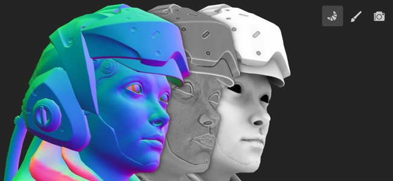
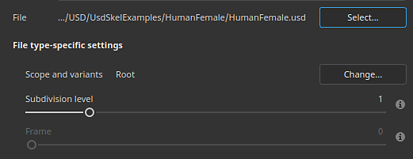

# Version 8.3

**Substance 3D Painter 8.3** introduit un tout nouveau mode de cuisson, l&#39;importation de fichiers USD et la prise en charge de la taille physique en mode Projection UV.

Date de publication : *10 janvier 2023*

## Fonctionnalité majeure

### Nouveau mode de cuisson

L&#39;ancienne fenêtre de cuisson a été remplacée par un mode dédié avec plusieurs nouveautés, notamment avec la visualisation de l&#39;aire d&#39;affichage comme l&#39;affichage de la cage et les erreurs d&#39;appariement.

* **Accès et basculement entre les modes**\
  La cuisson est désormais un nouveau mode distinct, qui vient s’ajouter aux modes de peinture et de rendu déjà existants dans l’application. Pour passer au mode de cuisson, il suffit d&#39;utiliser l&#39;icône petit croissant dans la barre d&#39;outils contextuelle. Le basculement entre les modes peut également se faire autrement : en utilisant le menu des modes ou les raccourcis clavier. Pour revenir à un autre mode, il vous suffit d&#39;utiliser l&#39;icône dédiée du mode (en outre, le bouton **Cartes du maillage de cuisson** dans les [paramètres de l&#39;ensemble de textures](../interface/texture-set/texture-set-settings.md) peut toujours être utilisé pour passer au nouveau mode).

  

  

* **Nouvelle interface de mode**\
  La vitre de cuisson traditionnelle a été transformée en mode avec des quais dédiés, notamment :

  * La **liste des ensembles de textures** peut être utilisée pour définir les parties du projet qui seront cuites.
  * **Mesh Map Bakers** permet de choisir entre les paramètres de cuisson courants et les paramètres du boulanger. C&#39;est également l&#39;endroit où vous pouvez spécifier quel processus de boulangerie sera lancé.
  * **Paramètres de maillage** est l&#39;emplacement de tous les paramètres baker et communs. Ils peuvent être modifiés en fonction de la sélection effectuée dans les deux fenêtres précédentes.
  * **Le journal de cuisson** regroupe différentes informations sur le processus de cuisson, notamment les messages d&#39;erreur.
  * **Visualisation de la cuisson** : ce panneau se trouve dans la fenêtre d&#39;affichage et contrôle plusieurs options liées à l&#39;affichage des maillages poly bas et haut.

  {width="500px"}

* **Démarrer et annuler le processus de cuisson directement à partir de la fenêtre d&#39;affichage**\
  Le bouton permettant de lancer ou d’annuler le processus de cuisson se trouve désormais au bas de la fenêtre d’affichage. Une petite flèche peut également être utilisée pour spécifier le mode de cuisson : en fonction de la sélection de la liste des ensembles de textures ou en utilisant l&#39;ensemble de textures actuellement actif.

  

  

* **Afficher le maillage polyvalent dans la fenêtre d&#39;affichage**\
  Lorsque vous spécifiez un maillage polyvalent dans les paramètres de cuisson, il est désormais également chargé dans la clôture (sauf si le paramètre de visualisation dédié est désactivé). Cela permet de vérifier si la géométrie du maillage poly bas et élevé correspond bien.

  {width="400px"}

* **Afficher le maillage de la cage dans la fenêtre d&#39;affichage avec les zones manquantes en tant qu&#39;erreur**\
  Le maillage de la cage peut également être affiché dans la clôture. Lorsque vous n&#39;utilisez pas de fichier de maillage dédié, une cage implicite s&#39;affiche à la place et réagit au paramètre Distance frontale maximale. Lors du réglage de la taille de la cage, toute partie du maillage en polygone qui se trouve en dehors de la cage est affichée en rouge par défaut, ce qui permet de trouver facilement une partie du maillage qui ne sera pas atteinte par le processus de cuisson.

  

* **Regardez autour du maillage pendant le chargement et la cuisson**\
  Le chargement des maillages et la cuisson ne figent plus l&#39;application, ce qui signifie qu&#39;il est possible d&#39;interagir avec la clôture pendant ces opérations. Cela peut être utile pour examiner la cuisson en cours, identifier les problèmes tôt et annuler la cuisson, ce qui permet de gagner du temps à la fin. De même, le jeu de textures le plus visible dans la clôture sera désormais cuit en premier, ce qui permettra d&#39;obtenir des résultats sur des zones spécifiques à l&#39;avance.

  

* **Paramètres de matériau et d&#39;aire d&#39;affichage neutres**\
  Pour vous aider à vous concentrer sur les résultats de la cuisson et à rechercher les problèmes éventuels, le mode de cuisson n’affiche pas les textures peintes, mais utilise plutôt un matériau neutre. Les paramètres de cette matière neutre peuvent être ajustés dans le panneau Visualisation Cuisson à l&#39;intérieur de la clôture.

  

* **Afficher les bords nets avec des coutures UV manquantes**\
  Une source d’artefacts lors de la cuisson est la présence de bords durs qui n’ont pas de coutures UV. Cela peut entraîner des lignes visibles et rompre le smoothness de l’ombrage. À cette fin, des paramètres de visualisation ont été ajoutés pour les mettre en évidence dans la vue 3D et 2D, car ils sont très faciles à manquer sinon.

  {width="450px"}

  {width="300px"}

* **Synchroniser et désynchroniser les paramètres**\
  La nouvelle action de synchronisation permet de spécifier quelle partie des paramètres de cuisson est synchronisée entre les ensembles de textures. Sinon, il serait fastidieux de configurer les paramètres plusieurs fois de manière identique. Parfois, il est utile d&#39;avoir des ensembles de textures avec des paramètres dédiés et de les garder non synchronisés est préférable. Par exemple, le fait de séparer les paramètres communs permet désormais d&#39;utiliser une distance frontale maximale, une résolution et/ou une liste de maillages à poly élevé qui seraient différents par ensemble de textures.

  {width="400px"}

  {width="400px"}

* **Vérificateur de correspondance par nom**\
  L&#39;onglet **Correspondance par nom** dans le **journal de cuisson** peut vous aider à trouver les erreurs dans le processus de correspondance avant la cuisson, ce qui facilite l&#39;identification des maillages qui ne correspondent pas. Les maillages correspondants sont regroupés, tandis que les autres sont isolés et affichés en rouge.

  {width="450px"}

>[!NOTE]
>
> Il existe de nombreux autres nouveaux paramètres dans ce nouveau mode. Pour en savoir plus, consultez la [page de documentation dédiée](../baking/baking.md).

### Nouvelle importation et exportation de fichiers USD

Cette nouvelle version ajoute la prise en charge du format de fichier [Universal Scene Description (USD)](https://graphics.pixar.com/usd/release/intro.html). Il est désormais possible de démarrer un projet Painter, en exportant des maillages et des textures à l’aide d’un format USD, ce qui permet un workflow plus cohérent entre les applications.

* **Importer un fichier USD avec des variantes, une peau et à une image spécifique**\
  Un format de fichier USD peut être utilisé lors de la création d’un projet ou de la réimportation d’un filet dans un projet. Les fichiers USD pouvant souvent être des scènes complexes, un sélecteur de portée et de variante est également disponible pour importer uniquement un sous-ensemble du fichier.

  {width="400px"}

  {width="400px"}

* **Exporter le dollar américain en tant que nouveau fichier ou lié au dollar américain d&#39;origine utilisé dans le projet**\
  Lorsque votre texturation est prête, vous pouvez utiliser la fenêtre **Fichier > Exporter des textures** pour exporter votre fichier USD parallèlement à vos fichiers de texture. Pour ce faire, il vous suffit d&#39;activer le paramètre **Exporter la ressource en USD**. Cela générera plusieurs fichiers USD qui pourront être facilement intégrés dans un pipeline par la suite. Si vous avez utilisé un fichier autre qu’USD ou un fichier USD sans UV, le nouveau fichier de géométrie USD est exporté en plus des textures simples et du fichier de matière USD.\
  En outre, il est également possible d&#39;utiliser **Fichier > Exporter le maillage** pour exporter la géométrie du projet en tant que fichier USD.

  

  {width="400px"}

### Prise en charge améliorée de la taille physique en mode UV

Le support des matériaux de Substance avec tailles physiques intégrées a été étendu aux projections UV.

* **Taille physique en mode UV**\
  Il est désormais possible de définir le mode Échelle sur Taille physique au lieu de Mosaïque dans le calque de remplissage et les effets de remplissage à l’aide du mode Projection UV. La taille de l’UV est calculée automatiquement en fonction de la taille moyenne des triangles à partir du déballage UV.

  {width="400px"}

* **Basculer automatiquement sur taille physique** Un nouveau paramètre de projet a été ajouté pour définir automatiquement le paramètre d’échelle sur taille physique lors de la création d’un matériau (par exemple, lorsque vous faites glisser et déposez une ressource pour la fenêtre Ressource). Cela permet d’utiliser un dimensionnement cohérent dans l’ensemble d’un projet sans avoir à changer de paramètres manuellement chaque fois qu’un nouveau calque de remplissage est créé. Pour l&#39;activer dans un projet existant, accédez à **Édition > Configuration du projet** et activez **Basculer la mise à l&#39;échelle du calque de remplissage sur Taille physique lors de l&#39;affectation de matériaux**. Ce paramètre peut également être activé lors de la création d’un projet.

  

## Informations sur la prise en charge des plateformes

Avec cette version, nous avons augmenté la version minimale prise en charge de Painter sur Steam à Ubuntu 20.04.

## Tutoriels

Pour découvrir et en savoir plus sur le nouveau mode Baking, consultez notre dernier tutoriel :

## Notes de mise à jour

*(Publié Le 10 Janvier 2023)*\
Résumé : **version majeure avec un nouveau mode de création, une nouvelle importation et exportation de fichiers USD et la prise en charge des tailles physiques pour Projection UV**

**Ajouté :**

* [Mode de cuisson] Nouveau mode de cuisson dédié au processus de cuisson
* [Mode de cuisson] Définissez le raccourci pour passer en mode de cuisson sur F8
* [Mode Cuisson] Ajouter les boutons Démarrer et Annuler la cuisson dans la clôture
* [Mode de cuisson] Ajouter une sélection de cuisson dans la liste des ensembles de textures
* [Baking Mode] Ajouter une nouvelle fenêtre Mesh Map Bakers pour sélectionner les boulangers
* [Mode de cuisson] Ajouter une nouvelle fenêtre Paramètres de maillage pour modifier les paramètres de cuisson
* [Mode de cuisson] Ajouter une nouvelle fenêtre Journal de cuisson pour suivre le processus de cuisson
* [Mode d’ancrage] Ajout de paramètres d’ancrage et d’actions d’annulation à la fenêtre Historique
* [Mode d’ancrage] Ajout de chemins de navigation dans les paramètres de mappage de maillage
* [Mode Cuisson] Ajout de vignettes de cartes de maillage dans la fenêtre Boulonneurs de cartes de maillage
* [Mode Cuisson] Ajout d’un menu réductible de paramètres de visualisation dans la clôture 3D
* [Mode de cuisson] Ajouter un paramètre de visualisation pour afficher/masquer le filet à polygone
* [Mode de cuisson] Ajoutez un paramètre de visualisation pour afficher/masquer le filet et la structure filaire de la cage
* [Mode de cuisson] Ajouter un paramètre de visualisation pour afficher/masquer le filet à faible polygone
* [Mode Cuisson] Ajoutez un paramètre de visualisation pour afficher les bords nets sans coutures UV comme erreurs
* [Mode de cuisson] Dans la clôture, informez les utilisateurs des erreurs de maillage et de cuisson si le journal de cuisson n&#39;est pas visible
* [Mode Cuisson] Ajoutez une action pour synchroniser les paramètres du boulanger sur tous les ensembles de textures

  Dans la fenêtre Boulangers de cartes de maillage, chaque boulanger (ainsi que les paramètres communs) peut être synchronisé entre les ensembles de textures en cliquant sur l&#39;icône de lien en regard de leur nom. Cette action ouvre une fenêtre qui permet de sélectionner les ensembles de textures qui partageront les mêmes paramètres.
* [Mode boulangerie] Ajout d’actions pour copier et coller les paramètres du boulanger

  Dans la fenêtre Boulangers de cartes de maillage, vous pouvez copier et coller chaque paramètre de boulanger dans les ensembles de textures via le menu dédié en haut de la fenêtre ou via le menu contextuel accessible via un clic droit.
* [Baking Mode] Ajouter un bouton dans Baking Log pour passer de l&#39;erreur aux paramètres de droite

  Lorsqu’un boulanger échoue ou qu’un maillage ne se charge pas correctement, un message d’erreur s’affiche dans le journal de boulangerie. Un bouton en regard du message permet de modifier la fenêtre Boulonneurs de cartes de maillage et Paramètres de carte de maillage pour afficher les paramètres associés. Cela permet d’isoler plus facilement la source d’un problème afin de pouvoir le résoudre.
* [Mode Cuisson] Ajoutez des menus pour gérer les ensembles de textures et les sélections de boulanger

  Dans la fenêtre « Liste des ensembles de textures » et « Boulangers de cartes de maillage », un petit menu d&#39;action a été ajouté pour aider à copier et à inverser les sélections.
* [Mode de cuisson] Fractionner la liste de sélection du boulanger par ensemble de textures
* [Mode de cuisson] Fractionner les paramètres courants par ensemble de textures
* [Mode cuisson] Charger les maillages en polygone et en cage sans figer l&#39;interface
* [Mode d’ancrage] Utilisez la barre de progression de la fenêtre pour afficher le chargement du maillage
* [Baking Mode] Ajouter l’état de chargement du maillage dans Baking Log
* [Mode Cuisson] Permet de retourner le filet dans la clôture pendant la cuisson
* [Mode de cuisson] Définir l&#39;ordre de cuisson en fonction de la visibilité actuelle de la fenêtre de maillage
* [Mode de cuisson] Afficher la cage de cuisson implicite dans la clôture

  Lorsque vous n&#39;utilisez pas de fichier de maillage de cage personnalisé, un maillage de cage automatique est généré et affiché dans la clôture. Sa taille sera basée sur le paramètre Distance frontale maximale des paramètres courants de cuisson. Le maillage de la cage est utilisé pour indiquer jusqu&#39;où ira la correspondance entre le poly bas et le poly haut.
* [Mode Cuisson] Afficher la liste correspondante des noms de maillage pour Correspondance par nom dans le journal Cuisson
* [Mode Cuisson] Utiliser une matière neutre pour afficher le modèle 3D dans la clôture
* [Mode de cuisson] Désactiver le calcul du moteur en mode de cuisson
* [Mode Cuisson] Afficher un avertissement lors de la fermeture de l’application pendant qu’un cuisson est en cours
* [Boulangers] Mise à jour des libellés de paramètres de lissage

  Les valeurs du paramètre d’anticrénelage ont été renommées en « Suréchantillonnage » et dotées d’un nombre multiplicateur explicite pour clarifier leur comportement.
* [Bakers] Mettez à jour bakers vers la version 2.5.7.
* [USD] Importation et exportation de fichiers Universal Scene Description (USD)
* [USD] Ajoutez des options USD à la fenêtre Nouveau projet lors de la sélection d’un fichier USD
* [USD] Fenêtre de sélection Ajouter une nouvelle étendue et des variantes

  Lors de l&#39;importation d&#39;un fichier USD, cliquer sur le bouton de modification dans la fenêtre Nouveau projet ou Configuration du projet permet de sélectionner la partie et les variantes d&#39;un fichier USD à importer.
* [USD] Option Ajouter des niveaux de subdivision

  Lors de la création d’un projet avec un fichier de maillage USD contenant des subdivisions, il est possible de sélectionner le niveau de subdivisions à l’aide d’un curseur. Le projet sera créé avec le maillage subdivisé. Le niveau peut être modifié via la configuration du projet.
* [USD] Importation de maillages avec peau USD à une image spécifique

  Lors de la création d’un projet avec un fichier de filet USD contenant une animation, il est possible de sélectionner l’image à l’aide d’un curseur qui reflète la séquence de montage intégrée. L’image peut être modifiée via la configuration du projet.
* [USD][Exporter] Ajoutez une option pour exporter des fichiers USD

  Nouvelle case à cocher Exporter en USD ajoutée à la fenêtre Exporter les textures. Lorsqu’elle est cochée, elle permet d’exporter des fichiers USD ainsi que des textures à l’aide de n’importe quel modèle.
* [USD][Exporter] Ajoutez un format de fichier USD à l’exportation du maillage
* [USD] Renommez le paramètre prédéfini d’exportation « USD PBR Metal Roughness » pour qu’il soit plus explicite

  Le modèle d’exportation USD précédemment connu sous le nom de « rugosité du métal USD PBR » est toujours accessible via Exporter des textures > Modèle de sortie > USDz (Apple AR).
* [Déplier automatiquement] Ajouter l’orientation de verrouillage pour le packing

  Nouvelle option pour les paramètres de déballage automatique qui permet de préserver l’orientation des Îlots UV existants lors de l’utilisation de la fonction de packing. Il est accessible via Nouveau projet > Options de déballage automatique > Orientation de l’Îlot UV.
* [Taille physique] Ajouter un paramètre pour utiliser automatiquement la Taille physique dans l’effet/le calque de remplissage

  Une nouvelle option permettant de passer automatiquement à l’échelle de taille physique lors de l’utilisation d’un matériau avec taille physique intégrée a été ajoutée. Il peut être activé par projet via Nouveau projet ou via Édition > Configuration du projet > Taille physique > Remplacer la mise à l’échelle du calque de remplissage par Taille physique lors de l’affectation de matériaux.
* [Taille physique] Exposer la taille physique pour la Projection UV

  La mise à l’échelle de taille physique est désormais disponible pour les Projections UV. Elle permet le redimensionnement automatique d’un matériau en fonction de la taille physique d’un filet. Elle peut être sélectionnée via Échelle > Taille physique dans le calque de remplissage ou la fenêtre Propriétés de l’effet.
* [Scripting][Python] Autoriser à interroger la version de l&#39;application
* [Scripting][JavaScript] API de mise à jour correspondant aux nouveaux paramètres de création
* [Scripting][Python] Module Baking : modifier les paramètres de baking
* [Scripting][Python] Module Baking : launch/cancel baking
* [Scripting][Python] Module de cuisson : sélectionner la méthode de courbure
* [Scripting][Python] Module de cuisson : sélection de vignettes bakers/uv
* [Scripting][Python] Module Baking : synchroniser les paramètres Baker sur tous les ensembles de textures
* [SVT] Activer la prise en charge du matériel fragmenté sur les GPU AMD

  L’accélération matérielle pour le système Sparse Virtual Textures peut désormais être activée avec les GPU AMD. Ce paramètre est automatiquement activé dans les préférences générales.
* [Projection] Renommer les paramètres de projection cylindriques

  Le paramètre « Cylinder Cap Culling » a été renommé « Backface Culling » pour mieux représenter son action. L’info-bulle associée a été ajustée en conséquence.
* [Projet] Enregistrer la version de l&#39;application dans le projet et la récupérer via un script

  Depuis la version 8.2, la version de l’application est maintenant stockée dans le fichier spp lors de l’enregistrement.\
  Ce numéro de version peut être récupéré avec la fonction last\_saved\_substance\_painter\_version() dans le module de projet de l&#39;API Python.\
  Pour les projets réalisés avant la version 8.2, la valeur renvoyée sera nulle.
* [Importation] Amélioration du temps d’importation général des modèles 3D

  Nous avons amélioré le temps d’importation général des maillages. Par example, la réduction du temps d&#39;attente lors du chargement de mailles à haut poly pour la cuisson. Cette optimisation s&#39;applique notamment au chargement de fichiers OBJ.

**Fixe :**

* [Blocage] Changement de canaux sur le filtre avec une pile spécifique
* [Mac][M1] Blocage lors de la création d’un calque de remplissage et du fait de quitter la pile de calques

  Ce problème peut être résolu en mettant à jour vers Mac OS 13 (Ventura).
* [Scripting][Python] Blocage lors de l&#39;utilisation de ui.add\_dock\_widget() avec un type incorrect
* [Baking] Message d’erreur incomplet dans le journal lorsqu’un bake échoue
* [Cuisson] La mémoire n’est pas libérée à la fin de la cuisson
* [Moteur] Le cache de texture ne se met pas à jour lors de la modification de la visibilité des effets
* [Export] 2DView exporte un mappage aléatoire uniforme
* [Projet] Erreur d’allocation de mémoire lors de l’enregistrement du projet avec un grand maillage
* [Fenêtre d’affichage] Dans certains cas, TAA provoque des artefacts lors de la peinture

**Problèmes Connus :**

* [Gestion des couleurs] Les conversions d’espace colorimétrique HDR avec ACE sous Linux produisent des couleurs condensées
* [Pile de calques] Source d’entrée non enregistrée par calque
* [Export] La vue 2D exporte un mappage aléatoire uniforme
