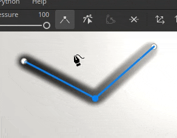

# Version 9.1

<b>Substance 3D Painter 9.1</b> ajoute le contrôle de tangente pour l&#39;outil Tracé, la prise en charge du format de fichier du SVG, la possibilité d&#39;importer et d&#39;appliquer des ressources par glisser-déposer et la prise en charge de la translucidité dans la clôture.

Date de publication : *7 novembre 2023*

## Principales fonctionnalités

### Nouvelles commandes de tangente et améliorations pour l’outil Tracé

Dans cette nouvelle version, nous poursuivons le développement de l’outil Chemin (introduit dans la version 9.0) pour ajouter les bits manquants et les fonctionnalités demandées par la communauté.

* <b>Contrôle manuel des points de tracé des tangentes</b>

  Il est désormais possible de définir manuellement les tangentes d’un point spécifique sur un tracé. Cela permet de remplacer le comportement automatique pour créer de nouvelles formes.

  
* <b>Modifier les points de tracé via des manipulateurs</b>

  Parfois, de simples points de glissement sur la surface de l’objet ne suffisent pas. Les manipulateurs permettent de déplacer des points au-delà de la surface. Cela peut être très utile pour déplacer plusieurs points à la fois, par exemple s’ils étaient trop éloignés d’une surface après une réimportation de maillage.

  
* <b>Activer/désactiver la visibilité des tracés individuellement</b>

  La visibilité des tracés peut désormais être modifiée par tracé via le panneau d’affichage dédié. La désactivation d’un tracé supprimera ses contributions des textures finales sans avoir à le supprimer.

  
* <b>Copier et coller les positions et les propriétés du tracé</b>

  Le copier-coller de tracés a été étendu pour ne pouvoir copier que les positions de points d’un tracé ou ses propriétés. Il est désormais possible de synchroniser les tracés de différentes manières, ce qui facilite la création d’effets complexes (via les positions) ou le partage d’un aspect spécifique entre différents emplacements (via les propriétés).

  

  

>[!NOTE]
>
> Pour plus d&#39;informations sur l&#39;outil Chemin, [consultez la documentation dédiée](../painting/tool-list/path.md).

### Nouvelle prise en charge de la translucidité, de la transparence et de l’absorption dans la fenêtre d’affichage

Le nuanceur <b>Adobe Standard Material</b> (ASM), qui est l&#39;outil par défaut lors de la création d&#39;un nouveau projet, a été mis à jour pour prendre en charge les propriétés <b>Translucidité</b>, <b>Transparence</b> et <b>Absorption</b>. Cela signifie qu’il est désormais possible d’afficher le résultat de ces comportements de rendu dans la fenêtre d’affichage en temps réel (ainsi qu’à l’intérieur du système de rendu Iray).

Il est donc désormais possible de créer des matériaux tels que le <b>verre</b>, le <b>feuillage</b> ou les <b>plastiques</b> avec une fine absorption de lumière et de les afficher directement dans l&#39;aire d&#39;affichage. L’exportation vers d’autres applications Substance 3D donnera également un aspect correspondant grâce à la définition ASM.

* <b>Nouveaux paramètres de nuanceur ASM</b>

  Le shader ASM a été mis à jour pour prendre en charge de nouvelles fonctionnalités, qui peuvent être modifiées via la fenêtre [Paramètres du shader](../interface/shader-settings/shader-settings.md) :

  * <b>Transparence</b> (opacité) : n&#39;est-il plus nécessaire de passer à un autre nuanceur pour obtenir des surfaces transparentes, comme le feuillage ? Activez plutôt le paramètre <b>test alpha</b> ou <b>fusion alpha</b> sous le groupe <b>Géométrie > Opacité</b>. Les paramètres habituels, tels que le tramage, sont également disponibles.
  * <b>Translucidité</b> : cette nouvelle propriété permet de créer des surfaces comme du verre, en rendant les formes transparentes tout en conservant les reflets du specular. Pour l&#39;utiliser, ajoutez un canal de translucidité dans votre projet et activez le paramètre <b>Translucidité</b> sous le groupe <b>Intérieur</b>.
  * <b>Absorption</b> : cette nouvelle propriété permet de simuler la lumière qui traverse un objet et qui est absorbée, ce qui peut être utile pour simuler le plastique ou les liquides d&#39;une meilleure manière que l&#39;utilisation de la diffusion sous la surface. Pour l&#39;utiliser, activez le paramètre <b>Absorption</b> sous le groupe <b>Intérieur</b>.
* <b>Amélioration de l’interface utilisateur et des info-bulles des paramètres du nuanceur</b>

  Avec la refonte du shader, nous avons profité de l&#39;occasion pour améliorer l&#39;interface utilisateur des paramètres, ainsi que pour ajouter de nombreuses nouvelles info-bulles pour découvrir plus facilement comment les activer.

  L’ordre des paramètres doit également mieux correspondre à celui des autres logiciels Substance 3D, ce qui facilite les allers-retours lors de l’essai des paramètres.

  
* <b>Nouvel exemple de projet pour faire une démonstration du matériau Adobe Standard</b>

  La manipulation des nouvelles propriétés ASM peut être difficile au début, c’est pourquoi un nouvel exemple de projet présentant plusieurs fonctionnalités de l’ombrage a été ajouté pour faciliter leur apprentissage.

  Ce projet s&#39;appelle <b>Table de restaurant française</b> et se trouve dans le menu <b>Fichier > Ouvrir l&#39;échantillon</b>. Il utilise également beaucoup de petits trucs, ce qui peut être une excellente ressource d&#39;apprentissage pour découvrir de nouvelles façons de texturer.

  
* <b>La couche de translucidité adopte désormais par défaut une couleur noire</b>

  Afin de faciliter l&#39;utilisation des nouvelles propriétés d&#39;ombrage et d&#39;éviter des résultats inattendus dans la clôture, la couleur par défaut de la couche Translucidité a été changée en noir (au lieu du blanc).

  Si ce canal était déjà utilisé dans votre projet, vous pouvez obtenir le comportement précédent en ajoutant simplement un calque de remplissage au bas de votre pile de calques et en définissant la valeur du canal sur blanc. Vous pouvez activer le paramètre <b>Utiliser la translucidité comme masque de diffusion</b> dans le paramètre shader afin de réappliquer la contribution du canal au résultat de diffusion sous-surface.

### Nouvelle prise en charge des fichiers graphiques vectoriels (SVG)

Cette version ajoute la prise en charge des fichiers SVG en tant que ressources pouvant être utilisées dans les calques, les outils de peinture, etc.

Les fichiers SVG sont assez pratiques pour représenter des logos ou des formes avec précision tout en étant très légers. Dans Painter, ils peuvent être rendus à la résolution souhaitée et facilement mis à jour, ce qui les rend parfaits pour le workflow non destructif.

* <b>Importer des fichiers de SVG</b>\
  Les fichiers du SVG peuvent être importés comme n’importe quelle autre ressource, dans des projets, des bibliothèques, etc. Le SVG <b>jusqu&#39;à la version 1.1</b> peut être importé, les fonctionnalités des versions plus récentes ne sont pas prises en charge.

  L’importation a également été facilitée dans cette version (voir ci-dessous), de sorte que l’utilisation de fichiers de SVG peut être effectuée par simple glisser-déposer de ressources extérieures à Painter directement sur le filet ou la pile de calques.
* <b>Paramètres du SVG dédié</b>\
  Lors de l’utilisation d’une ressource de SVG, quelques paramètres sont disponibles pour contrôler son aspect :

  * <b>Résolution</b> : pour utiliser une résolution automatique, une résolution définie dans le fichier ou une résolution personnalisée.
  * <b>Zone de recadrage</b> : pour définir la zone spécifique de la zone de travail SVG à utiliser.
  * <b>Portée</b> : pour sélectionner l&#39;ensemble du contenu du SVG ou seulement certains éléments.

  
* <b>Nouveaux matériaux sur mesure pour les SVG</b>

  3 nouvelles ressources ont été ajoutées pour faciliter l’utilisation des fichiers de SVG lors de la texturation :

  * <b>Peinture pulvérisée personnalisée</b> : permet de simuler une décalcomanie peinte sur un mur à partir d’une seule image d’entrée.
  * <b>Autocollant personnalisé</b> : pour créer un autocollant en plastique sur une surface. Il comporte plusieurs paramètres pour simuler les dommages et le pliage.
  * <b>Graphique en matériau</b> : permet de créer plusieurs propriétés de matériau à partir d&#39;une seule entrée d&#39;image. Cette ressource est automatiquement insérée lorsque vous faites glisser un fichier de SVG dans la clôture. Cette ressource offre un moyen facile de partager la transparence de ses entrées sur plusieurs canaux, ce qui la rend parfaite pour les décalcomanies simples.

  

  

>[!NOTE]
>
> Pour plus d&#39;informations sur le format et les paramètres du SVG, [consultez la documentation dédiée](../painting/vector-graphic-svg.md).

### Nouvelle importation de ressources par glisser-déposer

Cette version permet de glisser-déposer un fichier externe dans différents contextes de l’application pour importer automatiquement une ressource et l’utiliser. Ce nouveau processus permet d’ignorer les étapes fastidieuses liées à l’importation de fichiers.

* <b>Importer par glisser-déposer dans la fenêtre d&#39;affichage</b>

  Faites glisser un fichier externe dans la clôture pour pouvoir le placer directement sur le filet. Cette action crée automatiquement un calque. Selon la nature de la ressource (image, matériau de Substance, filtre de Substance, etc.) le résultat s’adaptera en conséquence.
* <b>Importer par glisser-déposer dans la pile de calques</b>\
  De la même manière qu&#39;il est possible de déposer des fichiers de ressources externes dans la clôture, déposer des fichiers dans la pile de calques permet de créer directement des calques ou des effets avec la ressource qu&#39;il contient.
* <b>Importer par glisser-déposer dans un emplacement de ressource</b>

  L’importation d’une ressource directement dans un calque ou un outil est également possible. S’il existe déjà un calque de remplissage ou un effet configuré à cet effet, il vous suffit de déposer un fichier externe dans l’un des emplacements de couche de la fenêtre Propriétés pour l’importer et l’appliquer.

>[!NOTE]
>
> Pour plus d&#39;informations sur l&#39;importation de ressources, [consultez la documentation dédiée](../content/importing-assets/import-drag-and-drop.md).

### Nouveaux comportements de glisser-déposer de ressources

Les améliorations par glisser-déposer ne se limitent pas à l’importation de ressources. Le glisser-déposer d’une ressource depuis la fenêtre Actifs peut désormais être utilisé pour créer de nouveaux calques, effets et même des masques à la volée.

* <b>Glissez-déposez de nombreux types de ressources</b>

  Il est désormais possible de faire glisser et déposer des types de ressources directement dans la fenêtre d’affichage ou la pile de calques. Vous pouvez désormais faire glisser et déposer (presque) n’importe où le type de ressources suivant :

  * Alpha
  * Textures
  * Procédur.
  * Matériaux
  * Matériaux adaptables
  * Masques adaptables
  * Générateurs
  * Filtres
  * Cartes d’environnement
* <b>Supprimer des ressources en tant que nouveau calque ou effet</b>

  En choisissant l’emplacement où une ressource est déposée, Painter crée automatiquement un calque ou un effet :

  
* <b>Choix entre la pile d’effets de contenu ou de masque lors du glissement\
  </b>

  Lorsque vous faites glisser une ressource sur une vignette, Painter bascule automatiquement vers les piles d’effets associées. Après cela, il devient très facile de simplement déposer la ressource dans un emplacement précis à l&#39;intérieur de cette pile. Cela évite d’avoir à basculer vers la pile de droite au préalable.

  
* <b>Créer un masque noir à la volée</b>

  Une nouvelle icône apparaît sur tout calque sans masque lors du déplacement d’une ressource. Lorsqu’une ressource est déposée sur ce masque fantôme, elle crée automatiquement un nouveau masque et ajoute la nouvelle ressource. Il s’agit d’un moyen rapide de configurer un nouveau masque et d’éviter d’annuler le glisser-déposer pour l’ajouter manuellement.

  
* <b>Déposez-vous dans la fenêtre d&#39;affichage pour créer de nouveaux calques</b>

  Vous pouvez également faire glisser et déposer des ressources dans la clôture pour créer de nouveaux calques. Selon le type de ressource, le résultat peut changer. Un filtre crée un calque de peinture en mode transparent, tandis qu’un masque dynamique crée un calque de remplissage avec un nouveau masque.

  

  
* <b>Utiliser des modificateurs de clavier pour les comportements avancés</b>

  Lors de la suppression d’une ressource, le maintien du modificateur de clavier CTRL ou ALT peut activer des comportements supplémentaires :

  * <b>CTRL</b> lors du dépôt dans la <b>pile de calques</b> : créez un calque avec la ressource dans un masque noir. peut être utile pour forcer un matériau à être mis dans un masque par example. Ou pour ignorer le menu déroulant avec un alpha.
  * <b>ALT</b> lors du dépôt dans la <b>pile de calques</b> : s&#39;applique uniquement lors du dépôt sur une vignette de calque. L’option ALT supprime tous les effets précédents. Cela peut être utilisé comme un moyen rapide d&#39;essayer différentes ressources, notamment les masques intelligents, sans avoir à les supprimer manuellement au préalable.
  * <b>CTRL</b> lors de la dépose dans la <b>fenêtre d&#39;affichage</b> : créez un calque avec la ressource dans un masque noir. La ressource sera placée sous un effet <b>Sélection d&#39;ID de couleur</b> qui sera défini en fonction de la sélection effectuée dans la clôture.
  * <b>ALT</b> lors de la dépose dans la <b>fenêtre d&#39;affichage</b> : comme précédemment, forcera une ressource à être en mode de projection de décalcomanie.

### Améliorations diverses

Plusieurs fonctionnalités et améliorations mineures ont également été ajoutées à cette version.

* <b>Compression sans perte des images 16 bits</b>

  Désormais, toutes les images contenues dans un projet avec un nombre de bits par pixel de 16 seront compressées avec un algorithme sans perte, ce qui permet de réduire leur taille sans perdre en qualité. Cela s’ajoute au fichier de projet qui compresse déjà ses propres données.

  Cette modification cible principalement les <b>textures de cuisson</b>, qui sont généralement la raison pour laquelle les fichiers de projet peuvent être très lourds sur le disque. En moyenne, la taille des projets sur disque <b>a été réduite de 30 % à 50 %</b>.

  Cette compression est appliquée automatiquement lors de l’enregistrement d’un projet (ancien ou nouveau) sur des ressources non déjà compressées. Cela signifie que pour les anciens projets, l’enregistrement pour la première fois dans cette nouvelle version peut prendre un peu plus de temps que d’habitude. Le gain de temps devrait revenir à la normale une fois cela fait.
* <b>Nouveau paramètre UV défini sur le mode de projection de remplissage UV défini</b>

  Un nouveau mode de projection pour les calques/effets de remplissage a été ajouté et nommé <b>UV défini sur UV défini sur projection</b>. Il peut être utilisé pour projeter une texture en fonction des différents UV disponibles sur le maillage à l’intérieur du projet. Il peut être utilisé pour effectuer un transfert de texture plus avancé sans avoir besoin de recourir à des outils externes.

  <b>L’ensemble d’UV 0</b> est l’UV par défaut utilisé pour la peinture par Painter. Si d&#39;autres jeux d&#39;UV sont disponibles, ils le seront dans le menu déroulant à partir du paramètre <b>Source</b> :

  
* <b>L&#39;Antialiasing temporel est activé par défaut sur tout nouveau projet</b>

  Lors de la création d&#39;un nouveau projet, le paramètre <b>Antialiasing temporel</b> disponible dans la fenêtre Paramètres d&#39;affichage est désormais activé par défaut afin d&#39;améliorer la qualité du rendu dans la clôture.
* <b>Nouvelles améliorations de l’API Python</b>

  L’API Python a reçu quelques ajouts dans cette version :

  * Painter peut être fermé/arrêté via Python avec la nouvelle fonction <b>substance\_painter.application.close() </b>.
  * La caméra principale de la fenêtre d’affichage peut désormais être modifiée via l’API. Cela inclut sa position, sa rotation mais aussi ses autres propriétés comme le champ de vision, l&#39;ouverture, etc. Pour faciliter le positionnement de la caméra en ce qui concerne le filet, l’API expose désormais également le cadre de sélection de la scène.
  * L’exportation du maillage du projet, avec triangulation ou non et displacement ou non, est désormais possible via le module d’exportation.
  * Le chemin d’accès aux textures d’exportation du projet peut désormais également être récupéré à partir de l’API.
* <b>Nouvel envoi vers After Effects (bêta)</b>

  Un nouveau mode Envoyer vers l’action est disponible pour exporter un filet et sa texture vers After Effects, ce qui facilite l’itération sur les effets visuels. Cette fonctionnalité nécessite l’accès à After Effects version 24.1 Beta minimum.

## Tutoriels

## Notes de mise à jour

### 9.1.0

(Publié le 7 novembre 2023)\
Résumé : <b>version majeure introduisant la prise en charge du SVG et de la transparence, ainsi que des améliorations de l’outil de glisser-déposer et de tracé</b>

<b>Ajouté :</b>

* [SVG] Autoriser l’importation de fichiers vectoriels (SVG)
* [SVG]&#x200B;[Interface utilisateur] Ajout de la prise en charge des propriétés spécifiques au SVG
* [SVG] Ajoutez une option pour conserver facilement les proportions de l’image originale
* [SVG] Autoriser à utiliser automatiquement l’alpha du SVG avec transparence
* [Interop] Autoriser l’envoi d’un filet texturé à After Effects (Ae 24.1 Beta)
* [Interop] Ajout de paramètres pour Envoyer vers After Effects
* [Qualité de service]&#x200B;[Ressources]&#x200B;[Interface utilisateur] Importer automatiquement les ressources en les faisant glisser dans l’emplacement de l’interface utilisateur
* [QoL] Autoriser le glisser-déposer de ressources externes dans la pile de calques
* [QoL]&#x200B;[Pile de calques] Faites glisser et déposez les textures du panneau Actifs dans la pile de calques
* [QoL]&#x200B;[Fenêtre] Autoriser à faire glisser et déposer le générateur, les filtres sur le filet
* [QoL]&#x200B;[Fenêtre] Autoriser à déposer des ressources externes sur le filet
* [QoL]&#x200B;[Projection] Ajouter un nouveau jeu UV au mode de projection du jeu UV
* [QoL] Glissez-déposez les masques dynamiques en tant que nouveaux calques dans la clôture et la pile de calques
* [QoL] Ajouter un sélecteur pour les générateurs avec plusieurs sorties lorsqu’ils sont utilisés dans un masque
* [QoL] Autoriser le glisser-déposer d’images monocouche sur un effet de remplissage
* [QoL]&#x200B;[Pile de calques] Utilisez les modificateurs CTRL/ALT par glisser-déposer pour spécifier où/comment créer des effets/calque
* [Tracé] Active/désactive la visibilité des tracés individuellement dans le panneau des tracés
* [Tracé] Permet d’utiliser des manipulateurs de transformation pour les points de tracé
* [Tracé] Permet de contrôler manuellement les tangentes par sommet
* [Chemin] Copier/coller les propriétés du chemin
* [Tracé] Ajout d’un raccourci vide pour le bouton de tangente de rupture
* [Shader] Prise en charge de l’opacité et de la translucidité dans le shader ASM
* [Shader] Ajouter la prise en charge du canal de Couleur d&#39;absorption avec ASM shader
* [Shader] Amélioration des info-bulles des paramètres de shader ASM
* [Shader] Changer la couleur par défaut de la couche de translucidité en noir
* [Paramètres d’affichage] Activer l’Antialiasing temporel par défaut
* [Paramètres d&#39;affichage] Activer le paramètre Diffusion sous-surface par défaut
* [Substance] Ajout de la prise en charge de la propriété ColorSpace à partir de l’entrée/sortie du graphique
* [Substance] Mettre à jour le moteur de Substance vers la version 9.0.3
* [UI] Rendre le bouton de la barre d’outils contextuelle accessible même si la fenêtre de l’application est petite
* [Déplier automatiquement] Contrôler le nombre de carreaux UV avec la densité Texel
* [Baking] Désactiver les GPU raytracings sur les GPU AMD par défaut
* [Performance] Appliquez une compression sans perte sur les images 16 bits pour réduire l’empreinte du projet
* [Python] Autoriser à manipuler la caméra par défaut dans la vue 3D
* [Python] Possibilité d’exporter un filet via un script
* [Contenu]&#x200B;[Échantillons] Ajouter un nouveau projet d&#39;échantillon « French Restaurant Table »
* [Contenu] Mettre à jour le logo de Substance alpha vers une nouvelle version
* [Contenu] Ajout de trois filtres de matériau axés sur le SVG (Autocollant personnalisé, Pulvérisation personnalisée et Graphisme au matériau)

<b>Fixe :</b>

* [Blocage] Modification de la taille du manipulateur sans utiliser l’outil de symétrie
* [Blocage] [Pile de calques] Création d’un calque lorsque rien n’est sélectionné
* [Projet] Les mappages de maillage peuvent être corrompus après la suppression de ressources inutilisées
* [Projet] Corruption de ressources après la réimportation ou la recadrage de l’image
* [Actifs] Le rechargement d’un actif le supprime des Favoris
* [Importer] Impossible d’importer des ressources lorsqu’il n’y a « Aucun résultat trouvé » dans le panneau des actifs
* [UI] La flèche contextuelle de la barre d’outils n’apparaît pas dans certains cas
* [Substance] Le bouton Côte à côte pour les valeurs booléennes n’est pas pris en charge.
* [Niveau] Libellé de canal incorrect lorsqu’il est utilisé dans le masque
* [Export]&#x200B;[glTF] Les fichiers glTF/GLB exportés depuis Painter ne possèdent pas d’unité de taille physique
* [Contenu] L’intensité du filtre Flou est réglée sur 16
* [Contenu] La saisie d’image « couleur cible » du filtre Correspondance de couleur n’est pas visible

<b>Problèmes connus :</b>

* [Gestion des couleurs] Les conversions d’espace colorimétrique HDR avec ACE sous Linux produisent des couleurs condensées
* [Blocage]&#x200B;[Linux] avec Linux Wayland sur AMD lors du glisser-déposer de ressources dans la pile de calques
* [Crash]&#x200B;[Mac] Modification de la valeur de filtrage anisotrope sur Monterey OS
* [Crash] Exr utilisé comme entrée d’image
* [Blocage] Utilisation de la carte d’environnement 16K
* [Déballage automatique] Problème d’interface utilisateur pour le contrôle de la densité du texte
* [Régression]&#x200B;[Interface utilisateur] Le menu contextuel est trop petit à l’écran
* [Python] Blocage lors de l’exportation du fichier USD déclenché par TextureStateEvent
* [QoL] Le glisser-déposer d’Alpha en mode décalcomanie crée une Projection UV dans le masque
