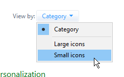
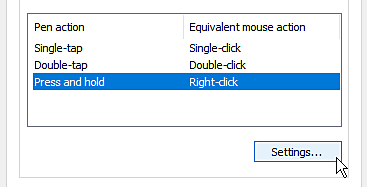

# Configuration des stylos et des tablettes

Cette page répertorie plusieurs recommandations pour configurer un stylet graphique sous Windows afin d’améliorer sa compatibilité avec l’application.

## Qu’est-ce que Windows Ink ?

Windows Ink est un logiciel/service qui gère les stylets tels que les stylets ou les stylets de tablettes graphiques. Il propose diverses applications telles que les Pense-bêtes et le Sketchpad pour interagir avec un stylet sur l’ordinateur.

Depuis la version 2019.3, l’application s’en sert pour gérer les tablettes graphiques. Avant cette version, Wintab était utilisé à la place (ancien service qui n&#39;est pas pris en charge par tous les modèles de tablettes graphiques).

## Activation de Windows Ink dans les paramètres du pilote de tablette

Pour vous assurer que la pression du stylet est correctement reconnue, Windows Ink doit être activé dans les paramètres du pilote de la tablette graphique.

>[!NOTE]
>
> Windows Ink n&#39;étant pas pris en charge sur les ordinateurs virtuels, les événements de tablette graphique ne seront pas transférés vers l&#39;application. La pression du stylet n&#39;est donc pas prise en charge dans cette configuration.

### Activation de Windows Ink pour les tablettes Wacom

1. Ouvrez le menu **Démarrer**.
1. Saisissez **Propriétés de la tablette Wacom** et cliquez sur le premier résultat de recherche.
1. Dans la fenêtre **Propriétés de la tablette Wacom**, cliquez sur le **Stylo** dans la liste des outils.\
   
1. Cliquez sur le bouton plus **« +«** pour ajouter un profil d&#39;application.\
   
1. Cliquez sur le bouton **Parcourir** dans la nouvelle fenêtre pour localiser l&#39;exécutable Substance 3D Painter.\
   
1. Cliquez sur **OK** pour valider et créer le profil.\
   
1. Cliquez sur l&#39;onglet **Mappage**.\
   
1. En bas à gauche de la fenêtre, assurez-vous que l&#39;option **Utiliser l&#39;encre Windows** est activée.\
   

>[!NOTE]
>
> Après avoir activé Windows Ink, redémarrez l’application pour vous assurer que les modifications sont correctement prises en compte.

### Activation de Windows Ink pour les tablettes Huion

1. Ouvrez le menu **Démarrer**.
1. Saisissez **Tablette Huion** et cliquez sur le premier résultat de recherche
1. Dans la fenêtre de la **tablette Huion**, cliquez sur **Stylo numérique**.\
   
1. En bas à gauche de la fenêtre, assurez-vous que l&#39;option **Activer l&#39;encre Windows** est activée.\
   

## Accès aux paramètres d’encre Windows

Les paramètres d’encre Windows sont accessibles dans les paramètres généraux de Windows :

1. Ouvrez le menu **Démarrer**.
1. Cliquez sur l&#39;icône **Paramètres**.\
   
1. Dans la fenêtre Paramètres, cliquez sur **Appareils**.\
   
1. Dans la fenêtre **Appareils**, cliquez sur **Stylet et encre Windows** (disponible uniquement si une tablette graphique est connectée).\
   

## Paramètres d’encre Windows recommandés

Vous trouverez ci-dessous les paramètres d’encre Windows et la configuration recommandée pour chacun d’eux.

>[!NOTE]
>
> Même après avoir suivi ce guide, certains visuels liés à Windows Ink restent visibles. Malheureusement, Microsoft ne propose pas de paramètres dans Windows pour les désactiver.
> 
> Les visuels restants sont les suivants :
> 
> * **Cercle** lors d&#39;un clic droit.
> * **Info-bulle** sous la souris lorsque vous appuyez sur un modificateur de touche (Ctrl, Alt ou Maj).

### Paramètres du stylet

| ***Paramètre*** | ***Description*** |
| --- | --- |
| **Choisir la main avec laquelle écrire** | Recommandé : **Main droite** Ces paramètres contrôlent la façon dont l&#39;orientation du stylet est reconnue. Définir ce paramètre sur Main gauche peut entraîner un gel de l’interface utilisateur lors de l’ajustement des paramètres. |
| **Afficher les effets visuels** | Recommandé : **Désactivé** ce paramètre contrôle les effets visuels qui s&#39;affichent lors de diverses interactions avec le stylet. Sa désactivation permet de masquer l’effet de cercle d’ondulation lorsque vous cliquez sur : 

 |
| **Afficher les curseurs** | Recommandé : **Désactivé** |
| **Me laisser utiliser mon stylet comme souris dans certaines applications pour ordinateur** | Recommandé : **Activé** ces paramètres permettent au stylet de la tablette graphique d&#39;envoyer des entrées de souris régulières. Si ce paramètre est désactivé, il peut entraîner des problèmes d’interaction avec les paramètres de l’interface utilisateur. |

### Paramètres d’écriture manuscrite

| ***Paramètre*** | ***Description*** |
| --- | --- |
| **Taille de la police lors de l’écriture directement dans le champ de texte** | Recommandé : **Moyen (par défaut)** |
| **Police lors de l’utilisation de l’écriture manuscrite** | Recommandé : **Interface utilisateur Segoe (par défaut)** |
| **Lorsque j&#39;appuie sur un champ de texte avec mon stylet, utilisez l&#39;écriture manuscrite pour saisir du texte** | Recommandé : **Uniquement en mode tablette** Ce paramètre contrôle la façon et le moment où la fenêtre de saisie de texte manuscrit apparaît. Si cette option n’est pas définie sur « uniquement en mode tablette », la fenêtre s’affiche chaque fois qu’un champ de texte est sélectionné dans l’interface utilisateur. Par exemple, lorsque vous saisissez une valeur spécifique dans un curseur. |
| **Me laisser utiliser mon stylet comme souris dans certaines applications pour ordinateur** | Recommandé : **Activé** ces paramètres permettent au stylet de la tablette graphique d&#39;envoyer des entrées de souris régulières. Si ce paramètre est désactivé, il peut entraîner des problèmes d’interaction avec les paramètres de l’interface utilisateur. |
| **Écrivez du bout du doigt dans le panneau d&#39;écriture manuscrite** | Recommandé : **Désactivé** |

### Paramètres des raccourcis stylet

| ***Paramètre*** | ***Description*** |
| --- | --- |
| **Cliquer une fois** | Recommandé : **Rien** |
| **Double-cliquer** | Recommandé : **Rien** |
| **Appuyez longuement (uniquement pris en charge sur certains stylos)** | Recommandé : **Rien** |
| **Autoriser les applications à remplacer le comportement du bouton de raccourci** | Recommandé : **Activé** |
| **Lorsque disponible, affichez l’espace de travail Encre après le retrait de mon stylo du stockage** | Recommandé : **Désactivé** |

## Accès aux paramètres Stylet et tactile

Les paramètres Plume et Tactile sont accessibles dans le Panneau de configuration :

1. Ouvrez le menu **Démarrer**.
1. Saisissez **Panneau de configuration** et cliquez sur le premier résultat de recherche.
1. Basculez le **mode d&#39;affichage** du Panneau de configuration en **petite icône**.\
   
1. Cliquez sur les paramètres **Stylo et tactile**.\
   

## Paramètres tactiles et du stylet recommandés

Les paramètres suivants sont recommandés pour améliorer le comportement de peinture et la manipulation de l’appareil photo.

Pour accéder aux paramètres, cliquez sur l&#39;une des **actions de stylet** dans la fenêtre, puis cliquez sur le bouton **paramètres**.

| ***Paramètre*** | ***Description*** |
| --- | --- |
| **Appuyer une fois** | Aucun paramètre. |
| **Appuyer deux fois** | Recommandé : **Valeurs par défaut.** |
| **Appuyez longuement** | Recommandé : **Désactiver le paramètre « Activer la pression et le maintien pour un clic droit »** La désactivation de ce paramètre permet de faire glisser n’importe quel élément normalement sans activer le cercle de glissement Windows : 

 |
| **Utiliser le bouton du stylet comme équivalent du clic droit** | Recommandé : **Activé** |
| **Utilisez le haut du stylo pour effacer l&#39;encre (si disponible)** | Recommandé : **Activé** |
