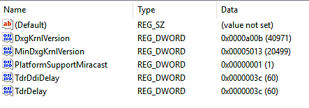

# Les pilotes GPU se bloquent lors de longs calculs (blocage de TDR)

{zoomable="yes"}

Sous Windows, cette fenêtre apparaît si Substance 3D Painter détecte que la valeur TDR actuelle est inférieure à une limite spécifique (10 secondes).

<table>
<tr style="border: 0;">
<td style="border: 0;" valign="top">

## Pourquoi le pilote GPU se bloque-t-il ?

</td>
<td style="border: 0;" valign="top">

### Modification des valeurs TDR

</td>
<td style="border: 0;" valign="top">

### Rétablissement des valeurs TDR par défaut

</td>
</tr>
</table>

## Pourquoi le pilote GPU se bloque-t-il ?

Afin d&#39;empêcher tout rendu ou calcul GPU de **verrouiller le système**, le système d&#39;exploitation Windows **tue le pilote GPU** chaque fois qu&#39;un rendu prend plus de quelques secondes. Lorsque le pilote est arrêté, l’application qui l’utilise se bloque automatiquement. Il n’est pas possible de savoir combien de temps une tâche de rendu ou un calcul peut prendre (cela dépend du GPU, des pilotes, du système d’exploitation, de la taille du maillage, de la taille de la texture, etc.). Il n’est donc pas possible de fixer une limite à la quantité que l’ordinateur doit traiter et d’éviter le blocage au niveau de l’application.

Sous Windows, une **clé de registre** **clé** spécifie le temps que le système d&#39;exploitation doit attendre avant de tuer le pilote GPU. Les applications ne sont pas autorisées à modifier ce paramètre directement, cette procédure doit être effectuée manuellement (voir ci-dessous).

Pour plus d&#39;informations, consultez la documentation officielle : <https://docs.microsoft.com/en-us/windows-hardware/drivers/display/tdr-registry-keys>.

### Liste des touches qui doivent être modifiées

Pour régler le TDR, il suffit d&#39;augmenter le délai TDR : définissez à la fois **TdrDelay** et **TdrDdiDelay** sur une valeur plus élevée (par exemple 60 secondes).

{zoomable="yes"}

>[!NOTE]
>
> Notez que ces touches peuvent être réinitialisées à leur valeur par défaut par les mises à jour de Windows ou les mises à jour des pilotes GPU.

## Modification des valeurs TDR

Suivez cette procédure pour modifier la valeur TDR.

***Notez que deux clés différentes devront être créées/modifiées.***

>[!WARNING]
>
> Veuillez noter que la modification du registre peut avoir des conséquences graves et inattendues qui peuvent empêcher le démarrage du système et peut nécessiter la réinstallation de l&#39;ensemble du système d&#39;exploitation si vous ne savez pas comment le modifier. Les clés de registre mentionnées dans cette page ne devraient toutefois pas créer ce genre de problèmes.
> 
> Adobe n&#39;assume aucune responsabilité pour tout dommage causé à votre système en modifiant le registre du système.

### 1 - Ouvrir la fenêtre Exécuter

Cliquez sur **Démarrer** puis sur **Exécuter** (ou appuyez sur les touches **Windows** et **R**). La fenêtre **Exécuter** s&#39;ouvre.

{zoomable="yes"}

### 2 - Lancez l’éditeur de registre

Saisissez **regedit** dans le champ de texte et appuyez sur **OK**.

{zoomable="yes"}

### 3 - Accédez à la clé de registre GraphicsDrivers.

La fenêtre du registre s’ouvre.\
Dans le volet de gauche, naviguez dans l&#39;arborescence jusqu&#39;à la clé **GraphicsDrivers** en accédant à :

```
Computer\HKEY_LOCAL_MACHINE\SYSTEM\CurrentControlSet\Control\GraphicsDrivers
```


Assurez-vous de **rester sur** « Pilotes graphiques » et de **ne pas cliquer** sur les **clés de registre ci-dessous** avant de passer aux étapes suivantes.

+++« GraphicsDrivers » dans l’arborescence du Registre Windows
{zoomable="yes"}


+++

### 4 - Ajouter ou modifier la valeur TdrDelay

>[!NOTE]
>
> Si la valeur <b>TdrDelay</b> <b>n&#39;existe pas encore</b>, cliquez avec le bouton droit de la souris dans le volet de droite et choisissez <b>Nouveau > Valeur DWORD (32 bits)</b> . Nommez-le « <b>TdrDelay</b> ». La casse est importante, assurez-vous de la suivre (et vérifiez qu&#39;il n&#39;y a pas d&#39;autres caractères tels qu&#39;un espace de fin).
> 
> 

Dans le **volet de droite**, double-cliquez sur la valeur **TdrDelay**. Modifiez le paramètre **Base** sur **Décimal**. Définissez la valeur sur une valeur autre que la valeur par défaut **2** (nous vous recommandons **60**).

Cette valeur indique en secondes combien de temps le système d’exploitation attendra avant de considérer que le GPU ne répond pas pendant un calcul.

Valeur DWORD {zoomable="yes"}

### 5 - Ajouter ou modifier la valeur TdrDdiDelay

>[!NOTE]
>
> Si la valeur <b>TdrDdiDelay</b> <b>n&#39;existe pas</b> , cliquez avec le bouton droit de la souris dans le volet de droite et choisissez <b>Nouveau > Valeur DWORD (32 bits)</b> . nommez-le « <b>TdrDdiDelay</b> ». Si la casse est importante, veillez à la suivre (et vérifiez qu’il n’y a pas d’autres caractères tels que les espaces).
> 
> 

Dans le **volet de droite**, double-cliquez sur la valeur **TdrDdiDelay** . Modifiez le paramètre **Base** sur **Décimal**. Définissez la valeur sur une valeur autre que la valeur par défaut **5** (nous vous recommandons **60** ).

Cette valeur indique en secondes combien de temps le système d’exploitation attendra avant de considérer qu’un logiciel a pris trop de temps pour quitter les pilotes GPU.

La valeur par défaut est **hexadécimale**. Passez simplement à la **décimale** pour afficher la valeur correcte. Notez que **3C** (hexadécimal) équivaut à **60** (décimal).

### 6 - Terminer et redémarrer

Le volet de droite doit maintenant se présenter comme suit :

{zoomable="yes"}

**Fermez** l&#39;éditeur du Registre. **Redémarrez** l&#39;ordinateur en utilisant **Démarrer** puis **Redémarrer**.

La valeur TdrValue n&#39;est prise en compte qu&#39;au démarrage de l&#39;ordinateur, de sorte que pour forcer une actualisation, un redémarrage est nécessaire.

Si l’application se bloque toujours lors d’un calcul long, essayez d’augmenter le délai (en secondes) de 60 à 120, par exemple.

## Rétablissement des valeurs TDR par défaut

Il existe deux façons de rétablir les valeurs par défaut du TDR :

* Définissez **TdrDelay** sur **2s** et **TdrDdiDelay** sur **5s**, en suivant les étapes décrites ci-dessus.
* Ou **Supprimez** les clés **TdrDelay** et **TdrDdiDelay** de l&#39;entrée de registre.
