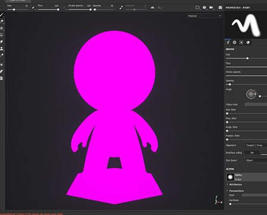

# Maillage rose dans le viewport

{width="400px"}

Le maillage peut apparaître **rose** à l&#39;intérieur du viewport, car le **shader** utilisé pour le dessiner **ne se compile plus** (comme indiqué par la **fenêtre de journal** ). Cela peut être dû à un shader obsolète qui ne prend pas en charge la dernière version du API de shader.

Voici comment résoudre le problème :

* Pour les **nuanceurs par défaut** : suivez la procédure étape par étape de la page [Mise à jour d&#39;un shader](../../../interface/shader-settings/updating-a-shader.md).
* Pour le **shader personnalisé** : examinez le message d&#39;erreur dans la fenêtre du journal ainsi que la page [API de shader](https://helpx.adobe.com/substance-3d/unlisted/documentation/spdoc/custom-shader-api-89686018.html).
