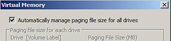

# Blocage avec une mémoire virtuelle insuffisante

Substance 3D Painter peut être instable si le fichier de **pagination** ( **mémoire swap**/ **mémoire virtuelle**) est défini avec une valeur **trop faible**.\
Il est conseillé de laisser le système d’exploitation gérer ces paramètres (ce qui est normalement le cas par défaut). Substance 3D Painter nécessite un **minimum** de **16 Go** de mémoire virtuelle pour fonctionner correctement.

## Comment modifier la taille de la mémoire virtuelle sous Windows ?

>[!NOTE]
>
> La modification de la taille de la mémoire virtuelle sous Windows nécessite un redémarrage de l’ordinateur.

Accédez aux paramètres de la mémoire virtuelle en procédant comme suit :

1. Cliquez avec le bouton droit sur l&#39;icône **Ordinateur/Ce PC** et choisissez **Propriétés**
1. Sélectionnez « **Paramètres système avancés**
1. Cliquez sur le bouton **Paramètres** de la section **Performances**.
1. Cliquez sur l&#39;onglet **Avancé**
1. Cliquez sur **Modifier** dans la section **Mémoire virtuelle**

Il est désormais possible de :

* Cochez la case **Gérer automatiquement la taille du fichier d&#39;échange pour tous les lecteurs**

**ou**

* Sélectionnez le disque dur sur lequel vous souhaitez modifier la taille de la mémoire virtuelle et choisissez **Taille gérée par le système**, puis cliquez sur le bouton **Définir**.

**Automatique :**

**Manuel :**

